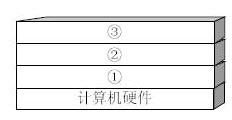
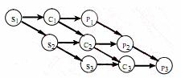
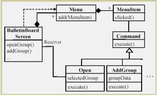
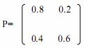

# 2009年系统架构师考试科目一：综合知识

**题目1：** 计算机系统中硬件层之上的软件通常按照三层来划分，如下图所示，图中①②③分别表示( )。

A. 操作系统、应用软件和其他系统软件
B. 操作系统、其他系统软件和应用软件
C. 其他系统软件、操作系统和应用软件
D. 应该软件、其他系统软件和操作系统

**正确答案：** B
**解析：** 从上图可以看出，操作系统是裸机上的第一层软件，是对硬件系统功能的首次扩充。它在计算机系统中占据重要而特殊的地位，其他系统软件属于第二层，如编辑程序、汇编程序、编译程序和数据库管理系统等系统软件；大量的应用软件属于第三层，例如银行账务查询、股市行情和机票预定系统等。其他系统软件和应用软件都是建立在操作系统基础之上的，并得到它的支持和取得它的服务。从用户角度看，当计算机配置了操作系统后，用户不再直接使用计算机系统硬件，而是利用操作系统所提供的命令和服务去操纵计算机，操作系统已成为现代计算机系统中必不可少的最重要的系统软件，因此把操作系统看作是用户与计算机之间的接口。

---

**题目2：** 某计算机系统中有一个CPU、一台扫描仪和一台打印机。现有三个图像任务，每个任务有三个程序段：扫描Si，图像处理Ci 和打印Pi(i=1,2,3)。图为三个任务各程序段并发执行的前趋图，其中，( )可并行执行，( )的直接制约，( )的间接制约。(1)A．“C1S2”，“P1C2S3”，“P2C3”

B. “C1S1”，“S2C2P2”，“C3P3”
C. “S1C1P1”，“S2C2P2”，“S3C3P3”
D. “S1S2S3”，“C1C2C3”，“P1P2P3”
(2)A．S1 受到S2 和S3、C1 受到C2 和C3、P1 受到P2 和P3
B. S2 和S3 受到S1、C2 和C3 受到C1、P2 和P3 受到P1
C. C1 和P1 受到S1、C2 和P2 受到S2、C3 和P3 受到S3
D. C1 和S1 受到P1、C2 和S2 受到P2、C3 和S3 受到P3
(3)A．S1 受到S2 和S3、C1 受到C2 和C3、P1 受到P2 和P3
B. S2 和S3 受到S1、C2 和C3 受到C1、P2 和P3 受到P1
C. C1 和P1 受到S1、C2 和P2 受到S2、C3 和P3 受到S3
D. C1 和S1 受到P1、C2 和S2 受到P2、C3 和S3 受到P3

**正确答案：** A、C、B
**解析：** 如图所示，当S1 执行完毕后，计算C1 与扫描S2 可并行执行；C1 与S2 执行完毕后，打印P1、计算C2 与扫描S3 可并行执行；P1、C2 与S3 执行完毕后，打印P2 与计算C3 可并行执行。根据题意，系统中有三个任务，每个任务有三个程序段，从前趋图中可以看出，系统要先进行扫描Si，然后再进行图像处理Ci，最后进行打印Pi，所以C1 和P1 受到S1 直接制约、C2 和P2 受到S2 的直接制约、C3 和P3 受到S3 的直接制约。系统中有一台扫描仪，因此S2 和S3 不能运行是受到了S1 的间接制约。如果系统中有三台扫描仪，那么S2 和S1 能运行；同理，C2 和C3 受到C1 的直接制约、P2 和P3 受到P1 的间接制约。

---

**题目3：** 在数据库设计的需求分析阶段应完成包括( ) 在内的文档。

A. E-R 图
B. 关系模式
C. 数据字典和数据流图
D. 任务书和设计方案

**正确答案：** （未提供）
**解析：** 需求分析阶段的任务是对现实世界要处理的对象（组织、部门和企业等）进行详细调查，在了解现行系统的概况，确定新系统功能的过程中收集支持系统目标的基础数据及处理方法。需求分析是在用户调查的基础上，通过分析，逐步明确用户对系统的需求。在需求分析阶段应完成的文档是数据字典和数据流图。

---

**题目4：** 设有职务工资关系P( 职务，最低工资，最高工资) ，员工关系EMP( 员工号，职务，工资) ，要求任何一名员工，其工资值必须在其职务对应的工资范围之内，实现该需求的方法是( ) 。

A. 建立“EMP.职务”向“P.职务”的参照完整性约束
B. 建立“P.职务”向“EMP.职务”的参照完整性约束
C. 建立EMP 上的触发器程序审定该需求
D. 建立P 上的触发器程序审定该需求

**正确答案：** C
**解析：** 本题考查对数据完整性约束方面基础知识的掌握。完整性约束为实体完整性约束、参照完整性约束和用户自定义完整性约束三类。其中实体完整性约束可以通过Primary Key 指定，参照完整性约束通过Foreign Key 指定，某些简单的约束可以通过Check、Assertion 等实现。针对复杂的约束，系统提供了触发器机制，通过用户编程实现。本题中的约束条件只能通过编写职工表上的触发器，在对工资进行修改或插入新记录时触发，将新工资值与工资范围表中职工职务对应的工资范围对比，只有在范围内才提交，否则回滚。

---

**题目5：** 设关系模式R(U，F ) ，其中R 上的属性集U={A，B，C，D，E}，R 上的函数依赖集F={A →B，DE→B，CB→E，E→A，B→D}。( ) 为关系R 的候选关键字。分解( ) 是无损连接，并保持函数依赖的。(1)A．AB

B. DE
C. CE
D. DB
(2) A．p={R1(AC)，R2(ED)，R3(B)}
B. p={R1(AC)，R2(E)，R3(DB)}
C. p={R1(AC)，R2(ED)，R3(AB)}
D. p={R1(ABC)，R2(ED)，R3(ACE)}

**正确答案：** C、D
**解析：** 第一问：C 只出现在左边，是候选候选键；只有C 选项包含C，经验证CE 能推导出U。因为E→A→B→D，则DE→B 也可推导出，CE→CE。则ABCDE 都可被推导出，即CE 的闭包为U。第二问：以此题为例（1）：判断分解p 是否为无损连接：若关系模式R(U,F)中，被分解为p={R1, R2}是R 的一个分解，若R1∩R2 →R1 - R2 或者R1∩R2 →R2 - R1，则为无损连接，此方法只适用于分解后的关系模式只有两个。（2）：当关系模式是多个时候。A 选项：第一步：构造一个初始的二维表，模式中含有属性值的，记为i ，i 为所在列数；不含有属性值的，记为bij ，其中i 为所在行数，j 为所在列数。属性A B C D E模式R1(AC) a1 b13 a3 b14 b15 R2(E) b21 b22 b23 b24 a5 R3(DB) b31 a2 b33 a4 b35第二步：根据F={A→B，DE→B，CB→E，E→A，B→D}依次进行标识法判断。例如：A→B判断首先标识出AB 所在列，发现A→B 中的决定因素A 没有两行是相同的。再继续判断DE →B，CB→E，E→A，B→D。由于A→B，DE→B，CB→E，E→A，B→D 的决定因素中没有两行是相同的，因此选项A 是有损连接的。B 选项类似。C 选项：属性A B C D E模式R1(AC) a1 b13 a3 b14 b15 R2(E) b21 b22 b23 a4 a5 R3(DB) a1 a2 b33 b34 b35发现A→B 中的决定因素A 的第1 行与第3 行的值相同，将列B 第1 行变成a2（这里的判断依据是：列B 第1 行与第3 行中如果有i ，则B 第1 行与第3 行都变成i ；如果没有，则取行号最小值，假如列B 第3 行为b32，则B 第1 行与第3 行都变成b13(行号最小)）。通过规则转换如下：属性A B C D E模式R1(AC) a1 a2 a3 b14 b15 R2(E) b21 b22 b23 a4 a5 R3(DB) a1 a2 b33 b34 b35再变换DE→B 决定因素中没有两行是相同的；继续判断CB→E，发现决定因素中没有两行是相同的；再判断E→A，发现E→A 决定因素中没有两行是相同的；继续判断B→D，发现列B 的第1 行与第3 行的值相同。则将D 的第3 行变成b14(依据为：没有i 就取行号最小的值)。转换为属性A B C D E模式R1(AC) a1 a2 a3 b14 b15 R2(E) b21 b22 b23 a4 a5 R3(DB) a1 a2 b33 b14 b35第三步：反复检查函数依赖集F，无法修改上表，发现上表中没有一行为a1,a2,a3,a4,a5。则是有损连接。D 选项：属性A B C D E模式R1(ABC) a1 a2 a3 b14 b15 R2(ED) b21 b22 b23 a4 a5 R3(ACE) a1 b32 a3 b34 a5发现A→B 中的决定因素A 的第1 行与第3 行的值相同，将列B 第3 行变成a2(依据为：没有i就取行号最小的值)。属性A B C D E模式R1(ABC) a1 a2 a3 b14 b15 R2(ED) b21 b22 b23 a4 a5 R3(ACE) a1 a2 a3 b34 a5再变换DE→B，发现决定因素中没有两行是相同的；继续判断CB→E，发现CB→E 中的决定因素CB 的第1 行与第3 行的值相同，则将A 的第1 行变成a5(依据为：没有i 就取行号最小的值)。转换成如下：属性A B C D E模式R1(ABC) a1 a2 a3 b14 a5 R2(ED) b21 b22 b23 a4 a5 R3(ACE) a1 a2 a3 b34 a5继续判断E→A，发现E→A 中的决定因素E 的第2 行与第3 行的值相同，则将A 的第2 行变成a1(依据为：没有i 就取行号最小的值)。转换成如下：属性A B C D E模式R1(ABC) a1 a2 a3 b14 b15 R2(ED) a1 b22 b23 a4 a5 R3(ACE) a1 a2 a3 b34 a5再判断B→D，发现发现B→D 中的决定因素B 的第1 行与第3 行的值相同，则将列D 第3 行变成b14(依据为：没有i 就取行号最小的值)。属性A B C D E模式R1(ABC) a1 a2 a3 b14 b15 R2(ED) a1 b22 b23 a4 a5 R3(ACE) a1 a2 a3 b14 a5发现上表中没有一行为a1,a2,a3,a4,a5。反复检查函数依赖集F={A→B，DE→B，CB→E，E→A，B→D}，看根据已知是否能推导出其他关系。发现由{A→B，CB→E}可推导出AC→E；{E→A，A→B，B→D}可推导出E→D。首先看AC→E 中的决定因素AC 的第1 行与第3 行的值相同(同时为a1,a3)，则将列E 第1 行变成a5(依据为：没有i 就取行号最小的值)。属性A B C D E模式R1(ABC) a1 a2 a3 b14 a5 R2(ED) a1 b22 b23 a4 a5 R3(ACE) a1 a2 a3 b14 a5再看E→D 中的决定因素E 的第1、2、3 行的值相同，则将列D 第1、2、3 行变成a4(依据为：没有i 就取行号最小的值)。属性A B C D E模式R1(ABC) a1 a2 a3 a4 a5 R2(ED) a1 b22 b23 a4 a5 R3(ACE) a1 a2 a3 a4 a5发现上表中第1 行为a1,a2,a3,a4,a5。判断为无损连接，其实第3 行a1,a2,a3,a4,a5，只要有一行满足条件即可。I:保持函数依赖的分解保持函数依赖，就是指原来有哪些函数依赖，当进行拆分以后，这些函数依赖在新的关系模式中，是否依然存在。如原来有关系模式P(C，S，T，R，G)，函数依赖为：F={C→T，ST→R，TR→C，SC→G}。分解成P1(C，T，R)，P2(C，S，G)，其中保持了P1(C，T，R)：C→T、TR→C 函数依赖。P2(C，S，G)保持了：SC→G 函数依赖。结果函数依赖：ST→R 就丢了。所以没有保持。此题函数依赖有问题，不具体解析。

---

**题目6：** 嵌入式系统中采用中断方式实现输入输出的主要原因是( ) 。在中断时，CPU 断点信息一般保存到( ) 中。(1)A．速度最快

B. CPU 不参与操作
C. 实现起来比较容易
D. 能对突发事件做出快速响应
(2) A．通用寄存器
B. 堆
C. 栈
D. I/O 接口

**正确答案：** （未提供）
**解析：** 本题主要考查嵌入式系统中断的基础知识。嵌入式系统中采用中断方式实现输入输出的主要原因是能对突发事件做出快速响应。在中断时，CPU 断点信息一般保存到栈中(栈有一个先入后出的特点，保持了断点信息，以后查看从最近的断点开始处理，非常有效。)

---

**题目7：** 在嵌入式系统设计时，下面几种存储结构中对程序员是透明的是( ) 。

A. 高速缓存
B. 磁盘存储器
C. 内存
D. flash 存储器

**正确答案：** A
**解析：** 本题主要考查嵌入式系统程序设计中对存储结构的操作。对照4 个选项，可以立即看出高速缓存（Cache）对于程序员来说是透明的，因为其他几种存储器我们编写代码时存储数据，需要知道地址，存放空间等，但是高速缓存就不会，我们直接拿来用，它内部的细节不需要知道。

---

**题目8：** 系统间进行异步串行通信时，数据的串/并和并/串转换一般是通过( ) 实现的。

A. I/O 指令
B. 专用的数据传送指令
C. CPU 中有移位功能的数据寄存器
D. 接口中的移位寄存器

**正确答案：** （未提供）
**解析：** 本题主要考查嵌入式系统间进行异步串行通信时数据的串/并和并/串转换方式。一般来说，嵌入式系统通常采用接口中的移位寄存器来实现数据的串/并和并/串转换操作。

---

**题目9：** 以下关于网络核心层的叙述中，正确的是( ) 。

A. 为了保障安全性，应该对分组进行尽可能多的处理
B. 在区域间高速地转发数据分组
C. 由多台二、三层交换机组成
D. 提供多条路径来缓解通信瓶颈

**正确答案：** ：B
**解析：** 核心层：提供不同区域或者下层的高速连接和最优传输路径。汇聚层：将网络业务连接到接入层，并且实施与安全、流量负载和路由相关的策略。接入层：为局域网接入广域网或者终端用户访问用户网络提供接入。在设计核心层设备的功能时，应尽量避免使用数据包过滤、策略路由等降低数据包转发处理的特性，以优化核心层获得低延迟和良好的可管理性。由于核心层的目标是快速传递分组，因此不宜集成控制功能和分组处理功能，而且传输带宽必须是千兆或万兆级的。核心层交换机一般都是三层交换机或者三层以上的交换机。提供多条路径是为了高效性和可靠性。

---

**题目10：** 网络开发过程中，物理网络设计阶段的任务是( ) 。

A. 依据逻辑网络设计的功能要求，确定设备的具体物理分布和运行环境
B. 分析现有网络和新网络的各类资源分布，掌握网络所处状态
C. 根据需求规范和通信规范，实施资源分配和安全规划
D. 理解网络应该具有的功能和性能，最终设计出符合用户需求的网络

**正确答案：** A
**解析：** 网络的生命周期至少包括网络系统的构思计划、分析设计、实时运行和维护的过程。对于大多数网络系统来说，由于应用的不断发展，这些网络系统需要不断重复设计、实施、维护的过程。网络逻辑结构设计是体现网络设计核心思想的关键阶段，在这一阶段根据需求规范和通信规范，选择一种比较适宜的网络逻辑结构，并基于该逻辑结构实施后续的资源分配规划、安全规划等内容。C 选项。物理网络设计是对逻辑网络设计的物理实现，通过对设备的具体物理分布、运行环境等的确定，确保网络的物理连接符合逻辑连接的要求。在这一阶段，网络设计者需要确定具体的软硬件、连接设备、布线和服务。A 选项。现有网络体系分析的工作目的是描述资源分布，以便于在升级时尽量保护已有投资，通过该工作可以使网络设计者掌握网络现在所处的状态和情况。B 选项。需求分析阶段有助于设计者更好地理解网络应该具有什么功能和性能，最终设计出符合用户需求的网络，它为网络设计提供依据。D 选项。

---

**题目11：** 某公司欲构建一个网络化的开放式数据存储系统，要求采用专用网络连接并管理存储设备和存储管理子系统。针对这种应用，采用( ) 存储方式最为合适。

A. 内置式存储
B. DAS
C. SAN
D. NAS

**正确答案：** C
**解析：** 开放系统的直连式存储（Direct-Attached Storage，DAS）在服务器上外挂了一组大容量硬盘，存储设备与服务器主机之间采用SCSI 通道连接，带宽为10MB/s、20MB/s、40MB/s 和80MB/s 等。直连式存储直接将存储设备连接到服务器上，这种方法难以扩展存储容量，而且不支持数据容错功能，当服务器出现异常时会造成数据丢失。网络接入存储（Network Attached Storage，NAS）是将存储设备连接到现有的网络上，提供数据存储和文件访问服务的设备。NAS 服务器是在专用主机上安装简化了的瘦操作系统（只具有访问权限控制、数据保护和恢复等功能）的文件服务器。NAS 服务器内置了与网络连接所需要的协议，可以直接联网，具有权限的用户都可以通过网络访问NAS 服务器中的文件。存储区域网络（Storage Area Network，SAN）是一种连接存储设备和存储管理子系统的专用网络，专门提供数据存储和管理功能。SAN 可以被看作是负责数据传输的后端网络，而前端网络（或称为数据网络）则负责正常的TCP/IP 传输。也可以把SAN 看作是通过特定的互连方式连接的若干台存储服务器组成的单独的数据网络，提供企业级的数据存储服务。

---

**题目12：** 以下关于基准测试的叙述中，正确的是( ) 。

A. 运行某些诊断程序，加大负载，检查哪个设备会发生故障
B. 验证程序模块之间的接日是否正常起作用
C. 运行一个标准程序对多种计算机系统进行检查，以比较和评价它们的性能
D. 根据程序的内部结构和内部逻辑，评价程序是否正确

**正确答案：** C
**解析：** 用户希望能有一些公正的机构采用公认的评价方法来测试计算机的性能。这样的测试称为基准测试，基准测试采用的测试程序称为基准程序(Benchmark）。基准程序就是公认的标准程序，用它能测试多种计算机系统，比较和评价它们的性能，定期公布测试结果，供用户选购计算机时参考。对计算机进行负载测试就是运行某种诊断程序，加大负载，检查哪个设备会发生故障。在程序模块测试后进行的集成测试，主要测试各模块之间的接口是否正常起作用。白盒测试就是根据程序内部结构和内部逻辑，测试其功能是否正确。

---

**题目13：** 以下关于计算机性能改进的叙述中，正确的是( ) 。

A. 如果某计算机系统的CPU 利用率已经达到100%则该系统不可能再进行性能改进
B. 使用虚存的计算机系统如果主存太小，则页面交换的频率将增加，CPU 的使用效率就会降
低，因此应当增加更多的内存
C. 如果磁盘存取速度低，引起排队，此时应安装更快的CPU 以提高性能
D. 多处理机的性能正比于CPU 的数目，增加CPU 是改进性能的主要途径

**正确答案：** B
**解析：** 计算机运行一段时间后，经常由于应用业务的扩展，发现计算机的性能需要改进。计算机性能改进应针对出现的问题，找出问题的瓶颈，再寻求适当的解决方法。计算机的性能包括的面很广，不单是CPU 的利用率。即使CPU 的利用率已经接近100%，这只说明目前计算机正在运行大型计算任务。其他方面的任务可能被外设阻塞着，而改进外设成为当前必须解决的瓶颈问题（A 选项）。如果磁盘存取速度低，则应增加新的磁盘或更换使用更先进的磁盘。安装更快的CPU 不能解决磁盘存取速度问题（C 选项）。多处理机的性能并不能正比于CPU 的数目，因为各个CPU 之间需要协调，需要花费一定的开销（D 选项）。使用虚存的计算机系统如果主存太小，则主存与磁盘之间交换页面的频率将增加，业务处理效率就会降低，此时应当增加更多的内存。这就是说，除CPU 主频外，内存大小对计算机实际运行的处理速度也密切相关（B 选项）。

---

**题目14：** 商业智能是指利用数据挖掘、知识发现等技术分析和挖掘结构化的、面向特定领域的存储与数据仓库的信息。它可以帮助用户认清发展趋势、获取决策支持并得出结论。以下( ) 活动，并不属于商业智能范畴。

A. 某大型企业通过对产品销售数据进行挖掘，分析客户购买偏好
B. 某大型企业查询数据仓库中某种产品的总体销售数量
C. 某大型购物网站通过分析用户的购买历史记录，为客户进行商品推荐
D. 某银行通过分析大量股票交易的历史数据，做出投资决策

**正确答案：** （未提供）
**解析：** 商业智能是利用数据挖掘技术、知识发现等技术分析和挖掘结构化的、面向特定领域的存储与数据仓库的信息，它可以帮助用户认清发展趋势、识别数据模式、获取能决策支持并得出结论。商务智能技术主要体现在“智能”上，即通过对大量数据的分析，得到趋势变化等重要知识，并为决策提供支持。选项A、C、D 都是对数据进行分析，获得知识的过程；选项B 仅仅是获取数据，并没有对数据进行分析，因此不属于商业智能范畴。

---

**题目15：** 企业应用集成通过采用多种集成模式构建统一标准的基础平台，将具有不同功能和目的且独立运行的企业信息系统联合起来。其中，面向( ) 的集成模式强调处理不同应用系统之间的交互逻辑，与核心业务逻辑相分离，并通过不同应用系统之间的协作共同完成某项业务功能。

A. 数据
B. 接口
C. 过程
D. 界面

**正确答案：** C
**解析：** 企业应用集成通过采用多种集成模式，构建统一标准的基础平台，将具有不同功能和目的而又独立运行的企业信息系统联合起来。目前市场上主流的集成模式有三种，分别是面向信息的集成、面向过程的集成和面向服务的集成。其中面向过程的集成模式强调处理不同应用系统之间的交互逻辑，与核心业务逻辑相分离，并通过不同应用系统之间的协作共同完成某项业务功能。

---

**题目16：** 电子数据交换(EDI)是电子商务活动中采用的一种重要的技术手段。以下关于EDI 的叙述中，错误的是( ) 。

A. EDI 的实施需要一个公认的标准和协议，将商务活动中涉及的文件标准化和格式化
B. EDI 的实施在技术上比较成熟，成本也较低
C. EDI 通过计算机网络，在贸易伙伴之间进行数据交换和自动处理
D. EDI 主要应用于企业与企业、企业与批发商之间的批发业务

**正确答案：** B
**解析：** 电子数据交换是电子商务活动中采用的一种重要的技术手段。EDI 的实施需要一个公认的标准和协议，将商务活动中涉及的文件标准化和格式化；EDI 通过计算机网络，在贸易伙伴之间进行数据交换和自动处理；EDI 主要应用于企业与企业、企业与批发商之间的批发业务；EDI 的实施在技术上比较成熟，但是实施EDI 需要统一数据格式，成本与代价较大。

---

**题目17：** 用户文档主要描述所交付系统的功能和使用方法。下列文档中，( ) 属于用户文档。

A. 需求说明书
B. 系统设计文档
C. 安装文档
D. 系统测试计划

**正确答案：** C
**解析：** 用户文档主要描述所交付系统的功能和使用方法，并不关心这些功能是怎样实现的。用户文档是了解系统的第一步，它可以让用户获得对系统准确的初步印象。用户文档至少应该包括下述5 方面的内容。①功能描述：说明系统能做什么。②安装文档：说明怎样安装这个系统以及怎样使系统适应特定的硬件配置。③使用手册：简要说明如何着手使用这个系统(通过丰富的例子说明怎样使用常用的系统功能，并说明用户操作错误是怎样恢复和重新启动的)。④参考手册：详尽描述用户可以使用的所有系统设施以及它们的使用方法，并解释系统可能产生的各种出错信息的含义(对参考手册最主要的要求是完整，因此通常使用形式化的描述技术)。⑤操作员指南(如果需要有系统操作员的话)：说明操作员应如何处理使用中出现的各种情况。系统文档是从问题定义、需求说明到验收测试计划这样一系列和系统实现有关的文档。描述系统设计、实现和测试的文档对于理解程序和维护程序来说是非常重要的。

---

**题目18：** 配置项是构成产品配置的主要元素，其中( ) 不属于配置项。

A. 设备清单
B. 项目质量报告
C. 源代码
D. 测试用例

**正确答案：** （未提供）
**解析：** 配置项是构成产品配置的主要元素，配置项主要有以下两大类：（1）属于产品组成部分的工作成果：如需求文档、设计文档、源代码和测试用例等；（2）属于项目管理和机构支撑过程域产生的文档：如工作计划、项目质量报告和项目跟踪报告等。这些文档虽然不是产品的组成部分，但是值得保存。设备清单不属于配置项。

---

**题目19：** 一个大型软件系统的需求通常是会发生变化的。以下关于需求变更策略的叙述中，错误的是( )。

A. 所有需求变更必须遵循变更控制过程
B. 对于未获得核准的变更，不应该做变更实现工作
C. 完成了对某个需求的变更之后，就可以删除或者修改变更请求的原始文档
D. 每一个集成的需求变更必须能追溯到一个经核准的变更请求

**正确答案：** C
**解析：** 一个大型软件系统的需求通常是会发生变化的。在进行需求变更时，可以参考以下的需求变更策略：（1）所有需求变更必须遵循变更控制过程；（2）对于未获得批准的变更，不应该做设计和实现工作；（3）变更应该由项目变更控制委员会决定实现哪些变更；（4）项目风险承担者应该能够了解变更数据库的内容；（5）决不能从数据库中删除或者修改变更请求的原始文档；（6）每一个集成的需求变更必须能跟踪到一个经核准的变更请求。

---

**题目20：** 以下关于需求管理的叙述中，正确的是( )。

A. 需求管理是一个对系统需求及其变更进行了解和控制的过程
B. 为了获得项目，开发人员可以先向客户做出某些承诺
C. 需求管理的重点在于收集和分析项目需求
D. 软件开发过程是独立于需求管理的活动

**正确答案：** A
**解析：** 需求管理是一个对系统需求变更、了解和控制的过程。需求管理过程与需求开发过程相互关联，当初始需求导出的同时就启动了需求管理计划，一旦形成了需求文档的初稿，需求管理活动就开始了。关于需求管理过程域内的原则和策略，可以参考：①需求管理的关键过程领域不涉及收集和分析项目需求，而是假定已收集了软件需求，或者已由更高一级的系统给定了需求。②开发人员在向客户以及有关部门承诺某些需求之前，应该确认需求和约束条件、风险、偶然因素、假定条件等。③关键处理领域同样建议通过版本控制和变更控制来管理需求文档。

---

**题目21：** ( ) 方法以原型开发思想为基础，采用迭代增量式开发，发行版本小型化，比较适合需求变化较大或者开发前期对需求不是很清晰的项目。

A. 信息工程
B. 结构化
C. 面向对象
D. 敏捷

**正确答案：** （未提供）
**解析：** 敏捷方法以原型开发思想为基础，采用迭代增量式开发，发行版本小型化，比较适合需求变化较大或者开发前期对需求不是很清晰的项目。

---

**题目22：** 项目管理工具用来辅助项目经理实施软件开发过程中的项目管理活动，它不能( 1 )。( 2 ) 就是一种典型的项目管理工具。(1)A．覆盖整个软件生存周期

B. 确定关键路径、松弛时间、超前时间和滞后时间
C. 生成固定格式的报表和裁剪项目报告
D. 指导软件设计人员按软件生存周期各个阶段的适用技术进行设计工作
(2) A．需求分析工具
B. 成本估算工具
C. 软件评价工具
D. 文档分析工具

**正确答案：** D、B
**解析：** 项目管理工具用来辅助软件的项目管理活动。通常项目管理活动包括项目的计划、调度、通信、成本估算、资源分配及质量控制等。一个项目管理工具通常把重点放在某一个或某几个特定的管理环节上，而不提供对管理活动包罗万象的支持。项目管理工具具有以下特征：（1）覆盖整个软件生存周期；（2）为项目调度提供多种有效手段；（3）利用估算模型对软件费用和工作量进行估算；（4）支持多个项目和子项目的管理；（5）确定关键路径，松弛时间，超前时间和滞后时间；（6）对项目组成员和项目任务之间的通信给予辅助；（7）自动进行资源平衡；（8）跟踪资源的使用；（9）生成固定格式的报表和剪裁项目报告。成本估算工具就是一种典型的项目管理工具。

---

**题目23：** 逆向工程导出的信恳可以分为4 个抽象层次，其中( ) 可以抽象出程序的抽象语法树、符号表等信息；( ) 可以抽象出反映程序段功能及程序段之间关系的信息。

A. 实现级
B. 结构级
C. 功能级
D. 领域级
A. 实现级
B. 结构级
C. 功能级
D. 领域级

**正确答案：** （未提供）
**解析：** 逆向工程导出的信息可分为如下4 个抽象层次。实现级：包括程序的抽象语法树、符号表等信息。结构级：包括反映程序分量之间相互依赖关系的信息，例如调用图、结构图等。功能级：包括反映程序段功能及程序段之间关系的信息。领域级：包括反映程序分量或程序与应用领域概念之间对应关系的信息。

---

**题目24：** 某软件公司欲开发一个Windows 平台上的公告板系统。在明确用户需求后，该公司的架构师决定采用Command 模式实现该系统的界面显示部分，并设计UML 类图如下图所示。图中与Command 模式中的“ Invoker ”角色相对应的类是( ) ，与“ConcreteCommand”角色相对应的类是( ) 。

A. Command
B. MenuItem
C. Open
D. ButktinBoardScreen
A. Command
B. MenuItem
C. Open
D. BulktinBoardScreen

**正确答案：** （未提供）
**解析：** Command（命令）模式是设计模式中行为模式的一种，它将“请求”封装成对象，以便使用不同的请求、队列或者日志来参数化其他对象。Command 模式也支持可撤销的操作。Command 模式的类图如下所示。对于题目所给出的图，与“Invoker”角色相对应的类是MenuItem，与“Concrete Command”角色相对应的类是Open。

---

**题目25：** 用例( use case ) 用来描述系统对事件做出响应时所采取的行动。用例之间是具有相关性的。在一个“订单输入子系统”中，创建新订单和更新订单都需要核查用户帐号是否正确。用例“创建新订单”、“更新订单” 与用例“核查客户帐号”之间是( ) 关系。

A. 包含( include )
B. 扩展( extend )
C. 分类( classification )
D. 聚集( aggregation )

**正确答案：** ：A
**解析：** 用例是在系统中执行的一系列动作，这些动作将生成特定参与者可见的价值结果。它确定了一个和系统参与者进行交互，并可由系统执行的动作序列。用例模型描述的是外部执行者(Actor )所理解的系统功能。用例模型用于需求分析阶段，它的建立是系统开发者和用户反复讨论的结果，表明了开发者和用户对需求规格达成的共识。两个用例之间的关系主要有两种情况：一种是用于重用的包含关系，用构造型include表示；另一种是用于分离出不同行为的扩展，用构造型extend 表示。包含关系：当可以从两个或两个以上的原始用例中提取公共行为，或者发现能够使用一个构件来实现某一个用例的部分功能是很重要的事时，应该使用包含关系来表示它们。扩展关系：如果一个用例明显地混合了两种或两种以上的不同场景，即根据情况可能发生多种事情，可以断定将这个用例分为一个主用例和一个或多个辅用例描述可能更加清晰。

---

**题目26：** 面向对象的设计模型包含以( ) 表示的软件体系结构图，以( ) 表示的用例实现图，完整精确的类图，针对复杂对象的状态图和用以描述流程化处理的活动图等。

A. 部署图
B. 包图
C. 协同图
D. 交互图
A. 部署图
B. 包图
C. 协同图
D. 交互图

**正确答案：** （未提供）
**解析：** 面向对象的设计模型包含以包图表示的软件体系结构图，以交互图表示的用例实现图，完整精确的类图，针对复杂对象的状态图和用以描述流程化处理的活动图等。

---

**题目27：** 基于构件的开发模型包括软件的需求分析定义( 1 ) 、( 2 ) 、( 3 ) 以及测试和发布5 个顺序执行的阶段。(1) A．构件接口设计

B. 体系结构设计
C. 元数据设计
D. 集成环境设计
(2) A．数据库建模
B. 业务过程建模
C. 对象建模
D. 构件库建立
(3) A．应用软件构建
B. 构件配置管理
C. 构件单元测试
D. 构件编码实现

**正确答案：** （未提供）
**解析：** 基于构件的开发模型利用模块化方法将整个系统模块化，并在一定构件模型的支持下复用构件库中的一个或多个软件构件，通过组合手段高效率、高质量地构造应用软件系统的过程。基于构件的开发模型融合了螺旋模型的许多特征，本质上是演化形的，开发过程是迭代的。基于构件的开发模型由软件的需求分析定义、体系结构设计、构件库建立、应用软件构建以及测试和发布5 个阶段组成。

---

**题目28：** 以下关于软件构件及其接口的叙述，错误的是( ) 。

A. 构件是软件系统中相对独立且具有一定意义的构成成分
B. 构件在容器中进行管理并获取其属性或者服务
C. 构件不允许外部对所支持的接口进行动态发现或调用
D. 构件可以基于对象实现，也可以不基于对象实现

**正确答案：** C
**解析：** 软件构件是软件系统中具有一定意义的、相对独立的可重用单元。与对象相比，构件可以基于对象实现，也可以不作为对象实现。构件需要在容器中管理并获取容器提供的服务；客户程序可以在运行状态下利用接口动态确定构件所支持的功能并调用。

---

**题目29：** 在一个典型的基于MVC( Model-View-Controller ) 的J2EE 应用中，分发客户请求、有效组织其它构件为客户端提供服务的控制器由( ) 实现。

A. Entity Bean
B. Session Bean
C. Servlet
D. JSP

**正确答案：** （未提供）
**解析：** 在一个典型的基于MVC（Model View Controlle）的J2EE 应用中，系统的界面由JSP构件实现，分发客户请求、有效组织其他构件为客户端提供服务的控件器由Servlet 构件实现，数据库相关操作由Entity Bean 构件实现，系统核心业务逻辑由Session Bean 构件实现。

---

**题目30：** 以下关于RDBMS 数据分布的叙述中，错误的是( 40 ) 。

A. 数据垂直分割是将不同表的数据存储到不同的服务器上
B. 数据水平分割是将不同行的数据存储到不同的服务器上
C. 数据复制是将数据的多个副本存储到不同的服务器上
D. 数据复制中由RDBMS 维护数据的一致性

**正确答案：** A
**解析：** 数据分割和数据复制是数据分布的两种重要方式。数据分割有垂直分割和水平分割两种模式，前者是将表中不同字段的数据存储到不同的服务器上；后者是将表中不同行的数据存储到不同的服务器上。数据复制是为了提升数据访问效率而采用的一种增加数据冗余的方法，它将数据的多个副本存储到不同的服务器上，由RDBMS 负责维护数据的一致性。

---

**题目31：** 系统应用架构设计中，网络架构数据流图的主要作用是将处理器和设备分配到网络中。( ) 不属于网络架构数据流图的内容。

A. 服务器、客户端及其物理位置
B. 处理器说明信息
C. 单位时间的数据流大小
D. 传输协议

**正确答案：** C
**解析：** 应用架构建模中要绘制的第一个物理数据流图（PDFD）是网络架构DFD，它们不显示单位时间的数据流量，需要显示的信息包括服务器及其物理位置；客户端及其物理位置；处理器说明；传输协议。

---

**题目32：** 系统输入设计中应尽可能考虑人的因素，以下关于输入设计的一般原理中，错误的是( ) 。

A. 只让用户输入变化的数据
B. 使用创新的模式吸引用户的眼球
C. 表格中各个数据项应有提示信息
D. 尽可能使用选择而不是键盘输入的方式获取数据

**正确答案：** B
**解析：** 本题考查应用系统输入设计的基本知识。人的因素在系统输入设计中扮演了很重要的角色。输入应该尽可能地简单，以降低错误发生的可能性，如对于范围可控的数据，使用选择的方式替代用户输入；只输入变化的数据等。输入应该尽可能使用已有含义明确的设计，需要采用模仿的方式而非创新。为了避免用户理解的二义性，应该对表格中输入的数据给出提示信息。

---

**题目33：** 系统测试将软件、硬件、网络等其它因素结合，对整个软件进行测试。( ) 不是系统测试的内容。

A. 路径测试
B. 可靠性测试
C. 安装测试
D. 安全测试

**正确答案：** （未提供）
**解析：** 系统测试是根据系统方案说明书来设计测试用例，常见的系统测试主要有恢复测试、安全性测试、压力测试、性能测试、可靠性测试、可用性测试、可维护性测试和安装测试。

---

**题目34：** 软件测试是为了发现错误而执行程序的过程。黑盒测试法主要根据( ) 来设计测试用例。

A. 程序内部逻辑
B. 程序外部功能
C. 程序数据结构
D. 程字流程图

**正确答案：** B
**解析：** 软件测试是为了发现错误而执行程序的过程。黑盒测试也称为功能测试，是根据规格说明所规定的功能来设计测试用例，它不考虑程序的内部结构和处理过程。常用的黑盒测试技术有等价类划分、边值分析、错误猜测和因果图等。

---

**题目35：** 软件架构贯穿于软件的整个生命周期，但在不同阶段对软件架构的关注力度并不相同，在( ) 阶段，对软件架构的关注最多。

A. 需求分析与设计
B. 设计与实现
C. 实现与测试
D. 部署与变更

**正确答案：** （未提供）
**解析：** 软件架构贯穿于软件的整个生命周期，但在不同的阶段对软件架构的关注力度并不相同。需求分析阶段主要关注问题域；设计阶段主要将需求转换为软件架构模型；软件实现阶段主要关注将架构设计转换为实际的代码；软件部署阶段主要通过组装软件组件提高系统的实现效率。其中设计与实现阶段在软件架构上的工作最多，也最重要，因此关注力度最大。

---

**题目36：** 软件架构设计是降低成本、改进质量、按时和按需交付产品的关键活动。以下关于软件架构重要性的叙述中，错误的是( ) 。

A. 架构设计能够满足系统的性能、一可维护性等品质
B. 良好的架构设计能够更好地捕获并了解用户需求
C. 架构设计能够使得不同的利益相关人( stakeholders ) 达成一致的目标
D. 架构设计能够支持项目计划和项目管理等活动

**正确答案：** （未提供）
**解析：** 软件架构设计是降低成本、改进质量、按时和按需交付产品的关键因素。架构设计能够满足系统的性能、可维护性等品质；能够使得不同的利益相关人（stakeholders）达成一致的目标；能够支持项目计划和项目管理等活动；能够有效地管理复杂性；等等。然而系统架构的给出必须建立在需求明确的基础上，架构的设计应该是在需求明确之后才能开始，有先后顺序，B 选项错误。

---

**题目37：** 软件架构需求是指用户对目标软件系统在功能、行为、性能、设计约束等方面的期望。以下活动中，不属于软件架构需求过程范畴的是( ) 。

A. 设计构件
B. 需求获取
C. 标识构件
D. 架构需求评审

**正确答案：** A
**解析：** 软件架构需求是指用户对目标软件系统在功能、行为、性能和设计约束等方面的期望。需求过程主要是获取用户需求，标识系统中所要用到的构件，并进行架构需求评审。其中标识构件又详细分为生成类图、对类图进行分组和将类打包成构件三步。软件架构需求并不应该包括设计构件的过程。

---

**题目38：** 基于架构的软件设计(ABSD)强调由商业、质量和功能需求的组合驱动软件架构设计。以下关于ABSD 的叙述中，错误的是( ) 。

A. 使用ABSD 方法，设计活动可以从项目总体功能框架明确就开始
B. ABSD 方法是一个自顶向下，递归细化的过程
C. ABSD 方法有三个基础：功能分解、选择架构风格实现质量和商业需求以及软件模
板的使用
D. 使用ABSD 方法，设计活动的开始意味着需求抽取和分析活动可以终止

**正确答案：** D
**解析：** 基于架构的软件设计（ABSD）强调由商业、质量和功能需求的组合驱动软件架构设计。使用ABSD 方法，设计活动可以从项目总体功能框架明确就开始，并且设计活动的开始并不意味着需求抽取和分析活动可以终止，而是应该与设计活动并行。ABSD 方法有三个基础：第一个基础是功能分解，在功能分解中使用已有的基于模块的内聚和耦合技术。第二个基础是通过选择体系结构风格来实现质量和商业需求。第三个基础是软件模板的使用。ABSD 方法是一个自顶向下，递归细化的过程，软件系统的架构通过该方法得到细化，直到能产生软件构件的类。

---

**题目39：** 软件架构文档是对软件架构的正式描述，能够帮助与系统有关的开发人员更好地理解软件架构。软件架构文档的写作应该遵循一定的原则。以下关于软件架构文档写作原则的叙述中，错误的是( ) 。

A. 架构文档应该从架构设计者的角度进行编写
B. 应该保持架构文档的即时更新，但更新不要过于频繁
C. 架构文档中的描述应该尽量避免不必要的重复
D. 每次架构文档修改，都应该记录修改的原则

**正确答案：** A
**解析：** 软件架构文档是对软件架构的一种描述，帮助程序员使用特定的程序设计语言实现软件架构。软件架构文档的写作应该遵循一定的原则，这些原则包括：文档要从使用者的角度进行编写；必须分发给所有与系统有关的开发人员；应该保持架构文档的即时更新，但更新不要过于频繁；架构文档中描述应该尽量避免不必要的重复：每次架构文档修改都应该记录进行修改的原则。

---

**题目40：** 架构复审是基于架构开发中一个重要的环节。以下关于架构复审的叙述中，错误的是( ) 。

A. 架构复审的目标是标识潜在的风险，及早发现架构设计的缺陷和错误
B. 架构复审过程中，通常会对一个可运行的最小化系统进行架构评估和测试
C. 架构复审人员由系统设计与开发人员组成
D. 架构设计、文档化和复审是一个迭代的过程

**正确答案：** （未提供）
**解析：** 架构复审是基于架构开发中一个重要的环节。架构设计、文档化和复审是一个迭代的过程。从这个方面来说，在一个主版本的软件架构分析之后，要安排一次由外部人员（用户代表和领域专家）参加的复审。架构复审过程中，通常会对一个可运行的最小化系统进行架构评估和测试。架构复审的目标是标识潜在的风险，及早发现架构设计的缺陷和错误。

---

**题目41：** Windows 操作系统在图形用户界面处理方面采用的核心架构风格是( ) 风格。Java 语言宣传的“一次编写，到处运行”的特性，从架构风格上看符合( ) 风格的特点。(1) A．虚拟机

B. 管道-过滤器
C. 事件驱动
D. 微内核-扩展
(2) A．虚拟机
B. 管道-过滤器
C. 事件驱动
D. 微内核-扩展

**正确答案：** （未提供）
**解析：** Windows 操作系统在图形用户界面处理方面采用的是典型的“事件驱动”的架构风格。首先注册事件处理的是回调函数，当某个界面事件发生时（例如键盘敲击、鼠标移动等），系统会查找并选择合适的回调函数处理该事件。Java 语言是一种解释型语言，在Java 虚拟机上运行，这从架构风格上看是典型的“虚拟机”风格，即通过虚拟机架构屏蔽不同的硬件环境。

---

**题目42：** 某软件开发公司负责开发一个Web 服务器服务端处理软件，其核心部分是对客户端请求消息的解析与处理，包括HTTP 报头分离、SOAP 报文解析等功能。该公司的架构师决定采用成熟的架构风格指导整个软件的设计，以下( ) 架构风格，最适合该服务端处理软件。

A. 虚拟机
B. 管道－过滤器
C. 黑板结构
D. 分层结构

**正确答案：** （未提供）
**解析：** 根据题干描述，Web 服务器服务端的核心功能是数据处理，由于Web 服务在数据传输方面具有协议分层的特征，即底层协议会包装上层协议（HTTP 协议体中包含整个SOAP 消息内容），因此需要数据内容的逐步分解与分阶段处理。比较选项中的架构风格，由于管道-过滤器的架构风格支持分阶段数据处理，因此特别适合该服务端处理软件的要求。

---

**题目43：** 某公司欲开发一个基于图形用户界面的集成调试器。该调试器的编辑器和变量监视器可以设置调试断点。当调试器在断点处暂停运行时，编辑程序可以自动卷屏到断点，变量监视器刷新变量数值。针一对这样的功能描述，采用( ) 的架构风格最为合适。

A. 数据共享
B. 虚拟机
C. 隐式调用
D. 显式调用

**正确答案：** （未提供）
**解析：** 根据题干描述，调试器在设置端点时，其本质是在断点处设置一个事件监听函数，当程序执行到断点位置时，会触发并调用该事件监听函数，监听函数负责进行自动卷屏、刷新变量数值等动作。这是一个典型的回调机制，属于隐式调用的架构风格。

---

**题目44：** 某公司欲开发一种工业机器人，用来进行汽车零件的装配。公司的架构师经过分析与讨论，给出了该机器人控制软件的两种候选架构方案：闭环控制和分层结构。以下对于这两种候选架构的选择理由，错误的是( ) 。

A. 应该采用闭环控制架构，因为闭环结构给出了将软件分解成几个协作构件的方法，
这对于复杂任务特别适合
B. 应该采用闭环控制结构，因为闭环控制架构中机器人的主要构件监控器、传感器、
发动机等) 是彼此分开的，并能够独立替换
C. 应该采用分层结构，因为分层结构很好地组织了用来协调机器人操作的构件，系统
结构更加清晰
D. 应该采用分层结构，因为抽象层的存在，满足了处理不确定性的需要：在较低层次
不确定的实现细节在较高层次会变得确定

**正确答案：** A
**解析：** 采用闭环结构的软件通常由几个协作构件共同构成，且其中的主要构件彼此分开，能够进行替换与重用，但闭环结构通常适用于处理简单任务（如机器装配等），并不适用于复杂任务。分层结构的特点是通过引入抽象层，在较低层次不确定的实现细节在较高层次会变得确定，并能够组织层间构件的协作，系统结构更加清晰。

---

**题目45：** 一个软件的架构设计是随着技术的不断进步而不断变化的。以编译器为例，其主流架构经历了管道-过滤器到数据共享为中心的转变过程。以下关于编译器架构的叙述中，错误的是( ) 。

A. 早期的编译器采用管道一过滤器架构风格，以文本形式输入的代码被逐步转化为各
种形式，最终生成可执行代码
B. 早期的编译器采用管道一过滤器架构风格，并且大多数编译器在词法分析时创造独
立的符号表，在其后的阶段会不断修改符号表，因此符号表并不是程序数据的一部分
C. 现代的编译器采用以数据共享为中心的架构风格，主要关心编译过程中程序的中间
表示
D. 现代的编译器采用以数据共享为中心的架构风格，但由于分析树是在语法分析阶段
结束后才产生作为语义分析的输入，因此分析树不是数据中心的共享数据

**正确答案：** D
**解析：** 一个软件的架构设计是随着技术的不断进步而不断变化的。以编译器为例，其主流架构经历了管道-过滤器到数据共享为中心的转变过程。早期的编译器采用管道-过滤器架构风格，以文本形式输入的代码被逐步转化为各种形式，最终生成可执行代码。早期的编译器采用管道-过滤器架构风格，并且大多数编译器在词法分析时创造独立的符号表，在其后的阶段会不断修改符号表，因此符号表并不是程序数据的一部分。现代的编译器采用以数据共享为中心的架构风格，主要关心编译过程中程序的中间表示。现代的编译器采用以数据共享为中心的架构风格，分析树是在语法分析阶段结束后才产生作为语义分析的输入，分析树是数据中心中重要的共享数据，为后续的语义分析提供了帮助。

---

**题目46：** ( 1 )的选择是开发一个软件系统时的基本设计决策；( 2 ) 是最低层的模式，关注软件系统的设计与实现，描述了如何实现构件及构件之间的关系。引用一计数是C++管理动态资源时常用的一种( 3 ) 。(1) A．架构模式

B. 惯用法
C. 设计模式
D. 分析模式
(2) A．架构模式
B. 惯用法
C. 设计模式
D. 分析模式
(3) A．架构模式
B. 惯用法
C. 设计模式
D. 分析模式

**正确答案：** A、B、B
**解析：** 架构模式是软件设计中的高层决策，例如C/S 结构就属于架构模式，架构模式反映了开发软件系统过程中所作的基本设计决策；设计模式主要关注软件系统的设计，与具体的实现语言无关：惯用法则是实现时通过某种特定的程序设计语言来描述构件与构件之间的关系，例如引用-计数就是C++语言中的一种惯用法。

---

**题目47：** 某软件公司基于面向对象技术开发了一套图形界面显示构件库VisualComponent。在使用该库构建某图形界面时，用户要求为界面定制一些特效显示效果，如带滚动条、能够显示艺术字体的透明窗体等。针对这种需求，公司采用( ) 最为灵活。

A. 桥接模式
B. 命令模式
C. 组合模式
D. 装饰模式

**正确答案：** （未提供）
**解析：** 根据题干描述，可以看出其基础是一个图形界面，并要求为图形界面提供一些定制的特效，例如带滚动条的图形界面，能够显示艺术字体且透明的图形界面等。这要求能够动态地对一个对象进行功能上的扩展，也可以对其子类进行功能上的扩展。对照选项中的4 种设计模式，装饰模式最符合这一要求。

---

**题目48：** 某软件公司承接了为某工作流语言开发解释器的工作。该工作流语言由多种活动节点构成，具有类XML 的语法结构。用户要求解释器工作时，对每个活动节点进行一系列的处理，包括执行活动、日志记录、调用外部应用程序等，并且要求处理过程具有可扩展能力。针对这种需求，公司采用( ) 最为恰当。

A. 适配器模式
B. 迭代器模式
C. 访问者模式
D. 观察者模式

**正确答案：** （未提供）
**解析：** 根据题干描述，可以看出本题的核心在于对某个具有固定结构的活动节点需要多种处理能力，且处理能力可扩展，也就是说要求在不改变原来类结构（活动节点）的基础上增加新功能。对照4 个选项，发现访问者模式最符合要求。

---

**题目49：** Architecture Tradeoff Analysis Method (ATAM ) 是一种软件架构的评估方法，以下关于该方法的叙述中，正确的是( ) 。

A. ATAM 是一种代码评估方法
B. ATAM 需要评估软件的需求是否准确
C. ATAM 需要对软件系统进行测试
D. ATAM 不是一种精确的评估工具

**正确答案：** D
**解析：** ATAM 是软件体系结构评估中的一种方法，主要对软件体系结构的设计结果进行评估。评估是软件系统详细设计、实现和测试之前的阶段工作，因此评估不涉及系统的实现代码和测试，因为评估是考查软件体系结构是否能够合适地解决软件系统的需求，并不对软件需求自身是否准确进行核实，而软件需求是否准确是需求评审阶段的工作。ATAM 并不是一种精确的评估方法，该方法表现的主要形式是评审会议。

---

**题目50：** 识别风险点、非风险点、敏感点和权衡点是ATAM 方法中的关键步骤。己知针对某系统所做的架构设计中，提高其加密子系统的加密级别将对系统的安全性和性能都产生非常大的影响，则该子系统一定属于( ) 。

A. 风险点和敏感点
B. 权衡点和风险点
C. 权衡点和敏感点
D. 风险点和非风险点

**正确答案：** （未提供）
**解析：** 加密子系统的加密级别会对安全性和性能产生影响，一般而言，加密程度越高，安全性越好，但是其性能会降低；而加密程度越低，安全性越差，但性能一般会提高。因此该子系统将在安全性和性能两个方面产生冲突，所以该子系统一定属于权衡点和敏感点。

---

**题目51：** 信息安全策略应该全面地保护信息系统整体的安全，网络安全体系设计是网络逻辑设计工作的重要内容之一，可从物理线路安全、网络安全、系统安全、应用安全等方面来进行安全体系的设计与规划。其中，数据库的容灾属于( ) 的内容。

A. 物理线路安全与网络安全
B. 网络安全与系统安全
C. 物理线路安全与系统安全
D. 系统安全与应用安全

**正确答案：** （未提供）
**解析：** 网络安全体系设计是逻辑设计工作的重要内容之一，数据库容灾属于系统安全和应用安全考虑范畴。

---

**题目52：** 公司总部与分部之间需要传输大量数据，在保障数据安全的同时又要兼顾密钥算法效率，最合适的加密算法是( ) 。

A. RC-5
B. RSA
C. ECC
D. MD5

**正确答案：** （未提供）
**解析：** 公司总部与分部之间通过Internet 传输数据，需要采用加密方式保障数据安全。加密算法中，对称加密比非对称加密效率要高。RSA 和ECC 属于非对称加密算法，MD5 为摘要算法，故选择RC-5。

---

**题目53：** 我国的《著作权法》对一般文字作品的保护期是作者有生之年和去世后50 年，德国的《版权法》对一般文字作品的保护期是作者有生之年和去世后70 年。假如某德国作者已去世60 年，以下说法中正确的是( ) 。

A. 我国M 出版社拟在我国翻译出版该作品，需要征得德里作者继承人的许可方可在
我国出版发行
B. 我国M 出版社拟在我国翻译出版该作品，不需要征得德国作者继承人的许可，就
可在我国出版发行
C. 我国M 出版社未征得德国作者继承人的许可，将该翻译作品销售到德国，不构成
侵权
D. 我国M 出版社未征得德国作者继承人的许可，将该翻译作品在我国销售，构成侵
权

**正确答案：** B
**解析：** 依据我国著作权法的规定，该德国作者的作品已经超过法定版权保护期，不再受到版权保护。因此，出版社不需要征得德国作者继承人的许可，即可在我国出版发行该德国作者的作品。如果将该翻译出版作品未征得德国作者继承人的许可销售到德国，已构成侵权。这是因为德国的《版权法》规定作品的版权保护期是作者有生之年和去世后70 年，作者去世60年，作品的保护期尚未超过，所以我国出版社若将该翻译出版作品未征得德国作者继承人的许可销售到德国，则构成侵权。我国的《著作权法》对一般文字作品的保护期是作者有生之年和去世后50 年，该作者已去世60 年，超过了我国《著作权法》对一般文字作品的保护期，在我国也不再受著作权保护。所以我国M 出版社不需要征得德国作者继承人的许可，即可在我国出版发行该德国作者的作品。

---

**题目54：** ( )不属于我国著作权法所保护的内容。

A. 为保护其软件著作权而采取的技术措施
B. 软件权利电子信息
C. 通过信息网络传播的软件
D. 采用反编译技术获得的软件

**正确答案：** D

---

**题目55：** 王某原是X 公司的项目经理，在X 公司任职期间主持开发了某软件，但未与X 公司签定劳动合同及相应的保密协议。X 公司对该软件进行了软件著作权登记并获准。王某随后离职并将其在X 公司任职期间掌握的该软件技术信息、客户需求及部分源程序等秘密信息提供给另一软件公司。王某的行为( ) 。

A. 既侵犯了科技公司的商业秘密权，又侵犯了科技公司的软件著作权
B. 既未侵犯科技公司的商业秘密权，又未侵犯科技公司的软件著作权
C. 侵犯了科技公司的商业秘密权
D. 侵犯了科技公司的软件著作权

**正确答案：** D
**解析：** 王某作为公司的职员，在任职期间主存开发的软件为职务软件，公司对该软件享有软件著作权。公司未与王某签定劳动合同及相应的保密协议，可以认为科技公司主观上没有保守商业秘密的意愿，客观上没有采取相应的保密措施，那么公司的软件技术秘密和软件经营秘密就不具有保密性。所以，不认为王某侵犯了公司的商业秘密权。

---

**题目56：** 对实际应用问题建立了数学模型后，一般还需要对该模型进行检验。通过检验尽可能找出模型中的问题，以利于改进模型，有时还可能会否定该模型。检验模型的做法有多种，但一般不会( ) 。

A. 利用实际案例数据对模型进行检验
B. 进行逻辑检验，分析该模型是否会出现矛盾
C. 用计算机模拟实际问题来检验模型
D. 检验该模型所采用的技术能否被企业负责人理解

**正确答案：** （未提供）
**解析：** 选项D 中，企业负责人需要提供一切必要的支持来解决实际问题。至于解决过程中采用的技术问题，则需要由技术人员研究决定。企业负责人只需要听取汇报，从宏观上认可就可以，不需要理解其中的技术细节。

---

**题目57：** 某类产品n 种品牌在某地区的市场占有率常用概率向量u=(u1，u2，…，un)表示(各分量分别表示各品牌的市场占有率，值非负，且总和为1)。市场占有率每隔一定时间的变化常用转移矩阵P n n表示。设初始时刻的市场占有率为向量u，则下一时刻的市场占有率就是uP，再下一时刻的市场占有率就是uP^2，…。如果在相当长时期内，该转移矩阵的元素s 均是常数，则市场占有率会逐步稳定到某个概率向量z，即出现ZP=Z。这种稳定的市场占有率体现了转移矩阵的特征，与初始时刻的市场占有率无关。假设占领某地区市场的冰箱品牌A 与B，每月市场占有率的变化可用如一下常数转移矩阵来描述：则冰箱品牌A 与B 在该地区最终将逐步稳定到市场占有率( )。

A. (1/4，3/4)
B. (1/3，2/3)
C. (1/2，1/2)
D. (2/3，1/3)

**正确答案：** （未提供）
**解析：** 根据题意，该地区冰箱品牌A 与B 每月占有率的变化描述为常数转移矩阵P。不管初始时刻这两种品牌的市场占有率(以概率向量来描述)如何，最终将稳定到概率向量Z，而且有关系式ZP=Z。这表明，Z 的下一时刻仍然是Z。设Z=(Z1，Z2)，其中Z1≥0，Z2≥0，Z1+Z2=1，从ZP=Z 可以列出方程：

---

**题目0：** 8Z1+0.4Z2=Z1

**正确答案：** （未提供）

---

**题目0：** 2Z1+0.6Z2=Z2根据上述条件，求解该方程，得到Z1=2/3，Z2=1/3。因此，冰箱品牌A 与B 在该地区最终将逐步稳定到市场占有率(2/3，1/3)。品牌A 将占有2/3 的市场，品牌B 将占有1/3 的市场。

**正确答案：** （未提供）

---

**题目58：** An architectural style defines as a family of such systems in terms of a( 1 ) of structural organization．More specifically，an architectural style defines a vocabulary of ( 2 ) and connector types，and a set of ( 3 ) on how they can be combined. For many styles there may also exist one or more ( 4 ) that specify how to determine a system’s overall properties from the properties of its parts．Many of architectural styles have been developed over the years. The best-known examples of( 5 ) architectures are programs written in the Unix shell. (1) A．pattern

B. data flow
C. business process
D. position level
(2) A．metadata
B. components
C. models
D. entities
(3) A．functions
B. code segments
C. interfaces
D. constraints
(4) A．semantic models
B. weak entities
C. data schemas
D. business models
(5) A．event-based
B. object-oriented
C. pipe-and-filter
D. Layered

**正确答案：** （未提供）
**解析：** 架构风格以一种结构化组织模式定义一组这样的系统。具体来说，一种架构风格定义了一个构件及连接器类型的词汇表，以及一组关于它们如何能够被关联的约束对于许多风格来说，可能也存在一个或多个语义模型，从系统部件的特性来确定系统的整体特性。许多架构风格已经发展了很多年，众所周知的管道-过滤器架构的例子就是用UNIX shell 编写的程序。pattern：模式metadata：元数据segments：部分constraints：约束semantic：语义schemas：模式，图式，计划layered：分层的

---
