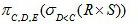
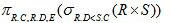
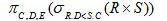
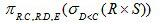
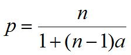
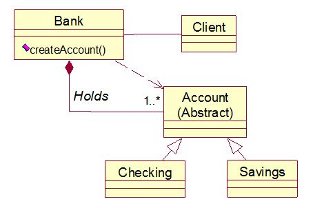
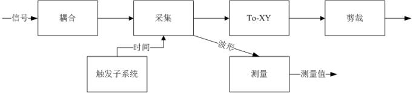

# 2010年系统架构师考试科目一：综合知识

**题目1：** 某公司欲对其内部的信息系统进行集成，需要实现在系统之间快速传递可定制格式的数据包，并且当有新的数据包到达时，接收系统会自动得到通知。另外还要求支持数据重传，以确保传输的成功。针对这些集成需求，应该采用( )的集成方式。

A. 远程过程调用
B. 共享数据库
C. 文件传输
D. 消息传递

**正确答案：** （未提供）
**解析：** 根据题干描述，该公司需要在应用集成后实现采用可定制的格式频繁地、立即地、可靠地、异步地传输数据包。远程过程调用一般是基于同步的方式，效率较低，而且容易失败；共享数据库和文件传输的集成方式在性能方面较差，系统不能保持即时数据同步，而且容易造成应用与数据紧耦合；消息传递的集成方式能够保证数据的异步、立即、可靠传输，恰好能够满足该公司的集成需求。

---

**题目2：** 采用微内核结构的操作系统提高了系统的灵活性和可扩展性，( )。

A. 并增强了系统的可靠性和可移植性，可运行于分布式系统中
B. 并增强了系统的可靠性和可移植性，但不适用于分布式系统
C. 但降低了系统的可靠性和可移植性，可运行于分布式系统中
D. 但降低了系统的可靠性和可移植性，不适用于分布式系统

**正确答案：** A
**解析：** 本题考查操作系统基本概念。在设计微内核OS 时，采用了面向对象的技术，其中的“封装”，“继承”，“对象类”和“多态性”，以及在对象之间采用消息传递机制等，都十分有利于提高系统的“正确性”、“可靠性”、“易修改性”、“易扩展性”等，而且还能显著地减少开发系统所付出的开销。采用微内核结构的操作系统与传统的操作系统相比，其优点是提高了系统的灵活性、可扩充性，增强了系统的可靠性，提供了对分布式系统的支持。其原因如下：①灵活性和可扩展性：由于微内核OS 的许多功能是由相对独立的服务器软件来实现的，当开发了新的硬件和软件时，微内核OS 只须在相应的服务器中增加新的功能，或再增加一个专门的服务器。与此同时，也必然改善系统的灵活性，不仅可在操作系统中增加新的功能，还可修改原有功能，以及删除已过时的功能，以形成一个更为精干有效的操作系统。②增强了系统的可靠性和可移植性：由于微内核是出于精心设计和严格测试的，容易保证其正确性；另一方面是它提供了规范而精简的应用程序接口（API），为微内核外部的程序编制高质量的代码创造了条件。此外，由于所有服务器都是运行在用户态，服务器与服务器之间采用的是消息传递通信机制，因此，当某个服务器出现错误时，不会影响内核，也不会影响其它服务器。另外，由于在微内核结构的操作系统中，所有与特定CPU 和I/O 设备硬件有关的代码，均放在内核和内核下面的硬件隐藏层中，而操作系统其它绝大部分(即各种服务器)均与硬件平台无关，因而，把操作系统移植到另一个计算机硬件平台上所需作的修改是比较小的。③提供了对分布式系统的支持：由于在微内核OS 中，客户和服务器之间以及服务器和服务器之间的通信，是采用消息传递通信机制进行的，致使微内核OS 能很好地支持分布式系统和网络系统。事实上，只要在分布式系统中赋予所有进程和服务器惟一的标识符，在微内核中再配置一张系统映射表(即进程和服务器的标识符与它们所驻留的机器之间的对应表)，在进行客户与服务器通信时，只需在所发送的消息中标上发送进程和接收进程的标识符，微内核便可利用系统映射表，将消息发往目标，而无论目标是驻留在哪台机器上。

---

**题目3：** 若操作系统文件管理程序正在将修改后的( )文件写回磁盘时系统发生崩溃，对系统的影响相对较大。

A. 用户数据
B. 用户程序
C. 系统目录
D. 空闲块管理

**正确答案：** C
**解析：** 本题考查操作系统基本概念。操作系统为了实现“按名存取”，必须为每个文件设置用于描述和控制文件的数据结构，专门用于文件的检索，因此至少要包括文件名和存放文件的物理地址，该数据结构称为文件控制块（File Control Block，FCB），文件控制块的有序集合称为文件目录，或称系统目录文件。若操作系统正在将修改后的系统目录文件写回磁盘时系统发生崩溃，则对系统的影响相对较大。

---

**题目4：** 某虚拟存储系统采用最近最少使用(LRU)页面淘汰算法，假定系统为每个作业分配4个页面的主存空间，其中一个页面用来存放程序。现有某作业的程序如下：Var A: Array[1..100，1..100] OF integer; i，j: integer; FOR i:=1 to 100 DO FOR j:=1 to 100 DO A[i，j]:=0;设每个页面可存放200 个整数变量，变量i、j 存放在程序页中。初始时，程序及i、j 均已在内存，其余3 页为空。若矩阵A 按行序存放，那么当程序执行完后共产生( )次缺页中断；若矩阵A 按列序存放，那么当程序执行完后共产生( )次缺页中断。

A. 50
B. 100
C. 5000
D. 10000
A. 50
B. 100
C. 5000
D. 10000

**正确答案：** A、C
**解析：** 解析一：矩阵A[100][100]总共有100 行、100 列，若矩阵A 按行序存放，那么每一个页面可以存放2 行，也就是说矩阵的2 行刚好放在1 页内，访问他们需要中断1 次，这样100 行总共需要中断50 次。若矩阵A 按列序存放，那么每一个页面可以存放2 列，也就是说矩阵的2 列刚好放在1页内，由于内循环“FOR j:=1 to 100 DO”是按列序变化，访问他们需要中断50 次，这样100行总共需要中断50×100 次。解析二：从题干可知，作业共有4 个页面的主存空间，其中一个已被程序本身占用，所以在读取变量时可用的页面数只有3 个。每个页面可存放200 个整数变量，程序中A 数组共有100*100=10000 个变量。按行存放时，每个页面调入的200 个变量刚好是程序处理的200 个变量，所以缺页次数为10000/200=50。而按列存放时，虽然每个页面调取数据时，同样也读入了200 个变量，但这200 个变量中，只有2 个是近期需要访问的(如第1 个页面调入的是A[*，1]与A[*，2]，但程序近期需要访问的变量只有A[1，1]和A[1，2])，所以缺页次数为10000/2=5000。

---

**题目5：** 在数据库设计的( )阶段进行关系规范化。

A. 需求分析
B. 概念设计
C. 逻辑设计
D. 物理设计

**正确答案：** C
**解析：** 数据库设计分为用户需求分析、概念设计、逻辑设计和物理设计四个主要阶段。将抽象的概念模型转化为与选用的DBMS 产品所支持的数据模型相符合的逻辑模型，它是物理设计的基础。包括模式初始设计、子模式设计、应用程序设计、模式评价以及模式求精。逻辑设计阶段的任务是将概念模型设计阶段得到的基本E-R 图，转换为与选用的DBMS产品所支持的数据模型相符合的逻辑结构。如采用基于E-R 模型的数据库设计方法，该阶段就是将所设计的E-R 模型转换为某个DBMS 所支持的数据模型；如采用用户视图法，则应进行模式的规范化，列出所有的关键字以及用数据结构图描述表集合中的约束与联系，汇总各用户视图的设计结果，将所有的用户视图合成一个复杂的数据库系统。

---

**题目6：** 某数据库中有员工关系E(员工号，姓名，部门，职称，月薪)；产品关系P(产品号，产品名称，型号，尺寸，颜色)；仓库关系W(仓库号，仓库名称，地址，负责人)；库存关系I(仓库号，产品号，产品数量)。

A. 若数据库设计中要求：
①仓库关系W 中的“负责人”引用员工关系的员工号
②库存关系I 中的“仓库号，产品号”惟一标识I 中的每一个记录
③员工关系E 中的职称为“工程师”的月薪不能低于3500 元
则①②③依次要满足的完整性约束是(
)。
B. 若需得到每种产品的名称和该产品的总库存量，则对应的查询语句为：
SELELCT 产品名称，SUM(产品数量
FROM P，I
WHERE P.产品号= I.产品号(
);
(1)A．实体完整性、参照完整性、用户定义完整性
B. 参照完整性、实体完整性、用户定义完整性
C. 用户定义完整性、实体完整性、参照完整性
D. 实体完整性、用户定义完整性、参照完整性
(2)A．ORDER BY 产品名称
B. ORDER BY 产品数量
C. GROUP BY 产品名称
D. GROUP BY 产品数量

**正确答案：** （未提供）
**解析：** 关系模型的完整性规则是对关系的某种约束条件。关系模型中可以有三类完整性约束：实体完整性、参照完整性和用户定义的完整性。实体完整性规定基本关系的主属性不能取空值。由于①仓库关系W 中的“负责人”引用员工关系的员工号，所以应满足参照完整性约束；②库存关系I 中的“仓库号，产品号”惟一标识I 中的每一个记录，所以应满足实体完整性约束；③职称为“工程师”的月薪不能低于3500 元，是针对某一具体关系数据库的约束条件，它反映某一具体应用所涉及的数据必须满足的语义要求，所以应满足用户定义完整性约束。因此，试题(1)的正确答案为B。SQL 查询是数据库中非常重要的内容。该SQL 查询要求对查询结果进行分组，即具有相同名称的产品的元组为一组，然后计算每组的库存数量。由此可排除A、B 和D，所以试题(2)正确答案为C。

---

**题目7：** 若对关系R(A，B，C，D)和S(C，D，E)进行关系代数运算，则表达式与( )等价。A. B. C. D.

**正确答案：** B

---

**题目8：** 计算机执行程序时，在一个指令周期的过程中，为了能够从内存中读指令操作码，首先是将( )的内容送到地址总线上。

A. 程序计数器PC
B. 指令寄存器IR
C. 状态寄存器SR
D. 通用寄存器GR

**正确答案：** （未提供）
**解析：** 计算机执行程序时，在一个指令周期的过程中，为了能够从内存中读指令操作码，首先是将程序计数器(PC)的内容送到地址总线上。

---

**题目9：** 内存按字节编址，利用8K×4bit 的存储器芯片构成84000H 到8FFFFH 的内存，共需( )片。

A. 6
B. 8
C. 12
D. 24

**正确答案：** （未提供）
**解析：** 根据题目描述，采用该存储器芯片需要构成8FFFFH －84000H + 1 = C000H 的空间，且内存按照字节（8bit）编码，需要的容量是C000H×8bit。C000H×8bit =49152×8bit=48×1024×8bit=48K×8bit，一片存储芯片的容量是8K× 4bit，两者相除得12。

---

**题目10：** 某磁盘磁头从一个磁道移至另一个磁道需要10ms。文件在磁盘上非连续存放，逻辑上相邻数据块的平均移动距离为10 个磁道，每块的旋转延迟时间及传输时间分别为100ms 和2ms，则读取一个100 块的文件需要( )ms 的时间。

A. 10200
B. 11000
C. 11200
D. 20200

**正确答案：** （未提供）
**解析：** 根据题目描述，读取一个连续数据需要的时间包括磁道移动时间、旋转延迟时间和传输时间三个部分，总时间花费为(10×10) + 100 + 2 = 202ms，因此读取一个100 块文件需要的时间为202×100=20200ms。

---

**题目11：** 计算机系统中，在( )的情况下一般应采用异步传输方式。

A. CPU 访问内存
B. CPU 与I/O 接口交换信息
C. CPU 与PCI 总线交换信息
D. I/O 接口与打印机交换信息

**正确答案：** （未提供）
**解析：** 本题考查计算机系统中数据传输的方式。CPU 访问内存通常是同步方式，CPU 与I/O接口交换信息通常是同步方式，CPU 与PCI 总线交换信息通常是同步方式，I/O 接口与打印机交换信息则通常采用基于缓存池的异步方式，因此答案为D。

---

**题目12：** 大型局域网通常划分为核心层、汇聚层和接入层，以下关于各个网络层次的描述中，不正确的是( )。

A. 核心层进行访问控制列表检查
B. 汇聚层定义了网络的访问策略
C. 接入层提供局域网络接入功能
D. 接入层可以使用集线器代替交换机

**正确答案：** A
**解析：** 本题主要考查大型局域网的层次和各个层次的功能，大型局域网通常划分为核心层、汇聚层和接入层，其中核心层在逻辑上只有一个，它连接多个分布层交换机，通常是一个园区中连接多个建筑物的总交换机的核心网络设备；汇聚层定义的网络的访问策略；接入层提供局域网络接入功能，可以使用集线器代替交换机。

---

**题目13：** 网络系统设计过程中，逻辑网络设计阶段的任务是( )。

A. 依据逻辑网络设计的要求，确定设备的物理分布和运行环境
B. 分析现有网络和新网络的资源分布，掌握网络的运行状态
C. 根据需求规范和通信规范，实施资源分配和安全规划
D. 理解网络应该具有的功能和性能，设计出符合用户需求的网络

**正确答案：** C
**解析：** 本题主要考查网络设计方面的基础知识。根据网络系统设计的一般规则，在逻辑网络设计阶段的任务通常是根据需求规范和通信规范，实施资源分配和安全规划。其他几个选项都不是逻辑网络设计阶段的任务。

---

**题目14：** 网络系统生命周期可以划分为5 个阶段，实施这5 个阶段的合理顺序是( )。

A. 需求规范、通信规范、逻辑网络设计、物理网络设计、实施阶段
B. 需求规范、逻辑网络设计、通信规范、物理网络设计、实施阶段
C. 通信规范、物理网络设计、需求规范、逻辑网络设计、实施阶段
D. 通信规范、需求规范、逻辑网络设计、物理网络设计、实施阶段

**正确答案：** （未提供）
**解析：** 本题主要考查网络系统生命周期的基础知识。网络系统生命周期可以划分为5 个阶段，实施这5 个阶段的合理顺序是需求规范、通信规范、逻辑网络设计、物理网络设计、实施阶段。

---

**题目15：** 假设单个CPU 的性能为1，则由n 个这种CPU 组成的多处理机系统的性能P 为：其中，a 是一个表示开销的常数。例如，a=0.1，n=4 时，P 约为3。也就是说，由4 个这种CPU 组成的多机系统的性能约为3。该公式表明，多机系统的性能有一个上限，不管n 如何增加，P 都不会超过某个值。当a=0.1 时，这个上限是( )。

A. 5
B. 10
C. 15
D. 20

**正确答案：** （未提供）
**解析：** 将a=0.1 带入式子，求极限为10。

---

**题目16：** 以下关于系统性能的叙述中，不正确的是( )。

A. 常见的Web 服务器性能评估方法有基准测试、压力测试和可靠性测试
B. 评价Web 服务器的主要性能指标有最大并发连接数、响应延迟和吞吐量
C. 对运行系统进行性能评估的主要目的是以更好的性能/价格比更新系统
D. 当系统性能降到基本水平时，需要查找影响性能的瓶颈并消除该瓶颈

**正确答案：** C
**解析：** 本题主要考查系统性能评估的主要方法和需要注意的问题。对运行系统进行评估的主要目的是评价信息系统在性能方面的表现，找出系统可能存在的性能瓶颈。其中，常见的Web服务器性能评估方法有基准测试、压力测试和可靠性测试等，评价Web 服务器的主要性能指标有最大并发连接数、响应延迟和吞吐量等。当系统性能降到基本水平时，需要查找影响性能的瓶颈并消除该瓶颈。

---

**题目17：** 某大型公司欲开发一个门户系统，该系统以商业流程和企业应用为核心，将商业流程中不同的功能模块通过门户集成在一起，以提高公司的集中贸易能力、协同能力和信息管理能力。根据这种需求，采用企业( )门户解决方案最为合适。

A. 信息
B. 知识
C. 应用
D. 垂直

**正确答案：** C
**解析：** 企业门户是一个信息技术平台，这个平台可以提供个性化的信息服务，为企业提供一个单一的访问企业各种信息资源和应用程序的入口。现有的企业门户大致可以分为企业信息门户、企业知识门户和企业应用门户三种。其中企业信息门户重点强调为访问结构数据和无结构数据提供统一入口，实现收集、访问、管理和无缝集成。企业知识门户提供了一个创造、搜集和传播企业知识的平台，通过企业知识门户，员工可以与工作团队中的其他成员取得联系，寻找能够提供帮助的专家。企业应用门户是一个用来提高企业的集中贸易能力、协同能力和信息管理能力的平台。它以商业流程和企业应用为核心，将商业流程中功能不同的应用模块通过门户集成在一起，提高公司的集中贸易能力、协同能力和信息管理能力。

---

**题目18：** 客户关系管理(CRM)系统将市场营销的科学管理理念通过信息技术的手段集成在软件上，能够帮助企业构建良好的客户关系。以下关于CRM 系统的叙述中，错误的是( )。

A. 销售自动化是CRM 系统中最基本的模块
B. 营销自动化作为销售自动化的补充，包括营销计划的编制和执行、计划结果分析等
C. CRM 系统能够与ERP 系统在财务、制造、库存等环节进行连接，但两者关系相
对松散，一般不会形成闭环结构
D. 客户服务与支持是CRM 系统的重要功能。目前，客户服务与支持的主要手段是通
过呼叫中心和互联网来实现

**正确答案：** C
**解析：** 客户关系管理（CRM）系统将市场营销的科学管理理念通过信息技术的手段集成在软件上，能够帮助企业构建良好的客户关系。在客户管理系统中，销售自动化是其中最为基本的模块，营销自动化作为销售自动化的补充，包括营销计划的编制和执行、计划结果分析等功能。客户服务与支持是CRM 系统的重要功能。目前，客户服务与支持的主要手段有两种，分别是呼叫中心和互联网。CRM 系统能够与ERP 系统在财务、制造、库存等环节进行连接，两者之间虽然关系比较独立，但由于两者之间具有一定的关系，因此会形成一定的闭环反馈结构。

---

**题目19：** 共享数据库是一种重要的企业应用集成方式。以下关于共享数据库集成方式的叙述中，错误的是( )。

A. 共享数据库集成方式通常将应用程序的数据存储在一个共享数据库中，通过制定统
一的数据库模式来处理不同应用的集成需求
B. 共享数据库为不同的应用程序提供了统一的数据存储与格式定义，能够解决不同应
用程序中数据语义不一致的问题
C. 多个应用程序可能通过共享数据库频繁地读取和修改相同的数据，这会使共享数据
库成为一个性能瓶颈
D. 共享数据库集成方式的一个重要限制来自外部的已封装应用，这些封装好的应用程
序只能采用自己定义的数据库模式，调整和集成余地较小

**正确答案：** ：B
**解析：** 共享数据库是一种重要的企业应用集成方式，它通常将应用程序的数据存储在一个共享数据库中，通过制定统一的数据库模式来处理不同应用的集成需求。共享数据库为不同的应用程序提供了统一的数据存储与格式定义，能够在一定程度上缓解数据语义不一致的问题，但无法完全解决该问题。在共享数据库集成中，多个应用程序可能通过共享数据库频繁地读取和修改相同的数据，这会使数据库成为一个性能瓶颈。共享数据库集成方式的一个重要限制来自外部的已封装应用，这些封装好的应用程序只能采用自己定义的数据库模式，调整和集成余地较小。

---

**题目20：** 详细的项目范围说明书是项目成功的关键。( )不应该属于范围定义的输入。

A. 项目章程
B. 项目范围管理计划
C. 批准的变更申请
D. 项目文档管理方案

**正确答案：** （未提供）
**解析：** 在初步项目范围说明书中已文档化的主要的可交付物、假设和约束条件的基础上准备详细的项目范围说明书，是项目成功的关键。范围定义的输入包括以下内容：①项目章程。如果项目章程或初始的范围说明书没有在项目执行组织中使用，同样的信息需要进一步收集和开发，以产生详细的项目范围说明书。②项目范围管理计划。③组织过程资产。④批准的变更申请。所以项目文档管理方案不属于范围定义的输入。

---

**题目21：** 项目时间管理包括使项目按时完成所必需的管理过程，活动定义是其中的一个重要过程。通常可以使用( )来进行活动定义。

A. 鱼骨图
B. 工作分解结构(WBS)
C. 层次分解结构
D. 功能分解图

**正确答案：** B
**解析：** 项目时间管理包括使项目按时完成所必需的管理过程。项目时间管理中的过程包括：活动定义、活动排序、活动的资源估算、活动历时估算、制定进度计划以及进度控制。为了得到工作分解结构（Work Breakdown Structure，WBS）中最底层的交付物，必须执行一系列的活动。对这些活动的识别以及归档的过程就是活动定义。鱼骨图（也称为Ishikawa 图）是一种发现问题“根本原因”的方法，通常用来进行因果分析。

---

**题目22：** 在实际的项目开发中，人们总是希望使用自动工具来执行需求变更控制过程。下列描述中，( )不是这类工具所具有的功能。

A. 可以定义变更请求的数据项以及变更请求生存期的状态转换图
B. 记录每一种状态变更的数据，确认做出变更的人员
C. 可以加强状态转换图使经授权的用户仅能做出所允许的状态变更
D. 定义变更控制计划，并指导设计入员按照所制定的计划实施变更

**正确答案：** D
**解析：** 对许多项目来说，系统软件总需要不断完善，一些需求的改进是合理的而且不可避免，要使得软件需求完全不变更，也许是不可能的，但毫无控制的变更是项目陷入混乱、不能按进度完成或者软件质量无法保证的主要原因之一。一个好的变更控制过程，给项目风险承担者提供了正式的建议需求变更机制。可以通过需求变更控制过程来跟踪已建议变更的状态，使已建议的变更确保不会丢失或疏忽。在实际中，人们总是希望使用自动工具来执行变更控制过程。有许多人使用商业问题跟踪工具来收集、存储、管理需求变更；可以使用工具对一系列最近提交的变更建议产生一个列表给变更控制委员会开会时做议程用。问题跟踪工具也可以随时按变更状态分类包裹变更请求的数目。挑选工具时可以考虑以下几个方面：①可以定义变更请求的数据项。②可以定义变更请求生存期的状态转换图。③可以加强状态转换图使经授权的用户仅能做出所允许的状态变更。④记录每一种状态变更的数据，确认做出变更的人员。⑤可以定义在提交新请求或请求状态被更新后应该自动通知的设计人员。⑥可以根据需要生成标准的或定制的报告和图表。D 选项变更控制计划是需要人为指定的。

---

**题目23：** 需求管理是CMM 可重复级中的6 个关键过程域之一，其主要目标是( )。

A. 对于软件需求，必须建立基线以进行控制，软件计划、产品和活动必须与软件需求
保持一致
B. 客观地验证需求管理活动符合规定的标准、程序和要求
C. 策划软件需求管理的活动，识别和控制已获取的软件需求
D. 跟踪软件需求管理的过程、实际结果和执行情况

**正确答案：** A
**解析：** 过程能力成熟度模型(Capability Maturity Model，CMM)在软件开发机构中被广泛用来指导软件过程改进。该模型描述了软件成立能力的5 个成熟级别，每一级都包含若干关键过程域(Key Process．Areas，KPA)。CMM 的第二级为可重复级，它包括6 个关键过程域，分别是：需求管理、软件项目计划、软件项目跟踪和监督、软件分包合同管理、软件质量保证和软件配置管理。需求管理的目标是为软件需求建立一个基线，提供给软件工程和管理使用；软件计划、产品和活动与软件需求保持一致。

---

**题目24：** 在RUP 中采用“4+1”视图模型来描述软件系统的体系结构。在该模型中，最终用户侧重于( )，系统工程师侧重于( )。(1)A．实现视图

B. 进程视图
C. 逻辑视图
D. 部署视图
(2)A．实现视图
B. 进程视图
C. 逻辑视图
D. 部署视图

**正确答案：** （未提供）
**解析：** 在RUP 中采用“4+1”视图模型来描述软件系统的体系结构。“4+1”视图包括逻辑视图、实现视图、进程视图、部署视图和用例视图。分析人员和测试人员关心的是系统的行为，因此会侧重于用例视图；最终用户关心的是系统的功能，因此会侧重于逻辑视图；程序员关心的是系统的配置、装配等问题，因此会侧重于实现视图；系统集成人员关心的是系统的性能、可伸缩性、吞吐率等问题，因此会侧重于进程视图；系统工程师关心的足系统的发布、安装、拓扑结构等问题，因此会侧重于部署视图。

---

**题目25：** ( )把整个软件开发流程分成多个阶段，每一个阶段都由目标设定、风险分析、开发和有效性验证以及评审构成。

A. 原型模型
B. 瀑布模型
C. 螺旋模型
D. V 模型

**正确答案：** C
**解析：** 原型模型又称快速原型。原型模型主要有两个阶段：①原型开发阶段。软件开发人员根据用户提出的软件系统的定义，快速地开发一个原型。该原型应该包含目标系统的关键问题和反映目标系统的大致面貌，展示目标系统的全部或部分功能、性能等。②目标软件开发阶段。在征求用户对原型的意见后对原型进行修改完善，确认软件系统的需求并达到一致的理解，进一步开发实际系统。瀑布模型可以说是最早使用的软件生存周期模型之一。由于这个模型描述了软件生存的一些基本过程活动，所以它被称为软件生存周期模型。这些活动从一个阶段到另一个阶段逐次下降，形式上很像瀑布。瀑布模型的特点是因果关系紧密相连，前一个阶段工作的结果是后一个阶段工作的输入。螺旋模型是在快速原型的基础上扩展而成的。这个模型把整个软件开发流程分成多个阶段，每个阶段都由4 部分组成，它们是：①目标设定。为该项目进行需求分析，定义和确定这一个阶段的专门目标，指定对过程和产品的约束，并且制定详细的管理计划。②风险分析。对可选方案进行风险识别和详细分析，制定解决办法，采取有效的措施避免这些风险。③开发和有效性验证。风险评估后，可以为系统选择开发模型，并且进行原型开发，即开发软件产品。④评审。对项目进行评审，以确定是否需要进入螺旋线的下一次回路，如果决定继续，就要制定下一阶段计划。V 模型是一种典型的测试模型。在V 模型中测试过程被加在开发过程的后半部分，分别包括单元测试、集成测试、系统测试和验收测试。

---

**题目26：** 软件开发环境是支持软件产品开发的软件系统，它由软件工具集和环境集成机制构成。环境集成机制包括：提供统一的数据模式和数据接口规范的数据集成机制；支持各开发活动之间通信、切换、调度和协同的( )；为统一操作方式提供支持的( )。(1)A．操作集成机制

B. 控制集成机制
C. 平台集成机制
D. 界面集成机制
(2)A．操作集成机制
B. 控制集成机制
C. 平台集成机制
D. 界面集成机制

**正确答案：** B、D
**解析：** 软件开发环境（software development environment）是支持软件产品开发的软件系统。它由软件工具集和环境集成机制构成，前者用来支持软件开发的相关过程、活动和任务年；后者为工具集成和软件开发、维护和管理提供统一的支持，它通常包括数据集成、控制集成和界面集成。数据集成机制提供了存储或访问环境信息库的统一的数据接口规范；界面集成机制采用统一的界面形式，提供统一的操作方式；控制集成机制支持各开发活动之间的通信、切换、调度和协同工作。

---

**题目27：** 软件的横向重用是指重用不同应用领域中的软件元素。( )是一种典型的、原始的横向重用机制。

A. 对象
B. 构件
C. 标准函数库
D. 设计模式

**正确答案：** C
**解析：** 软件重用是指在两次或多次不同的软件开发过程中重复使用相同或相似软件元素的过程。按照重用活动是否跨越相似性较少的多个应用领域，软件重用可以区别为横向重用和纵向重用。横向重用是指重用不同应用领域中的软件元素，例如数据结构、分类算法和人机界面构建等。标准函数是一种典型的、原始的横向重用机制。纵向重用是指在一类具有较多公共性的应用领域之间进行软部件重用。纵向重用活动的主要关键点是域分析：根据应用领域的特征及相似性预测软部件的可重用性。

---

**题目28：** 下列关于不同软件开发方法所使用的模型的描述中，正确的是( )。

A. 在进行结构化分析时，必须使用数据流图和软件结构图这两种模型
B. 采用面向对象开发方法时，可以使用状态图和活动图对系统的动态行为进行建模
C. 实体联系图(E-R 图)是在数据库逻辑结构设计时才开始创建的模型
D. UML 的活动图与程序流程图的表达能力等价

**正确答案：** B。ACD 选项说法绝对

---

**题目29：** 某银行系统采用Factory Method 方法描述其不同账户之间的关系，设计出的类图如下所示。其中与Factory Method 中的“Creator”角色相对应的类是( )；与“Product”角色相对应的类是( )。

A. Bank
B. Account
C. Checking
D. Savings
A. Bank
B. Account
C. Checking
D. Savings

**正确答案：** A、B
**解析：** Factory Method 模式的意图是，定义一个用于创建对象的接口，让子类决定实例化哪一个类。Factory Method 是一个类的实例化延迟到其子类。Factory Method 模式的类图如下图所示。其中，类Product 定义了Factory Method 所创建的对象的接口；类ConcreteProduct 用于实现Product 接口；类Creator 声明了工厂方法，该方法返回一个Product 类型的对象。Creator 也可以定义一个工厂方法的缺省实现，它返回一个缺省的ConcreteProduct 对象。类ConcreteCreator 重定义了工厂方法，以返回一个ConcreteProduct 实例。对照两张类图可以看出，与“Creator”角色相对应的类是Bank；与“Product”角色相对应的类是Accout。

---

**题目30：** ( )是一个独立可交付的功能单元，外界通过接口访问其提供的服务。

A. 面向对象系统中的对象(Object)
B. 模块化程序设计中的子程序(Subroutine)
C. 基于构件开发中的构件(Component)
D. 系统模型中的包(Package)

**正确答案：** ：C
**解析：** 在基于构件的开发中，构件包含并扩展了模块化程序设计中子程序、面向对象系统中对象或类和系统模型中包的思想，它是系统设计、实现和维护的基础。构件定义为通过接口访问服务的一个独立可交付的功能单元。

---

**题目31：** 在基于构件的软件开发中，( )描述系统设计蓝图以保证系统提供适当的功能；( )用来了解系统的性能、吞吐率等非功能性属性。(1)A．逻辑构件模型

B. 物理构件模型
C. 组件接口模型
D. 系统交互模型
(2)A．逻辑构件模型
B. 物理构件模型
C. 组件接口模型
D. 系统交互模型

**正确答案：** （未提供）
**解析：** 在基于构件的软件开发中，逻辑构件模型用功能包描述系统的抽象设计，用接口描述每个服务集合，以及功能之间如何交互以满足用户需求，它作为系统的设计蓝图以保证系统提供适当的功能。物理构件模型用技术设施产品、硬件分布和拓扑结构、以及用于绑定的网络和通信协议描述系统的物理设计，这种架构用于了解系统的性能、吞吐率等许多非功能性属性。

---

**题目32：** 对象管理组织(OMG)基于CORBA 基础设施定义了四种构件标准。其中，( )的状态信息是由构件自身而不是由容器维护。

A. 实体构件
B. 加工构件
C. 服务构件
D. 会话构件

**正确答案：** D
**解析：** 对象管理组织（OMG）基于CORBA 基础设施定义了四种构件标准。实体（Entity）构件需要长期持久化并主要用于事务性行为，由容器管理其持久化。加工（Process）构件同样需要容器管理其持久化，但没有客户端可访问的主键。会话（Session）构件不需要容器管理其持久化，其状态信息必须由构件自己管理。服务（Service）构件是无状态的。

---

**题目33：** 分布式系统开发中，通常需要将任务分配到不同的逻辑计算层。业务数据的综合计算分析任务属于( )。

A. 表示逻辑层
B. 应用逻辑层
C. 数据处理层
D. 数据层

**正确答案：** （未提供）
**解析：** 分布式系统开发分为五个逻辑计算层：表示层实现用户界面；表示逻辑层为了生成数据表示而必须进行的处理任务，如输入数据编辑等；应用逻辑层包括为支持实际业务应用和规则所需的应用逻辑和处理过程，如信用检查、数据计算和分析等；数据处理层包括存储和访问数据库中的数据所需的应用逻辑和命令，如查询语句和存储过程等；数据层是数据库中实际存储的业务数据。

---

**题目34：** 在客户机/服务器系统开发中，采用( )时，应将数据层和数据处理层放置于服务器，应用逻辑层、表示逻辑层和表示层放置于客户机。

A. 分布式表示结构
B. 分布式应用结构
C. 分布式数据和应用结构
D. 分布式数据结构

**正确答案：** D
**解析：** 客户机/服务器系统开发时可以采用不同的分布式计算架构：①分布式表示架构是将表示层和表示逻辑层迁移到客户机，应用逻辑层、数据处理层和数据层仍保留在服务器上；②分布式数据架构是将数据层和数据处理层放置于服务器，应用逻辑层、表示逻辑层和表示层放置于客户机；③分布式数据和应用架构是将数据层和数据处理层放置在数据服务器上，应用逻辑层放置在应用服务器上，表示逻辑层和表示层放置在客户机上。

---

**题目35：** 系统输入设计中，采用内部控制方式以确保输入系统数据的有效性，( )用于验证数据是否位于合法的取值范围。

A. 数据类型检查
B. 自检位
C. 域检查
D. 格式检查

**正确答案：** （未提供）
**解析：** 系统输入设计中，通常通过内部控制的方式验证输入数据的有效性。数据类型检查确保输入了正确的数据类型；自检位用于对主关键字进行基于校验位的检查；域检查用于验证数据是否位于合法的取值范围；格式检查按照已知的数据格式对照检查输入数据的格式。

---

**题目36：** 系统测试由若干个不同的测试类型组成，其中( )检查系统能力的最高实际限度，即软件在一些超负荷情况下的运行情况；( )主要是检查系统的容错能力。(1)A．强度测试

B. 性能测试
C. 恢复测试
D. 可靠性测试
(2)A．强度测试
B. 性能测试
C. 恢复测试
D. 可靠性测试

**正确答案：** A、C
**解析：** 系统测试是根据系统方案说明书来设计测试例子的，常见的系统测试主要有以下内容：恢复测试：恢复测试监测系统的容错能力。安全性测试：系统的安全性测试是检测系统的安全机制、保密措施是否完善，主要是为了检验系统的防范能力。强度测试：是对系统在异常情况下的承受能力的测试，是检查系统在极限状态下运行时，性能下降的幅度是否在允许的范围内。性能测试：检查系统是否满足系统设计方案说明书对性能的要求。。可靠性测试：通常使用以下两个指标来衡量系统的可靠性：平均失效间隔时间MTBF(mean time between failures)是否超过了规定的时限，因故障而停机时间MTTR(mean time to repairs)在一年中不应超过多少时间。安装测试：在安装软件系统时，会有多种选择。安装测试就是为了检测在安装过程中是否有误、是否容易操作等。

---

**题目37：** 软件架构是降低成本、改进质量、按时和按需交付产品的关键因素。以下关于软件架构的描述，错误的是( )。

A. 根据用户需求，能够确定一个最佳的软件架构，指导整个软件的开发过程
B. 软件架构设计需要满足系统的质量属性，如性能、安全性和可修改性等
C. 软件架构设计需要确定组件之间的依赖关系，支持项目计划和管理活动
D. 软件架构能够指导设计入员和实现人员的工作

**正确答案：** （未提供）
**解析：** 软件架构是降低成本、改进质量、按时和按需交付产品的关键因素，软件架构设计需要满足系统的质量属性，如性能、安全性和可修改性等，软件架构设计需要确定组件之间的依赖关系，支持项目计划和管理活动，软件架构能够指导设计人员和实现人员的工作。一般在设计软件架构之初，会根据用户需求，确定多个候选架构，并从中选择一个较优的架构，并随着软件的开发，对这个架构进行微调，以达到最佳效果，A 选项错误。

---

**题目38：** 软件架构设计包括提出架构模型、产生架构设计和进行设计评审等活动，是一个迭代的过程以下关于软件架构设计活动的描述，错误的是( )。

A. 在建立软件架构的初期，一般需要选择一个合适的架构风格
B. 将架构分析阶段已标识的构件映射到架构中，并分析这些构件之间的关系
C. 软件架构设计活动将已标识构件集成到软件架构中，设计并实现这些构件
D. 一旦得到了详细的软件架构设计，需要邀请独立于系统开发的外部人员对系统进行
评审

**正确答案：** （未提供）
**解析：** 软件架构设计包括提出架构模型、产生架构设计和进行设计评审等活动，是一个迭代的过程，在建立软件架构的初期，一般需要选择一个合适的架构风格，将架构分析阶段已标识的构件映射到架构中，并分析这些构件之间的关系，一旦得到了详细的软件架构设计，需要邀请独立于系统开发的外部人员对系统进行评审。一般来说，软件架构设计活动将已标识构件集成到软件架构中，设计这些构件，但不予以实现，C 选项错误。

---

**题目39：** 基于软件架构的设计( Architecture Based Software Development，ABSD)强调由商业、质量和功能需求的组合驱动软件架构设计。它强调采用( )来描述软件架构，采用( )来描述需求。(1)A．类图和序列图

B. 视角与视图
C. 构件和类图
D. 构件与功能
(2)A．用例与类图
B. 用例与视角
C. 用例与质量场景
D. 视角与质量场景

**正确答案：** ：B、C
**解析：** 根据定义，基于软件架构的开发(Architecture Based Software Development，ABSD )强调由商业、质量和功能需求的组合驱动软件架构设计。它强调采用视角和视图来描述软件架构，采用用例和质量属性场景来描述需求。

---

**题目40：** 某游戏公司欲开发一个大型多人即时战略游戏，游戏设计的目标之一是能够支持玩家自行创建战役地图，定义游戏对象的行为和之间的关系。针对该目标，公司应该采用( )架构风格最为合适。

A. 管道-过滤器
B. 隐式调用
C. 主程序-子程序
D. 解释器

**正确答案：** （未提供）
**解析：** 本题主要考查软件架构设计策略与架构风格问题。根据题干描述，该软件系统特别强调用户定义系统中对象的关系和行为这一特性，这需要在软件架构层面提供一种运行时的系统行为定义与改变的能力，根据常见架构风格的特点和适用环境，可以知道最合适的架构设计风格应该是解释器风格。

---

**题目41：** 某公司欲为某种型号的示波器开发内置软件。该公司的架构师设计了如下图所示的软件架构。在软件架构评审时，专家认为该架构存在的问题是( )。

A. 在功能划分上将各个模块独立起来
B. 在硬件构件的混合和替换方面不是很灵活
C. 没有清晰地说明用户怎样与其交互
D. 没有明确的层次关系，没有强调功能之间的交互

**正确答案：** C
**解析：** 本题主要考查架构评审和软件架构设计的应用。根据图中示波器的功能描述，结合示波器常见的功能和使用方式，可以看出图中系统设计最大的缺陷在于没有建模系统与外界，特别是用户之间的交互方式。而与用户的交互无疑是示波器的一个十分重要的功能。

---

**题目42：** 某公司承接了一个开发家用空调自动调温器的任务，调温器测量外部空气温度，根据设定的期望温度控制空调的开关。根据该需求，公司应采用( )架构风格最为合适。

A. 解释器
B. 过程控制
C. 分层
D. 管道-过滤器

**正确答案：** （未提供）
**解析：** 本题主要考查架构风格与架构设计策略。根据题目描述，调温器需要实时获取外界的温度信息，并与用户定义的温度进行比较并做出动作。根据该系统的应用领域和实际需求，可以看出这是一个典型的过程控制架构风格的应用场景。

---

**题目43：** 某公司欲开发一个漫步者机器人，用来完成火星探测任务。机器人的控制者首先定义探测任务和任务之间的时序依赖性，机器人接受任务后，需要根据自身状态和外界环境进行动态调整，最终自动完成任务。针对这些需求，该机器人应该采用( )架构风格最为合适。

A. 解释器
B. 主程序-子程序
C. 隐式调用
D. 管道-过滤器

**正确答案：** A
**解析：** 本题主要考查架构风格与架构设计策略。本题出题本就不严谨，从描述来看多种架构风格均合适：过程控制，虚拟机，隐式调用。当次考试参考答案为C，但从此后的同类问题来看，答案修改为“虚拟机（解释器，规则系统）”，所以再次出现该类问题，建议首选虚拟机类风格。

---

**题目44：** 某公司欲开发一个语音识别系统，语音识别的主要过程包括分割原始语音信号、识别音素、产生候选词、判定语法片断、提供语义解释等。每个过程都需要进行基于先验知识的条件判断并进行相应的识别动作。针对该系统的特点，采用( )架构风格最为合适。

A. 解释器
B. 面向对象
C. 黑板
D. 隐式调用

**正确答案：** （未提供）
**解析：** 本题主要考查架构风格与架构设计策略。根据题目描述，语音识别系统是一个十分典型的专家系统，其特点是求解的正确结果不止一个，求解过程比较复杂，需要通过专家知识和反馈逐步得到正确结果。因此对比4 个候选项，黑板结构特别适合求解这类问题，语音识别是黑板架构风格的典型应用。

---

**题目45：** 特定领域软件架构(DSSA)是在一个特定应用领域为一组应用提供组织结构参考的标准软件架构。实施DSSA 的过程中包括一系列基本的活动，其中( )活动的主要目的是为了获得DSSA。该活动参加人员中，( )的主要任务是提供关于领域中系统的需求规约和实现的知识。(1)A．领域需求

B. 领域分析
C. 领域设计
D. 领域实现
(2)A．领域专家
B. 领域分析者
C. 领域设计者
D. 领域实现者

**正确答案：** C、A
**解析：** 参与DSSA 的人员可以划分为四种角色：领域专家、领域分析师、领域设计人员和领域实现人员。领域专家领域专家可能包括该领域中系统的有经验的用户、从事该领域中系统的需求分析、设计、实现以及项目管理的有经验的软件工程师等。领域专家的主要任务包括提供关于领域中系统的需求规约和实现的知识，帮助组织规范的、一致的领域字典，帮助选择样本系统作为领域工程的依据，复审领域模型、DSSA 等领域工程产品，等等。领域专家应该熟悉该领域中系统的软件设计和实现、硬件限制、未来的用户需求及技术走向等。领域分析人员领域分析人员应由具有知识工程背景的有经验的系统分析员来担任。领域分析人员的主要任务包括控制整个领域分析过程，进行知识获取，将获取的知识组织到领域模型中，根据现有系统、标准规范等验证领域模型的准确性和一致性，维护领域模型。领域分析人员应熟悉软件重用和领域分析方法；熟悉进行知识获取和知识表示所需的技术、语言和工具；应具有一定的该领域的经验，以便于分析领域中的问题及与领域专家进行交互；应具有较高的进行抽象、关联和类比的能力；应具有较高的与他人交互和合作的能力。领域设计人员领域设计人员应由有经验的软件设计人员来担任。领域设计人员的主要任务包括控制整个软件设计过程，根据领域模型和现有的系统开发出DSSA，对DSSA 的准确性和一致性进行验证，建立领域模型和DSSA 之间的联系。领域设计人员应熟悉软件重用和领域设计方法；熟悉软件设计方法；应有一定的该领域的经验，以便于分析领域中的问题及与领域专家进行交互。领域实现人员领域实现人员应由有经验的程序设计人员来担任。领域实现人员的主要任务包括根据领域模型和DSSA，或者从头开发可重用构件，或者利用再工程的技术从现有系统中提取可重用构件，对可重用构件进行验证，建立DSSA 与可重用构件间的联系。领域实现人员应熟悉软件重用、领域实现及软件再工程技术；熟悉程序设计；具有一定的该领域的经验。

---

**题目46：** 某服务器软件系统对可用性( Availability ) 、性能(Performance)和可修改性(Modification)的要求较高，( )设计策略能提高该系统的可用性，( )设计策略能够提高该系统的性能，( )设计策略能够提高该系统的可修改性。

A. Ping/Echo
B. 限制访问
C. 运行时注册
D. 接口-实现分离
A. 分层结构
B. 事务机制
C. 主动冗余
D. 队列调度
A. 信息隐藏
B. 记录/回放
C. 任务模型
D. 回滚

**正确答案：** A、D、A
**解析：** 本题主要考查质量属性以及实现质量属性的一般策略，不同策略主要针对一个或多个软件质量属性，其中Ping/Echo 主要提高系统的可用性；限制访问主要提高系统的安全性；运行时注册主要提高系统的可修改性；接口-实现分离主要提高系统的可修改性；主动冗余提高系统的可靠性；队列调度主要提高系统的性能；信息隐藏主要提高系统的可修改性；记录-回放主要提高系统的可测试性，等等。

---

**题目47：** 某服务器软件系统能够正确运行并得出计算结果，但存在“系统出错后不能在要求的时间内恢复到正常状态”和“对系统进行二次开发时总要超过半年的时间”两个问题，上述问题依次与质量属性中的( )相关。

A. 可用性和性能
B. 性能和可修改性
C. 性能和可测试性
D. 可用性和可修改性

**正确答案：** （未提供）
**解析：** 本题主要考查软件质量属性的判断与应用。“系统出错后不能在要求的时间内恢复到正常状态”，这是对系统错误恢复能力的描述，属于系统可用性的范畴。“对系统进行二次开发时总要超过半年的时间”，这是对系统进行调整和维护方面能力的描述，属于系统可修改性的范畴。

---

**题目48：** 某公司欲开发一个软件系统的在线文档帮助系统，用户可以在任何一个查询上下文中输入查询关键字，如果当前查询环境下没有相关内容，则系统会将查询按照一定的顺序转发给其他查询环境。基于上述需求，采用( )最为合适。

A. 责任链模式
B. 桥接模式
C. 装饰模式
D. 适配器模式

**正确答案：** （未提供）
**解析：** 本题主要考查设计模式的理解与应用。根据题干描述，在线文档系统需要根据用户的查询需求逐步将查询请求依次传递，对比4 个候选项，其中在责任链模式里，很多对象由每一个对象对其下家的引用而连接起来形成一条链。请求在这个链上传递，直到链上的某一个对象决定处理此请求。因此责任链模式是能够满足该要求的最好模式。

---

**题目49：** 某公司欲开发一套窗体图形界面类库。该类库需要包含若干预定义的窗格(Pane)对象，例如TextPane、ListPane 等，窗格之间不允许直接引用。基于该类库的应用由一个包含一组窗格的窗口组成，并需要协调窗格之间的行为。基于该类库，在不引用窗格的前提下实现窗格之间的协作，应用开发者应采用( )最为合适。

A. 备忘录模式
B. 中介者模式
C. 访问者模式
D. 迭代器模式

**正确答案：** （未提供）
**解析：** 本题主要考查设计模式的理解与应用。根据题干描述，应用系统需要使用某公司开发的类库，该应用系统是一组窗格组成，应用需要协调窗格之间的行为，并且不能引用窗格自身，在这种要求下，对比4 个候选项，其中中介者模式用一个中介对象封装一系列的对象交互。中介者使用各对象不需要显式的相互调用，从而使其耦合松散。可以看出该模式最符合需求。

---

**题目50：** 某公司开发一个文档编辑器，该编辑器允许在文档中直接嵌入图形对象，但开销很大。用户在系统设计之初提出编辑器在打开文档时必须十分迅速，可以暂时不显示当前页面以外的图形。针对这种需求，公司可以采用( )避免同时创建这些图形对象。

A. 代理模式
B. 外观模式
C. 桥接模式
D. 组合模式

**正确答案：** （未提供）
**解析：** 本题主要考查设计模式的理解与应用。根据题干描述，该编辑器需要在文档中嵌入显示开销很大的图形对象，为了能够提高系统效率，需要避免同时创建这些图像。这对这些要求，对比候选项，可以发现代理模式可以解决直接访问对象时带来的问题，例如：要访问的对象在远程的机器上；对象创建开销很大，或者某些操作需要安全控制，或者需要进程外的访问等。因此代理模式是最为合适的设计模式。

---

**题目51：** 正确识别风险点、非风险点、敏感点和权衡点是进行软件架构评价的关键步骤。其中( )是实现一个特定质量属性的关键特征，该特征为一个或多个软件构件所共有。“改变加密的级别可能会对安全性和性能都产生显著的影响”，这是一个对系统( )的描述。

A. 风险点
B. 非风险点
C. 敏感点
D. 权衡点
A. 风险点
B. 非风险点
C. 敏感点
D. 权衡点

**正确答案：** （未提供）
**解析：** 本题主要考查软件架构评价的理解和应用。正确识别风险点、非风险点、敏感点和权衡点是进行软件架构评价的关键步骤。其中敏感点是实现一个特定质量属性的关键特征，该特征为一个或多个软件构件所共有。系统权衡点会影响一个或多个属性，并对于多个属性来说都是敏感点。基于该定义，可以看出“改变加密的级别可能会对安全性和性能都产生显著的影响”正是一个对系统权衡点的描述。

---

**题目52：** 所谓网络安全漏洞是指( )。

A. 用户的误操作引起的系统故障
B. 网络节点的系统软件或应用软件在逻辑设计上的缺陷
C. 网络硬件性能下降产生的缺陷
D. 网络协议运行中出现的错误

**正确答案：** （未提供）
**解析：** 本题主要考查网络安全漏洞的基本概念，网络安全漏洞通常是指网络节点的系统软件或应用软件在逻辑上的缺陷，因此本题应该选择B。

---

**题目53：** ARP 攻击造成网络无法跨网段通信的原因是( )。

A. 发送大量ARP 报文造成网络拥塞
B. 伪造网关ARP 报文使得数据包无法发送到网关
C. ARP 攻击破坏了网络的物理连通性
D. ARP 攻击破坏了网关设备

**正确答案：** （未提供）
**解析：** 本题主要考查ARP 攻击的定义和特点。ARP 攻击是针对以太网地址解析协议（ARP）的一种攻击技术，此种攻击可让攻击者取得局域网上的数据封包甚至可篡改封包，且可让网络上特定计算机或所有计算机无法正常连接。ARP 攻击造成网络无法跨网段通信的原因是伪造网关ARP 报文使得数据包无法发送到网关。

---

**题目54：** 《GB 8567-88 计算机软件产品开发文件编制指南》是( )标准，违反该标准而造成不良后果时，将依法根据情节轻重受到行政处罚或追究刑事责任。

A. 强制性国家
B. 推荐性国家
C. 强制性软件行业
D. 推荐性软件行业

**正确答案：** A

---

**题目55：** 某软件企业开发了一套能够同硬件结合以提高设备性能的软件产品，向国家专利局申请方法发明专利，获得了专利权，并为该软件产品冠以“昆仑”商品专用标识，但未进行商标注册上市销售。此情况下，该软件产品不可能得到我国( )的保护。

A. 著作权法
B. 专利法
C. 商标法
D. 刑法

**正确答案：** C

---

**题目56：** 张某是M 国际运输有限公司计算机系统管理员。任职期间，根据公司的业务要求开发了“空运出口业务系统”，并由公司使用。随后，张某向国家版权局申请了计算机软件著作权登记，并取得了《计算机软件著作权登记证书》，证书明确软件名称是“空运出口业务系统V1.0”，著作权人为张某。以下说法中，正确的是( )。

A. 空运出口业务系统V1.0 的著作权属于张某
B. 空运出口业务系统V1.0 的著作权属于M 公司
C. 空运出口业务系统V1.0 的著作权属于张某和M 公司
D. 张某获取的软件著作权登记证是不可以撤销的

**正确答案：** ：B

---

**题目57：** 对实际应用问题建立数学模型并求得结果后，还需要根据建模的目的和要求，利用相关知识，结合研究对象的特点，进行模型分析。模型分析工作一般不包括( )。

A. 模型的合理性分析
B. 模型的误差分析
C. 模型的先进性分析
D. 参数的灵敏性分析

**正确答案：** （未提供）
**解析：** 本题主要考查数学建模的基本过程，在对实际应用问题建立数学模型并求得结果后，还需要根据建模的目的和要求，利用相关知识，结合研究对象的特点，进行模型分析。模型分析工作主要包括模型的合理性分析、模型的误差分析和参数的灵敏性分析等，一般不包括模型的先进性分析。

---

**题目58：** 某软件公司开发某种软件产品时花费的固定成本为16 万元，每套产品的可变成本为2元，设销售单价为10 元，则需要销售( )套才能达到盈亏平衡点。

A. 13000
B. 16000
C. 18000
D. 20000

**正确答案：** D
**解析：** 设共销售了n 套，则总成本=固定成本+每套产品的可变成本×n=160000+2n。销售总收入=单价×n=10n。盈亏平衡时，总成本=销售总收入，所以，160000+2n=10n，从而，n=20000（套）。当销售量低于2 万套时，会有亏损；当销售量超过2 万套时就会有盈利。

---

**题目59：** The software architecture is a set of software components, subsystems, relationships ，interactions, the properties of each of these elements，and the set of guiding principles that together constitute the fundamental properties and constraints of a software system or set of systems. ( 1 ) defines a general set of element types and their interactions. The examples include Pipes and Filters, Model-View-Controller, and Reflection. A ( 2 ) in software architecture is a representation used to understand or document one or more aspects of a problem or solution. Architecture is usually used in conjunction with many adjunct terms. The ( 3 )defines the key strategies, organization, goals and related processes of the enterprise. At the enterprise level, the ( 4 ) may be more of a set of guidelines on how the various software architectures should be constructed consistently across the enterprise. The ( 5 ), which describes the high-level set of elements involved in application from a particular domain along with their Interactions, is often used to focus on subsystem definition rather than application process level definition. (1)A．Architectural pattern

B. Architectural description
C. Architectural view
D. Architectural viewpoint
(2)A．model
B. domain
C. component
D. subsystem
(3)A．enterprise architecture
B. technical architecture
C. infrastructure architecture
D. business architecture
(4)A．enterprise architecture
B. data architecture
C. application architecture
D. information architecture
(5)A．product-line architecture
B. reference architecture
C. technology architecture
D. infrastructure architecture

**正确答案：** A、A、D、C、B
**解析：** 软件架构是一组软件构件、子系统、关联关系、交互关系以及其中每个元素的特性和一组指导原则，这些共同构成一个软件系统或一组系统的基本特性和约束。架构模式定义了一组通用的元素类型及其交互关系。其中的例子包括Pipes and Filters、MVC 和Reflection。软件架构中的模型是一种表现形式，用于从一个或多个方面理解或记录一个问题或解决方案。架构通常会与一些附属词结合起来使用。业务架构定义了企业的关键策略、组织、目标和相关过程。在企业层面，应用架构可能更多的是一组关于应该如何在整个企业一致地构建各种软件架构的指导原则。参考架构描述了源自特定领域的应用涉及的高层元素集合及其交互关系，通常用于关注子系统的定义而不是应用过程级别定义。Infrastructure：基础设施

---
