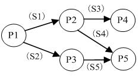
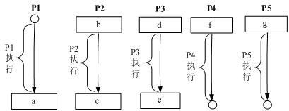
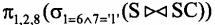
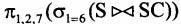
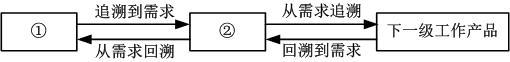
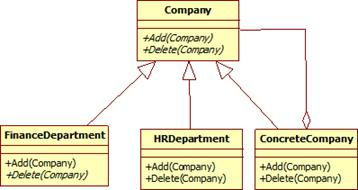
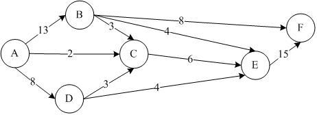
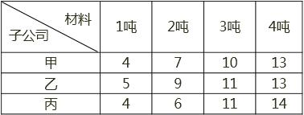

# 2011年系统架构师考试科目一：综合知识

**题目1：** 操作系统为用户提供了两类接口：操作一级和程序控制一级的接口，以下不属于操作一级的接口是( )。

A. 操作控制命令
B. 系统调用
C. 菜单
D. 窗口

**正确答案：** B
**解析：** 本题考查操作系统的基本概念。操作系统是管理计算机硬件与软件资源的程序，同时也是硬件与用户之间的接口。操作系统既提供了与用户交互的接口，也提供了与应用程序交互的接口。用户可以通过菜单，命令，窗口与操作系统进行交互，而应用程序可以通过系统调用(如调用系统API)来与操作系统交互。

---

**题目2：** 进程P1、P2、P3、P4 和P5 的前趋图如下：若用PV 操作控制进程P1～P5 并发执行过程，则需要设置5 个信号量S1、S2、S3、S4 和S5，进程间同步所使用的信号量标注在上图中的边上，且信号量S1～S5 的初始值都等于零，初始状态下从进程P1 开始执行。下图中a、b 和c 处应分别填写( 1 )；d 和e 处应分别填写( 2 )，f 和g 处应分别填写( 3 )。(1)A. V(S1)V(S2)、P(S1)和V(S3) V(S4)

B. P(S1)V(S2)、P(S1)和P(S2) V(S1)
C. V(S1)V(S2)、P(S1)和P(S3) P(S4)
D. P(S1)P(S2)、V(S1)和P(S3) V(S2)
(2)A. P(S1) 和V(S5)
B. V(S1) 和P(S5)
C. P(S2) 和V(S5)
D. V(S2) 和P(S5)
(3)A. P(S3)和V(S4) V(S5)
B. P(S3)和P(S4) P(S5)
C. V(S3)和V(S4) V(S5)
D. V(S3)和P(S4) P(S5)

**正确答案：** ：A、C、B
**解析：** 最简单的理解方式：箭头出就是V 操作，箭头入就是P 操作。

---

**题目3：** 某企业工程项目管理数据库的部分关系模式如下所示，其中带实下划线的表示主键，虚下划线表示外键。其中供应关系是( 1 )的联系。若一个工程项目可以有多个员工参加，每个员工可以参加多个项目，则项目和员工之间是( 2 )联系。对项目和员工关系进行设计时，( 3 ) 设计成一个独立的关系模式。(1)A. 2 个实体之间的1:n

B. 2 个实体之间的n:m
C. 3 个实体之间的1:n:m
D. 3 个实体之间的k:n:m
(2)A. 1:1
B. 1:n
C. n:m
D. n:1
(3)A.多对多的联系在向关系模型转换时必须
B. 多对多的联系在向关系模型转换时无须
C. 只需要将一端的码并入多端，所以无须
D. 不仅需要将一端的码并入多端，而且必须

**正确答案：** D、C、A
**解析：** 题目虽然有多个问题，但实际上只考查了一个知识点——实体之间的联系。供应关系中，有属性：项目号，零件号，供应商号。这些属于分别来自供应商、项目、零件这三个关系，并且，一个供应商可以向多个项目供应零件，一个供应商可以供应多种零件，一个项目可以由多个供应商供应零件，一个项目可以使用多种零件，而一种零件可以由多个不同供应商来提供，一种零件可用于不同项目。这说明供应关系涉及3 个实体，这3个实体之间的关系是k:n:m。从题目的描述“若一个工程项目可以有多个员工参加，每个员工可以参加多个项目”可以得知，项目和员工的关系是n:m。在实体转关系模式过程中，存在3 种类型的联系，他们的处理方式如下：1:1 联系：在两个关系模式中的任意一个模式中，加入另一个模式的键和联系类型的属性；1:n 联系：在n 端实体类型对应的关系模式中加入1 端实体类型的键和联系类型的属性；m:n 联系：将联系类型也转换成关系模式，属性为两端实体类型的键加上联系类型的属性。试题中是m:n 联系，所以需要把联系单独转成一个关系模式。

---

**题目4：** 给定学生S(学号，姓名，年龄，入学时间，联系方式)和选课SC(学号，课程号，成绩)关系，若要查询选修了1 号课程的学生学号、姓名和成绩，则该查询与关系代数表达式(8) 等价。A. B. C. D.

**正确答案：** （未提供）
**解析：** 解答本题需要对关系代数中的自然连接有一定了解。自然连接操作会自动以两个关系模式中共有属性值相等作为连接条件，对于连接结果，将自动去除重复的属性。所以在本题中，连接条件为两个表的学号相等，当连接操作完成以后，形成的结果表，有属性“学号，姓名，年龄，入学时间，联系方式，课程号，成绩”，此时要选择1 号课程的学生记录，应使用条件6=“1”，其含义是表中的第6 个属性值为“1”。所以本题应选B。

---

**题目5：** 以下关于CISC(Complex Instruction Set Computer，复杂指令集计算机)和RISC(Reduced Instruction Set Computer，精简指令集计算机)的叙述中，错误的是( ) 。

A. 在CISC 中，其复杂指令都采用硬布线逻辑来执行
B. 采用CISC 技术的CPU，其芯片设计复杂度更高
C. 在RISC 中，更适合采用硬布线逻辑执行指令
D. 采用RISC 技术，指令系统中的指令种类和寻址方式更少

**正确答案：** A
**解析：** 指令系统类型指令寻址方式实现方式其他CISC(复杂)数量多，使用频率差别大，可变长格式支持多种微程序控制技术研制周期长RISC(精简)数量少，使用频率接近，定长格式，大部分为单周期指令，操作寄存器，只有Load/Store支持方式少增加了通用寄存器；硬布线逻辑控制为主；适合采用流水线优化编译，有效支持高级语言由于RISC 处理器指令简单、采用硬布线控制逻辑、处理能力强、速度快，世界上绝大部分UNIX 工作站和服务器厂商均采用RISC 芯片作CPU 用。

---

**题目6：** 以下关于cache 的叙述中，正确的是( )。

A. 在容量确定的情况下，替换算法的时间复杂度是影响cache 命中率的关键因素
B. cache 的设计思想是在合理成本下提高命中率
C. cache 的设计目标是容量尽可能与主存容量相等
D. CPU 中的cache 容量应大于CPU 之外的cache 容量

**正确答案：** B
**解析：** cache 的性能是计算机系统性能的重要方而。命中率是cache 的一个重要指标，但不是最主要的指标。cache 设计的主要目标是在成本允许的情况下达到较高的命中率，使存储系统具有最短的平均访问时间。cache 的命中率和cache 容量的关系是：cache 容量越大，则命中率越高，随着容量的增加，其失效率接近0%(命中率接近100%)。但是，增加cache 容量意味着增加cache 的成本和增加cache 的命中时间。

---

**题目7：** 虚拟存储器发生页面失效时，需要进行外部地址变换，即实现( )的变换。

A. 虚地址到主存地址
B. 主存地址到Cache 地址
C. 主存地址到辅存物理地址
D. 虚地址到辅存物理地址

**正确答案：** （未提供）
**解析：** 虚拟存储器(Virtual Memory)：在具有层次结构存储器的计算机系统中，自动实现部分装入和部分替换功能，能从逻辑上为用户提供一个比物理贮存容量大得多，可寻址的“主存储器”。虚拟存储区的容量与物理主存大小无关，而受限于计算机的地址结构和可用磁盘容量。其页面的置换依据相应的页面置换算法进行，当页面失效时，需要进行数据交换，此时涉及到逻辑地址(虚地址)到辅存物理地址的变换，所以本题应选D。

---

**题目8：** 挂接在总线上的多个部件，下列说法正确的是( )。

A. 只能分时向总线发送数据，并只能分时从总线接收数据
B. 只能分时向总线发送数据，但可同时从总线接收数据
C. 可同时向总线发送数据，并同时从总线接收数据
D. 可同时向总线发送数据，但只能分时从总线接收数据

**正确答案：** B
**解析：** 本题考查考生对总线概念的理解。总线是一个大家都能使用的数据传输通道，大家都可以使用这个通道，但发送数据时，是采用的分时机制，而接收数据时可以同时接收，也就是说，同一个数据，可以并行的被多个客户收取。如果该数据不是传给自己的，数据包将被丢弃。

---

**题目9：** 核心层交换机应该实现多种功能，下面选项中，不属于核心层特性的是( )。

A. 高速连接
B. 冗余设计
C. 策略路由
D. 较少的设备连接

**正确答案：** ：C

---

**题目10：** 建筑物综合布线系统中的垂直子系统是指( )。

A. 由终端到信息插座之间的连线系统
B. 楼层接线间的配线架和线缆系统
C. 各楼层设备之间的互连系统
D. 连接各个建筑物的通信系统

**正确答案：** ：C
**解析：** 综合布线分六大子系统。1．工作区子系统(Worklocation)：目的是实现工作区终端设备与水平子系统之间的连接，由终端设备连接到信息插座的连接线缆所组成。工作区常用设备是计算机、网络集线器(Hub或Mau)、电话、报警探头、摄像机、监视器、音响等。2．水平子系统(Horizontal)：目的是实现信息插座和管理子系统(跳线架)间的连接，将用户工作区引至管理子系统，并为用户提供一个符合国际标准，满足语音及高速数据传输要求的信息点出口。该子系统由一个工作区的信息插座开始，经水平布置到管理区的内侧配线架的线缆所组成。3．管理子系统(Administration)：本子系统由交连、互连配线架组成。管理间为连接其他子系统提供连接手段。交连和互连允许将通信线路定位或重定位到建筑物的不同部分，以便能更容易地管理通信线路，使在移动终端设备时能方便地进行插拔。互连配线架根据不同的连接硬件分楼层配线架(箱)IDF 和总配线架(箱)MDF，IDF 可安装在各楼层的干线接线间，MDF 一般安装在设备机房。4．垂直干线子系统(Backbone)：目的是实现计算机设备、程控交换机(PBX)、控制中心与各管理子系统问的连接，是建筑物干线电缆的路由。该子系统通常是两个单元之间，特别是在位于中央点的公共系统设备处提供多个线路设施。系统由建筑物内所有的垂直干线多对数电缆及相关支撑硬件组成，以提供设备间总配线架与干线接线问楼层配线架之间的干线路由。常用介质是大对数双绞线电缆和光缆。5．设备室子系统(：Equipment)：本子系统主要由设备中的电缆、连接器和有关的支撑硬件组成，作用是将计算机、PBX、摄像头、监视器等弱电设备互连起来并连接到主配线架上。设备包括计算机系统、网络集线器(Hub)、网络交换机(Switch)、程控交换机(PBX)、音响输出设备、闭路电视控制装置和报警控制中心等。6．建筑群子系统(Campus)：该子系统将一个建筑物的电缆延伸到建筑群的另外一些建筑物中的通信设备和装置上，是结构化布线系统的一部分，支持提供楼群之间通信所需的硬件。它由电缆、光缆和入楼处的过流过压电气保护设备等相关硬件组成，常用介质是光缆。

---

**题目11：** 网络设计过程包括逻辑网络设计和物理网络设计两个阶段，下面的选项中，( )应该属于逻辑网络设计阶段的任务。

A. 选择路由协议
B. 设备选型
C. 结构化布线
D. 机房设计

**正确答案：** A
**解析：** 逻辑网络设计包括：网络结构设计、物理层技术选择、局域网技术选择与应用、广域网技术选择与应用、地址设计与命名模型、路由选择协议、网络管理、网络安全、逻辑网络设计文档，侧重点为逻辑结构。物理网络设计的内容包括：设备选型、结构化布线、机房设计及物理网络设计相关的文档规范(如：软硬件清单，费用清单)，侧重点为物理设备。

---

**题目12：** 随着业务的增长，信息系统的访问量和数据流量快速增加，采用负载均衡(LoadBalance)方法可避免由此导致的系统性能下降甚至崩溃。以下关于负载均衡的叙述中，错误的是( )。

A. 负载均衡通常由服务器端安装的附加软件来实现
B. 负载均衡并不会增加系统的吞吐量
C. 负载均衡可在不同地理位置、不同网络结构的服务器群之间进行
D. 负载均衡可使用户只通过一个IP 地址或域名就能访问相应的服务器

**正确答案：** B
**解析：** 负载均衡(LoadBalance)建立在现有网络结构之上，它提供了一种廉价、有效、透明的方法，来扩展网络设备和服务器的带宽、增加吞吐量、加强网络数据处理能力、提高网络的灵活性和可用性。负载均衡一般由服务端安装的附加软件来实现，通过采用负载均衡技术，系统的吞吐量会得到增加。负载均衡可以在不同地理位置、不同网络结构的服务器集群之间进行，采用负载均衡技术，用户可以仅通过IP 地址或域名访问相应的服务器。

---

**题目13：** 数据备份是信息系统运行管理时保护数据的重要措施。( )可针对上次任何一种备份进行，将上次备份后所有发生变化的数据进行备份，并将备份后的数据进行标记。

A. 增量备份
B. 差异备份
C. 完全备份
D. 按需备份

**正确答案：** A
**解析：** 数据备份从备份量来分，可以分为完全备份、增量备份、差异备份。完全备份：备份所有数据。即使两个备份时间点之间数据没有任何变动，所有数据还是会被备份下来。增量备份：跟完全备份不同，增量备份在做数据备份前会先判断数据的最后修改时间是否比上次备份的时间晚。如果不是，则表示该数据并没有被修改过，这次不需要备份。所以该备份方式，只记录上次备份之后的变动情况，而非完全备份。差异备份：差异备份与增量备份一样，都只备份变动过的数据。但增量备份是针对上次完整备份后，曾被更新过的。从以上对备份方式的分析可以得知：增量备份可针对上次任何一种备份进行。

---

**题目14：** 某企业欲对内部的数据库进行数据集成。如果集成系统的业务逻辑较为简单，仅使用数据库中的单表数据即可实现业务功能，这时采用( )方式进行数据交换与处理较为合适；如果集成系统的业务逻辑较为复杂，并需要通过数据库中不同表的连接操作获取数据才能实现业务功能，这时采用( )方式进行数据交换与处理较为合适。

A. 数据网关
B. 主动记录
C. 包装器
D. 数据映射
A. 数据网关
B. 主动记录
C. 包装器
D. 数据映射

**正确答案：** B、D
**解析：** 本题主要考查数据集成的相关知识。关键要判断在进行集成时，需要数据库的单表还是多表进行数据整合。如果是单表即可完成整合，则可以将该表包装为记录，采用主动记录的方式进行集成；如果需要多张表进行数据整合，则需要采用数据映射的方式完成数据集成与处理。

---

**题目15：** 某大型商业公司欲集成其内部的多个业务系统，这些业务系统的运行平台和开发语言差异较大，而且系统所使用的通信协议和数据格式各不相同，针对这种情况，采用基于( )的集成框架较为合适。除此以外，集成系统还需要根据公司的新业务需要，灵活、动态地定制系统之间的功能协作关系，针对这一需求，应该选择基于( )技术的实现方式更为合适。(1)A.数据库

B. 文件系统
C. 总线
D. 点对点
(2)A．分布式对象
B. 远程过程调用
C. 进程间通信
D. 工作流

**正确答案：** C、D
**解析：** 本题主要考查企业应用集成的理解和掌握。针对题干描述，该企业进行系统集成时，“业务系统的运行平台和开发语言差异较大，而且系统所使用的通信协议和数据格式各不相同”。在这种情况下，需要采用总线技术对传输协议和数据格式进行转换与适配。当需要集成并灵活定义系统功能之间的协作关系时，应该采用基于工作流的功能关系定义方式。

---

**题目16：** 软件产品配置是指一个软件产品在生存周期各个阶段所产生的各种形式和各种版本的文档、计算机程序、部件及数据的集合。该集合的每一个元素称为该产品配置中的一个配置项。下列不应该属于配置项的是( )。

A. 源代码清单
B. 设计规格说明书
C. 软件项目实施计划
D. CASE 工具操作手册

**正确答案：** （未提供）
**解析：** 本题考查软件产品配置项的相关知识。源代码清单、设计规格说明书、软件项目实施计划均可以成为配置项。而工具操作手册是指导开发人员使用CASE 工具来做开发的一个说明文档，它与软件产品并无直接关联，不宜作为配置项。

---

**题目17：** 软件质量保证是软件项目控制的重要手段，( )是软件质量保证的主要活动之一。

A. 风险评估
B. 软件评审
C. 需求分析
D. 架构设计

**正确答案：** B
**解析：** 软件质量保证是软件质量管理的重要组成部分。软件质量保证主要是从软件产品的过程规范性角度来保证软件的品质。其主要活动包括：质量审计(包括软件评审)和过程分析。而A 选项风险评估是属于项目管理中的风险管理维度。

---

**题目18：** 利用需求跟踪能力链(traceabilitylink)可以跟踪一个需求使用的全过程，也就是从初始需求到实现的前后生存期。需求跟踪能力链有4 类：追溯到需求、从需求追溯、回溯到需求、从需求回溯，如图所示。其中的①和②分别是

A. 客户需求、软件需求
B. 软件需求、客户需求
C. 客户需求、当前工作产品
D. 软件需求、当前工作产品

**正确答案：** A
**解析：** 本题考查需求跟踪相关内容。需求跟踪时，是分层次进行的，首先需要确认从用户方获取的需求，是否与软件需求能一一对应，然后再看软件需求到下一级工作产品之间是对存在一一对应的关系。这样层层传递的方式，可以尽量避免开发不需要的功能，以及遗漏该开发的内容。

---

**题目19：** 通常有两种常用的需求定义方法：严格定义方法和原型方法。下述的各种假设条件中，( )不适合使用严格定义方法进行需求定义。

A. 所有需求都能够被预先定义
B. 开发人员与用户之间能够准确而清晰地交流
C. 需求不能在系统开发前被完全准确地说明
D. 采用图形(或文字)充分体现最终系统

**正确答案：** C
**解析：** 需求定义方法包括严格定义方法和原型方法两种。严格定义方法适用于需求已全面获取，需求较为明确的情况。如果达不到这个要求，则适宜用原型方法。

---

**题目20：** 下列关于软件需求管理或需求开发的叙述中，正确的是( )。

A. 所谓需求管理是指对需求开发的管理
B. 需求管理包括：需求获取、需求分析、需求定义和需求验证
C. 需求开发是将用户需求转化为应用系统成果的过程
D. 在需求管理中，要求维持对用户原始需求和所有产品构件需求的双向跟踪

**正确答案：** D
**解析：** 需求管理是一种用于查找、记录、组织和跟踪系统需求变更的系统化方法。而非对需求开发的管理。需求开发包括：需求获取、需求分析、需求定义和需求验证，而非需求管理。需求的跟踪属于需求管理的范畴。C 选项是程序实现过程。

---

**题目21：** RUP 是一个二维的软件开发模型，其核心特点之一是( )。RUP 将软件开发生存周期划分为多个循环(cycle)，每个循环由4 个连续的阶段组成，每个阶段完成确定的任务。设计及确定系统的体系结构，制订工作计划及资源要求是在( )阶段完成的。

A. 数据驱动
B. 模型驱动
C. 用例驱动
D. 状态驱动
A. 初始(inception) B.细化(elaboration)
C. 构造(construction)
D. 移交(transition)

**正确答案：** C、B
**解析：** RUP 也称为UP、统一过程，其核心特点是：以架构为中心，用例驱动，迭代与增量。该开发模型分4 个阶段，分别为：初始、细化、构造、移交。其中题干所述的“确定系统的体系结构”是细化阶段的主要工作，所以该空应填细化。

---

**题目22：** 在面向对象设计中，用于描述目标软件与外部环境之间交互的类被称为( )，它可以( )。

A. 实体类
B. 边界类
C. 模型类
D. 控制类
A. 表示目标软件系统中具有持久意义的信息项及其操作
B. 协调、控制其他类完成用例规定的功能或行为
C. 实现目标软件系统与外部系统或外部设备之间的信息交流和互操作
D. 分解任务并把子任务分派给适当的辅助类

**正确答案：** B、C
**解析：** 面向对象技术中的类分为三种：实体类、边界类、控制类。实体类是用于对必须存储的信息和相关行为建模的类。实体对象(实体类的实例)用于保存和更新一些现象的有关信息，例如：事件、人员或者一些现实生活中的对象。实体类通常都是永久性的，它们所具有的属性和关系是长期需要的，有时甚至在系统的整个生存期都需要。边界类是一种用于对系统外部环境与其内部运作之间的交互进行建模的类。这种交互包括转换事件，并记录系统表示方式(例如接口)中的变更。常见的边界类有窗口、通信协议、打印机接口、传感器和终端。如果您在使用GUI 生成器，您就不必将按钮之类的常规接口部件作为单独的边界类来建模。通常，整个窗口就是最精制的边界类对象。边界类还有助于获取那些可能不面向任何对象的API(例如遗留代码)的接口。控制类用于对一个或几个用例所特有的控制行为进行建模。控制对象(控制类的实例)通常控制其他对象，因此它们的行为具有协调性质。控制类将用例的特有行为进行封装。

---

**题目23：** 最少知识原则(也称为迪米特法则)是面向对象设计原则之一，是指一个软件实体应当尽可能少地与其他实体发生相互作用。这样，当一个实体被修改时，就会尽可能少地影响其他的实体。下列叙述中，“( )”不符合最少知识原则。

A. 在类的划分上，应当尽量创建松耦合的类
B. 在类的设计上，只要有可能，一个类型应当设计成不变类
C. 在类的结构设计上，每个类都应当尽可能提高对其属性和方法的访问权限
D. 在对其他类的引用上，一个对象对其他对象的引用应当降到最低

**正确答案：** C
**解析：** 面向对象设计原则包括：单一职责原则：设计目的单一的类开放-封闭原则：对扩展开放，对修改封闭李氏(Liskov)替换原则：子类可以替换父类依赖倒置原则：要依赖于抽象，而不是具体实现；针对接口编程，不要针对实现编程接口隔离原则：使用多个专门的接口比使用单一的总接口要好组合重用原则：要尽量使用组合，而不是继承关系达到重用目的迪米特(Demeter)原则(最少知识法则)：一个对象应当对其他对象有尽可能少的了解迪米特法则的应用准则：1) 在类的划分上，应当创建有弱耦合的类。类之间的耦合越弱，就越有利于复用。2) 在类的结构设计上，每一个类都应当尽量降低成员的访问权限。一个类不应当public自己的属性，而应当提供取值和赋值的方法让外界间接访问自己的属性。3) 在类的设计上，只要有可能，一个类应当设计成不变类。4) 在对其它对象的引用上，一个类对其它对象的引用应该降到最低。其中迪米特原则的主要理念是让一个对象尽可能少的了解其它对象，这样，就能尽可能少的产生违规操作，让设计出来的系统更稳定。在本题中，C 选项提到“尽可能提高对其属性和方法的访问权限”违背了迪米特原则。

---

**题目24：** 下列关于各种软件开发方法的叙述中，错误的是( )。

A. 结构化开发方法的缺点是开发周期较长，难以适应需求变化
B. 可以把结构化方法和面向对象方法结合起来进行系统开发，使用面向对象方法进行
自顶向下的划分，自底向上地使用结构化方法开发系统
C. 与传统方法相比，敏捷开发方法比较适合需求变化较大或者开发前期需求不是很清
晰的项目，以它的灵活性来适应需求的变化
D. 面向服务的方法以粗粒度、松散耦合和基于标准的服务为基础，增强了系统的灵活
性、可复用性和可演化性

**正确答案：** （未提供）
**解析：** 本题考查开发相关的一系列知识。B 选项中“自底向上地使用结构化方法开发系统”显然是错误的，因为结构化方法的一个核心特色为：“自顶向下，逐步求精”，而非自底向上。

---

**题目25：** 某公司欲开发一门户网站，将公司的各个分公司及办事处信息进行整合。现决定采用composite 设计模式来实现公司的组织结构关系，并设计了如图所示的UML 类图。图中与Composite 模式中的“Component”角色相对应的类是( 1 )，与“Composite”角色相对应的类是( 2 )。(1)A．Company

B. Finance Department
C. HRDepartment
D. ConcreteCompany
(2)A．Company
B. Finance Department
C. HRDepartment
D. ConcreteCompany

**正确答案：** A、D
**解析：** 本题考查组合模式相关的知识。下图为组合模式的UML 图例。与题目给出的图例进行匹配可得出答案。

---

**题目26：** 企业战略数据模型可分为两种类型：( )描述日常事务处理中的数据及其关系；( )描述企业管理决策者所需信息及其关系。

A. 元数据模型
B. 数据库模型
C. 数据仓库模型
D. 组织架构模型
A. 元数据模型
B. 数据库模型
C. 数据仓库模型
D. 组织架构模型

**正确答案：** B、C
**解析：** 企业中使用的数据模型分两大类，一类针对于处理日常事务的应用系统，即数据库。另一类针对高层决策分析的，即数据仓库。

---

**题目27：** 运用信息技术进行知识的挖掘和( )的管理是企业信息化建设的重要活动。

A. 业务流程
B. IT 基础设施
C. 数据架构
D. 规章制度

**正确答案：** （未提供）
**解析：** 企业信息化建设是通过IT 技术的部署来提高企业的生产运维效率，从而降低经营成本。这个过程中业务流程的管理与知识的挖掘是重要的活动。因为在进行信息化过程中，由于计算机技术的引入，使得企业原本手工化的业务流程需要优化，从而适应计算机化的快速处理。同时从企业已积累的资源库中，挖掘有价值的信息，也是信息化建设的重点，这些知识的挖掘，能给企业带来丰厚的利润。

---

**题目28：** 以下关于企业信息化方法的叙述中，正确的是( )。

A. 业务流程重构是对企业的组织结构和工作方法进行重新设计，SCM(供应链管理)
是一种重要的实现手段
B. 在业务数量浩繁且流程错综复杂的大型企业里，主题数据库方法往往形成许多“信
息孤岛”，造成大量的无效或低效投资
C. 人力资源管理把企业的部分优秀员工看作是一种资本，能够取得投资收益
D. 围绕核心业务应用计算机和网络技术是企业信息化建设的有效途径

**正确答案：** （未提供）
**解析：** 本题考查信息化相关知识。选项A 描述错误，因为SCM 不是业务流程重构的实现手段。选项B 描述错误，因为事务型数据库容易形成信息孤岛，而主题数据库不容易形成“信息孤岛”。选项C 描述错误，因为人力资源是把所有员工看作是一种资本，而非部分员工。

---

**题目29：** 系统设计是软件开发的重要阶段，( )主要是按系统需求说明来确定此系统的软件结构，并设计出各个部分的功能和接口。

A. 外部设计
B. 内部设计
C. 程序设计
D. 输入/输出设计

**正确答案：** （未提供）
**解析：** 在软件开发中，外部设计又称为概要设计，其主要职能是设计各个部分的功能、接口、相互如何关联。内部设计又称为详细设计，其主要职能是设计具体一个模块的实现。所以本题应选A。

---

**题目30：** 快速迭代式的原型开发能够有效控制成本，( )是指在开发过程中逐步改进和细化原型直至产生出目标系统。

A. 可视化原型开发
B. 抛弃式原型开发
C. 演化式原型开发
D. 增量式原型开发

**正确答案：** （未提供）
**解析：** 原型开发分两大类：快速原型法(又称抛弃式原型法)和演化式原型法。其中快速原型法是快速开发出一个原型，利用该原型获取用户需求，然后将该原型抛弃。而演化式原型法是将原型逐步进化为最终的目标系统。所以本题应选C。

---

**题目31：** 静态分析通过解析程序文本从而识别出程序语句中可能存在的缺陷和异常之处；静态分析所包含的阶段中，( )的主要工作是找出输入变量和输出变量之间的依赖关系。

A. 控制流分析
B. 数据使用分析
C. 接口分析
D. 信息流分析

**正确答案：** D
**解析：** 静态分析通过解析程序文本从而识别出程序语句的各个部分，审查可能的缺陷和异常之处，静态分析包括五个阶段：控制流分析阶段找出并突出显示那些带有多重出口或入口的循环以及不可达到的代码段；数据使用分析阶段突出程序中变量的使用情况；接口分析阶段检查子程序和过程声明及它们使用的一致性；信息流分析阶段找出输入变量和输出变量之间的依赖关系；路径分析阶段找出程序中所有可能的路径并画出在此路径中执行的语句。

---

**题目32：** 确认测试主要用于验证软件的功能、性能和其他特性是否与用户需求一致。下述各种测试中，( )为确认测试。

A. 负载测试和压力测试
B. α测试和β测试
C. 随机测试和功能测试
D. 可靠性测试和性能测试

**正确答案：** B
**解析：** 本题考查确认测试的相关概念。确认测试中，需要“确认”的，是用户需求。所以这种测试有一个显著的特点，就是测试必须要有用户的参与。所有选项中，只有B 选项涉及的测试都有用户参与。Alpha 测试(α测试)是由一个用户在开发环境下进行的测试，也可以是公司内部的用户在模拟实际操作环境下进行的受控测试，Alpha 测试不能由程序员或测试员(有的地方又说可以让测试人员进行)完成。Beta 测试(β测试)是软件的多个用户在一个或多个用户的实际使用环境下进行的测试。开发者通常不在测试现场，Beta 测试不能由程序员或测试员完成。因而，Beta 测试是在开发者无法控制的环境下进行的软件现场应用。

---

**题目33：** 软件( )是指改正产生于系统开发阶段而在系统测试阶段尚未发现的错误。

A. 完善性维护
B. 适应性维护
C. 正确性维护
D. 预防性维护

**正确答案：** A
**解析：** 在系统交付使用后，改变系统的任何工作，都可以被称为维护。在系统运行过程中，软件需要维护的原因是多样的，根据维护的原因不同，可以将软件维护分为以下4 种：①正确性(改正性)维护。改正在系统开发阶段已发生而系统测试阶段尚未发现的错误。②适应性维护。在使用过程中，外部环境(新的硬、软件配置)、数据环境(数据库、数据格式、数据输入/输出方式、数据存储介质)可能发生变化。为使软件适应这种变化，而去修改软件的过程就称为适应性维护。③完善性维护。在软件的使用过程中，用户往往会对软件提出新的功能与性能要求。为了满足这些要求，需要修改或再开发软件，以扩充软件功能、增强软件性能、改进加工效率、提高软件的可维护性。这种情况下进行的维护活动称为完善性维护。④预防性维护。这是指为了适应未来的软硬件环境的变化，应主动增加预防性的新的功能，以使应用系统适应各类变化而不被淘汰。

---

**题目34：** ( ) 描述了一类软件架构的特征，它独立于实际问题，强调软件系统中通用的组织结构选择。垃圾回收机制是Java 语言管理内存资源时常用的一种( ) 。

A. 架构风格
B. 开发方法
C. 设计模式
D. 分析模式
A. 架构风格
B. 开发方法
C. 设计模式
D. 分析模式

**正确答案：** （未提供）
**解析：** 本题主要考查对软件架构风格和设计模式两个概念的掌握与区分。架构风格描述了一类软件架构的特征，它独立于实际问题，强调软件系统中通用的组织结构选择。垃圾回收机制是Java 语言管理内存资源时常用的一种设计模式。

---

**题目35：** 1995 年Kruchten 提出了著名的“4+1”视图，用来描述软件系统的架构。在“4+1”视图中，( )用来描述设计的对象模型和对象之间的关系；( )描述了软件模块的组织与管理；( )描述设计的并发和同步特征。

A. 逻辑视图
B. 用例视图
C. 过程视图
D. 开发视图
A. 逻辑视图
B. 用例视图
C. 过程视图
D. 开发视图
A. 逻辑视图
B. 用例视图
C. 过程视图
D. 开发视图

**正确答案：** A、D、C
**解析：** 本题考查“4+1”视图。“4+1”视图中的“4”，指的是：逻辑视图、开发视图、进程视图、物理视图，“1”指的是场景视图。场景视图又称为用例视图，显示外部参与者观察到的系统功能。逻辑视图从系统的静态结构和动态行为角度显示系统内部如何实现系统的功能。开发视图又称为实现视图，显示的是源代码以及实际执行代码的组织结构。处理视图又称为进程视图，显示程序执行时并发的状态。物理视图展示软件到硬件的映射。

---

**题目36：** 基于架构的软件设计(ABSD)强调由商业、质量和功能需求的组合驱动软件架构设计。ABSD 方法有三个基础：功能分解、( )和软件模板的使用。

A. 对需求进行优先级排列
B. 根据需求自行设计系统的总体架构
C. 选择架构风格实现质量及商业需求
D. 开发系统原型用于测试

**正确答案：** （未提供）
**解析：** ABSD 方法有三个基础：(1)功能的分解。使用已有的基于模块的内聚和耦合技术。(2)通过选择体系结构风格来实现质量和商业需求。(3)软件模板的使用。软件模板是一个特殊类型的软件元素，包括描述所有这种类型的元素在共享服务和底层构造的基础上如何进行交互。软件模板还包括属于这种类型的所有元素的功能，这些功能的例子有：每个元素必须记录某些重大事件，每个元素必须为运行期间的外部诊断提供测试点等。

---

**题目37：** 某公司研发一种语音识别软件系统，需要对用户的语音指令进行音节分割、重音判断、语法分析和语义分析，最终对用户的意图进行推断。针对上述功能需求，该语音识别软件应该采用( )架构风格最为合适。

A. 隐式调用
B. 管道一过滤器
C. 解释器
D. 黑板

**正确答案：** D
**解析：** 本题考查经典架构风格。其实从应用的角度来看，这些经典的架构风格提得越来越少了，但这些架构风格有一些经典的应用是要求掌握的。例如：管道-过滤器风格常常用于实现编译器。以规则为中心的虚拟机系统适合于实现专家系统。黑板风格适合于自然语言处理、语音处理、模式识别、图像处理。

---

**题目38：** 某企业内部现有的主要业务功能已经封装为Web 服务。为了拓展业务范围，需要将现有的业务功能进行多种组合，形成新的业务功能。针对业务灵活组合这一要求，采用( )架构风格最为合适。

A. 管道-过滤器
B. 解释器
C. 显式调用
D. 黑板

**正确答案：** （未提供）
**解析：** 解释器是指在程序语言定义的计算和有效硬件操作确定的计算之间建立对应的联系。完成信息识别和转换工作。题目中的场景需要用到信息的识别和转换，所以可以用解释器风格。

---

**题目39：** 编译器的主要工作过程是将以文本形式输入的代码逐步转化为各种形式，最终生成可执行代码。现代编译器主要关注编译过程和程序的中间表示，围绕程序的各种形态进行转化与处理。针对这种特征，现代编译器应该采用( )架构风格最为合适。

A. 数据共享
B. 虚拟机
C. 隐式调用
D. 管道-过滤器

**正确答案：** （未提供）
**解析：** 根据题干描述，现代编译器主要关注编译过程和程序的中间表示，围绕程序的各种形态进行转化与处理。这种情况下，可以针对程序的各种形态构建数据库，通过中心数据库进行转换与处理。根据上述分析，选项中列举的架构风格中，数据共享风格最符合要求。

---

**题目40：** 某软件公司正在设计一个通用的嵌入式数据处理平台，需要支持各种数据处理芯片之间的数据传递与交换。该平台的核心功能之一要求能够屏蔽芯片之间的数据交互，使其耦合松散，并且可以独立改变芯片之间的交互过程。针对上述需求，采用( )最为合适。

A. 抽象工厂模式
B. 策略模式
C. 中介者模式
D. 状态模式

**正确答案：** （未提供）
**解析：** 本题主要考查对设计模式的理解和掌握。根据题干描述，该系统需要能够支持不同芯片之间的数据交互，并能够独立改变芯片之间的数据交互过程。这种情况下，可以引入一个中介层，通过中介层屏蔽不同芯片之间的两两交互。根据上述分析，选项中列举的设计模式中，中介者模式最符合要求。

---

**题目41：** 某软件公司正在设计一个图像处理软件，该软件需要支持用户在图像处理过程中的撤销和重做等动作，为了实现该功能，采用( )最为合适。

A. 单例模式
B. 命令模式
C. 访问者模式
D. 适配器模式

**正确答案：** （未提供）
**解析：** 根据题干描述，系统需要支持用户在图像处理过程中的撤销和重做的动作，因此可以将用户动作封装成对象，通过对象之间的传递和转换实现撤销和重做等动作。根据上述分析，选项中列举的设计模式中，命令模式最符合要求。

---

**题目42：** 某互联网公司正在设计一套网络聊天系统，为了限制用户在使用该系统时发表不恰当言论，需要对聊天内容进行特定敏感词的过滤。针对上述功能需求，采用______能够灵活配置敏感词的过滤过程。

A. 责任链模式
B. 工厂模式
C. 组合模式
D. 装饰模式

**正确答案：** （未提供）
**解析：** 本题考查常见设计模式的特点。Abstract Factory(抽象工厂模式)：提供一个创建一系列相关或相互依赖对象的接口，而无需指定它们具体的类。Chain of Responsibility：为解除请求的发送者和接收者之间耦合，而使多个对象都有机会处理这个请求。将这些对象连成一条链，并沿着这条链传递该请求，直到有一个对象处理它。Composite：将对象组合成树形结构以表示“部分-整体”的层次结构。它使得客户对单个对象和复合对象的使用具有一致性。Decorator：动态地给一个对象添加一些额外的职责。就扩展功能而言，它比生成子类方式更为灵活。依据题意，需要限制用户在使用聊天系统时发表不恰当言论，需要对聊天内容进行特定敏感词的过滤，最为关键的一点是需要灵活配置过滤关键字。如果本系统采用责任链模式，即可达到这一点。

---

**题目43：** 某公司在对一家用车库门嵌入式软件系统进行架构设计时，识别出两个关键的质量属性场景，其中“当车库门正常下降时，如果发现下面有障碍物，则系统停止下降的时间需要控制在0.1 秒内”与( ) 质量属性相关；“系统需要为部署在远程PC 机上的智能家居系统留有控制接口，并支持在智能家居系统中对该系统进行远程错误诊断与调试”与( ) 质量属性相关。

A. 可用性
B. 性能
C. 可修改性
D. 可测试性
A. 可用性
B. 性能
C. 可修改性
D. 可测试性

**正确答案：** （未提供）
**解析：** 题干中描述“当车库门正常下降时，如果发现下面有障碍物，则系统停止下降的时间需要控制在0.1 秒内”这是对系统响应时间的要求，属于性能质量属性；“系统需要为部署在远程PC 机上的智能家居系统留有控制接口，并支持在智能家居系统中对该系统进行远程错误诊断与调试”，这是对系统测试和调试方面的描述，属于系统的可测试性质量属性。

---

**题目44：** 软件质量属性通常需要采用特定的设计策略实现。例如，( )设计策略能提高该系统的可用性，( )设计策略能够提高该系统的性能，( )设计策略能够提高该系统的安全性。

A. 心跳机制
B. 数据驱动
C. 关注点分离
D. 信息隐藏
A. 引入中间层
B. 事务机制
C. 主动冗余
D. 优先级队列
A. 信息隐藏
B. 内置监控器
C. 限制访问
D. 检查点

**正确答案：** A、D、C
**解析：** 本题考查提高质量属性的常见手段。提高可用性的手段包括：命令/响应机制、心跳机制、异常处理机制、冗余机制等。提高性能的手段包括：引入并发、维持数据或计算的多个副本、增加可用资源、控制采样频度、限制执行时间、固定优先级调度等。提高安全性的手段包括：身份认证、限制访问、检测攻击、维护完整性等。

---

**题目45：** 架构权衡分析方法(ATAM)是一种常用的软件架构评估方法，下列关于该方法的叙述中，正确的是( )。

A. ATAM 需要对代码的质量进行评估
B. ATAM 需要对软件系统需求的正确性进行评价
C. ATAM 需要对软件系统进行集成测试
D. ATAM 需要对软件质量属性进行优先级排序

**正确答案：** （未提供）
**解析：** ATAM 是评价软件构架的一种综合全面的方法。这种方法不仅可以揭示出构架满足特定质量目标的情况，而且(因为它认识到了构架决策会影响多个质量属性)可以使我们更清楚地认识到质量目标之间的联系――即如何权衡诸多质量目标。ATAM 是针对软件架构的评估方法，其层次较高，不会涉及具体代码质量的评估，所以A 选项不正确。而对于软件系统需求的正确性评价，应是需求验证的主要工作，也非ATAM所关注的内容。集成测试是在软件开发的测试阶段需要完成的任务，此时，架构设计、架构评审(即用ATAM，SAAM 进行软件架构评审)、软件详细设计、编码、单元测试工作都已完成，所以该工作，也非ATAM 所关注的内容。只有D 选项的属性优先级排序是ATAM 所要做的。

---

**题目46：** 识别风险点、非风险点、敏感点和权衡点是软件架构评估过程中的关键步骤。针对某系统所作的架构设计中，“系统需要支持的最大并发用户数量直接影响传输协议和数据格式”描述了系统架构设计中的一个( )；“由于系统的业务逻辑目前尚不清楚，因此现有系统三层架构中的第二层可能会出现功能重复，这会影响系统的可修改性”描述了系统架构设计中的一个( )。

A. 敏感点
B. 风险点
C. 非风险点
D. 权衡点
A. 敏感点
B. 风险点
C. 非风险点
D. 权衡点

**正确答案：** A、B
**解析：** 风险点与非风险点不是以标准专业术语形式出现的，只是一个常规概念，即可能引起风险的因素，可称为风险点。敏感点是一个或多个构件(和/或构件之间的关系)的特性。研究敏感点可使设计入员或分析员明确在搞清楚如何实现质量目标时应注意什么。权衡点是影响多个质量属性的特性，是多个质量属性的敏感点。例如，改变加密级别可能会对安全性和性能产生非常重要的影响。提高加密级别可以提高安全性，但可能要耗费更多的处理时间，影响系统性能。如果某个机密消息的处理有严格的时间延迟要求，则加密级别可能就会成为一个权衡点。

---

**题目47：** 在网络管理中要防止各种安全威胁。在SNMP 中，无法预防的安全威胁是( )。

A. 篡改管理信息：通过改变传输中的SNMP 报文实施未经授权的管理操作
B. 通信分析：第三者分析管理实体之间的通信规律，从而获取管理信息
C. 假冒合法用户：未经授权的用户冒充授权用户，企图实施管理操作
D. 消息泄露：SNMP 引擎之间交换的信息被第三者偷听

**正确答案：** B
**解析：** 在网络管理中要防止各种安全威胁。安全威胁分为主要和次要两类，其中主要的威胁有：(1)篡改管理信息：通过改变传输中的SNMP 报文实施未经授权的管理操作。(2)假冒合法用户：未经授权的用户冒充授权用户。企图实施管理操作次要的威胁为：(1)消息泄露：SNMP 引擎之间交换的信息被第三者偷听。(2)修改报文流：由于SNMP 协议通常是基于无连接的传输服务，重新排序报文流、延迟或重放报文的威胁都可能出现。这种威胁的危害性在于通过报文流的修改可能实施非法的管理操作。另外有两种威胁是安全体系结构不必防护的，因为不重要或者是无法预防。(1)拒绝服务：因为很多情况下拒绝服务和网络失效是无法区别的，所以可以由网络管理协议来处理，安全系统不必采取措施。(2)通信分析：第三者分析管理实体之间的通信规律，从而获取管理信息。

---

**题目48：** 以下安全协议中，用来实现安全电子邮件的协议是( )。

A. IPsec
B. L2TP
C. PGP
D. PPTP

**正确答案：** C
**解析：** PGP (Pretty Good Priracy)是一个完整的电子邮件安全软件包，包括加密、鉴别、电子签名和压缩等技术。PGP 并没有使用什么新的概念，它只是将现有的一些算法(如MD5、RSA及IDEA)等综合在一起而已。PGP 提供数据加密和数字签名两种服务。

---

**题目49：** 甲公司的某个注册商标是乙画家创作的绘画作品，甲申请该商标注册时未经乙的许可，乙认为其著作权受到侵害。在乙可采取的以下做法中，错误的是( )。

A. 向甲公司所在地人民法院提起著作权侵权诉讼
B. 请求商标评审委员会裁定撤销甲的注册商标
C. 首先提起诉讼，如对法院判决不服再请求商标评审委员会进行裁定
D. 与甲交涉，采取许可方式让甲继续使用该注册商标

**正确答案：** C
**解析：** 本题看似是考著作权与商标权相关内容。但实际上是在考查一般争议处理的流程。对于任何争议基本上都是采取的，先找主管行政管理部门进行仲裁，仲裁不成功再进行诉讼，而C 选项的说法，刚好弄反了。

---

**题目50：** 利用( )可以对软件的技术信息、经营信息提供保护。

A. 著作权
B. 专利权
C. 商业秘密权
D. 商标权

**正确答案：** C
**解析：** 本题考查商业秘密相关概念。商业秘密是《反不正当竞争法》中提出的，商业秘密(Business Secret)，按照我国《反不正当竞争法》的规定，是指不为公众所知悉、能为权利人带来经济利益，具有实用性并经权利人采取保密措施的技术信息和经营信息。

---

**题目51：** M 公司的程序员在不影响本职工作的情况下，在L 公司兼职并根据公司项目开发出一项与M 公司业务无关的应用软件。该应用软件的著作权应由( )享有。

A. M 公司
B. L 公司
C. L 公司与M 公司共同
D. L 公司与程序员共同

**正确答案：** （未提供）
**解析：** 依据题意，该应用软件是程序员在L 公司兼职，并按L 公司的工作要求开发出的软件，应属于L 公司的职务作品，所以著作权归L 公司所有。

---

**题目52：** 在军事演习中，张司令希望将部队尽快从A 地通过公路网(见下图)运送到F 地：图中标出了各路段上的最大运量(单位：千人/小时)。根据该图可以算出，从A 地到F地的最大运量是( )千人/小时。

A. 20
B. 21
C. 22
D. 23

**正确答案：** （未提供）
**解析：** 对于结点E，它的输出运力为15，而所有输入运力之和为14，则E 的最大真实运力，只能达到14，所以将E 的输出运力修改为14。对于D 结点，其输出运力和为7，而输入运力为8，则需要平衡为7。结点B 也需要调，但情况比较复杂，我们需要综合分析B 的输出运力与C 的输出运力，分析可知，当B 到C 的运力调整为l 时，既能达到结点运力的平衡，又能使运力最大，所以应调整为1。当完成这些调整之后，可轻易得出结论，最大运力为22。

---

**题目53：** 某公司需要将4 吨贵金属材料分配给下属的甲、乙、丙三个子公司(单位：吨)。据测算，各子公司得到这些材料后所能获得的利润(单位：万元)见下表：根据此表，只要材料分配适当，该公司最多可以获得利润( )万元。

**正确答案：** （未提供）
**解析：** 三个子公司分4 吨金属材料。分法包括：一、1+1+2 方案，即：1 家公司分2 吨，另外2 家公司分1 吨。该方案下的子方案包括：&nbsp;（1）甲2 吨+ 乙1 吨+ 丙1 吨：7+5+4=16（2）甲1 吨+ 乙2 吨+ 丙1 吨：4+9+4=17（3）甲1 吨+ 乙1 吨+ 丙2 吨：4+5+6=15二、2+2 方案，即：2 家公司每家分2 吨，另外1 家公司不分。该方案下的子方案包括：（1）甲2 吨+ 乙2 吨：7+9=16（2）甲2 吨+ 丙2 吨：7+6=13（3）乙2 吨+ 丙2 吨：9+6=15三、3+1 方案，即：1 家公司分3 吨，1 家公司分1 吨，另外1 家公司不分。该方案有多种子方案组合，但此处是选择题，只需要做一些分析即可得到结论。3+1 的方案，无论如何组合，都是将题目表格中的1 吨列中与3 吨列中各取1 个数相加得来。而此处能得到的最佳方案也就是5+11=16，而之前我们已算出17 的方案，所以3+1 产生不了最佳方案。四、4+0 方案，即：1 家公司分4 吨，其余两家公司不分。该方案也就对应着题目表格中的4 吨这一列，最大值为14 吨，也非最佳方案，所以最佳方案为甲1 吨+ 乙2 吨+ 丙1 吨=17。

---

**题目54：** Information systems design is defined as those tasks that focus on the specification of a detailed computer-based solution. Typically, there are four systems design tasks for in-house development. 1) The first task is to specify( 1 ),which defines the technologies to be used by one, more, or all information systems in terms of their data, processes, interfaces, and network components. This task is accomplished by analyzing the data models and process models that are initially created during requirements analys16. 2) The next systems design task is to develop the ( 2 ). The purpose of this task is to prepare technical design specifications for a database that will be adaptable to future requirements and expansion. 3) Once the database prototype has been built, the systems designer can work closely with system users to develop input, output and dialogue specifications. The( 3 )must be specified to ensure that the outputs are not lost, misrouted, misused, or incomplete. 4) The fourth design task involves packaging all the specifications from the previous design tasks into a set of specifications that will guide the( 4 ) activities during the following phases of the systems development methodology. Finally, we should( 5 ) and update the project plan accordingly. The key deliverable should include a detailed plan for the construction phase that should follow. (1)A. an application architecture

B. a distributed system
C. a system scope
D. a system physical model
(2)A. database design specifications
B. database organization decisions
C. data structure specifications
D. data distribution decisions
(3)A. format and layout
B. transaction details
C. additional instructions
D. internal controls
(4)A. system administrator’s
B. system analyst’s
C. computer programmer’s
D. system designer’s
(5)A. adjust the project schedule
B. reevaluate project feasibility
C. evaluate vendor proposals
D. select the best vendor proposal

**正确答案：** A、A、D、C、B
**解析：** 参考译文：信息系统设计被定义为一些任务，它们主要关注一个详细的计算机解决方案的规格说明。通常来说，内部开发有四种系统设计任务。（1）第一项任务是确定一个应用程序架构，它以数据、过程、接口和网络组件的方式定义一个、多个或所有信息系统要使用的技术。完成这项任务需要分析最初创建于需求分析期间的数据模型和过程模型。（2）下一项系统设计任务是开发数据库设计的规格说明。该任务的目的是准备一个数据库技术设计规格说明，以适应将来的需求和扩展。（3）一旦建成了数据库原型，系统设计入员能够和系统用户密切合作开发输入、输出和对话框规格说明。必须指定内部控件来确保输出不会丢失、误传、滥用或不完整。（4）第四项设计任务包括把之前所有设计任务的规格说明打包为一套规格说明，将在系统开发方法的后续阶段中指导计算机程序员的活动。最后，我们应该重新评估项目的可行性并相应地更新项目计划。主要交付成果将包括构建阶段应该遵循的一个详细计划。Specifications(规格) internal(内部的)

---
