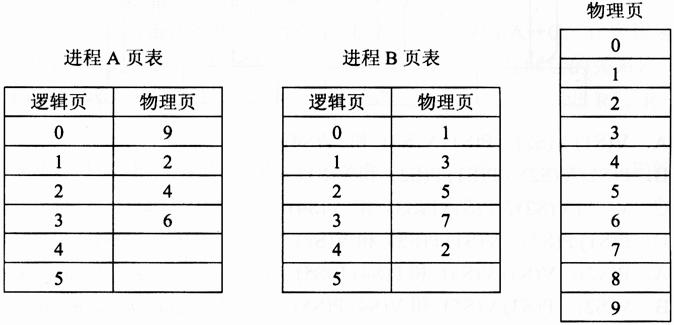
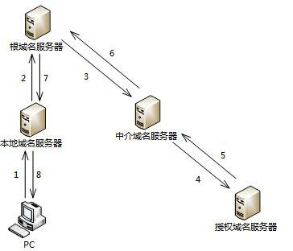

# 2013年系统架构师考试科目一：综合知识

**题目1：** 某操作系统采用分页存储管理方式，下图给出了进程A 和进程B 的页表结构。如果物理页的大小为512 字节，那么进程A 逻辑地址为1111(十进制)的变量存放在( )号物理内存页中。假设进程A 的逻辑页4 与进程B 的逻辑页5 要共享物理页8，那么应该在进程A 页表的逻辑页4 和进程B 页表的逻辑页5 对应的物理页处分别填( )。

**正确答案：** ：B、D

---

**题目2：** 进程P1、P2、P3、P4 和P5 的前趋图如下：若用PV 操作控制进程P1～P5 并发执行的过程，则需要设置5 个信号量S1、S2、S3、S4和S5，进程间同步所使用的信号量标注在上图中的边上，且信号量S1～S5 的初值都等于零，初始状态下进程P1 开始执行。下图中a、b 和c 处应分别填写()；d 和e 处应分别填写( )，f 和g 处应分别填写( )。(1)A.V(S1)V(S2)、P(S1)V(S3)和V(S4)

B. P(S1)V(S2)、P(S1)P(S2)和V(S1)
C. V(S1)V(S2)、P(S1)P(S3)和V(S4)
D. P(S1)P(S2)、V(S1)P(S3)和V(S2)
(2)A.P(S2)、V(S3)V(S5)和P(S4)P(S5)
B. V(S2)、P(S3)V(S5)和V(S4)P(S5)
C. P(S2)、V(S3)P(S5)和P(S4)V(S5)
D. V(S2)、V(S3)P(S5)和P(S4)V(S5)

**正确答案：** ：C、A
**解析：** 最简单的理解方式：箭头出就是V 操作，箭头入就是P 操作。

---

**题目3：** 假设关系模式R(U，F)，属性集U={A，B，C}，函数依赖集F={A→B，B→C}。若将其分解为ρ={R1(U1，F1)，R2(U2，F2)}，其中U1={A，B}，U2={A，C}。那么，关系模式R、R1、R2 分别达到了( 1 )；分解ρ( 2 )。(1)A．1NF、2NF、3NF

B. 1NF、3NF、3NF
C. 2NF、2NF、3NF
D. 2NF、3NF、3NF
(2)A．有损连接但保持函数依赖
B. 既无损连接又保持函数依赖
C. 有损连接且不保持函数依赖
D. 无损连接但不保持函数依赖

**正确答案：** ：D、D
**解析：** R 有函数依赖集F={A→B，B→C）。由于A 可确定B 和C，所以A 为主键，单个属性的主键不可能有部分依赖关系，所以R 已符合2NF。进一步分析是否为3NF 时，需要识别R 中是否存在传递依赖。A→B，B→C 属于典型的传递依赖，所以R 最高只到2NF。当R 被拆分为R1 与R2 后，R1 与R2 分别只有两个属性，此时的关系模式不可能存在部分依赖，也没法传递依赖（至少3 个属性才可能传递），所以都达到了3NF。接下来判断是否无损分解，由于：U1∩U2=A，U1-U2=B，U2-U1=C。而R 中有函数依赖：A→B，所以分解是无损分解。最后判断是否保持函数依赖：R1 中包含A 与B 两个属性，所以A→B 依赖关系被R1 保持下来了。而R2 中的A 与C 两个属性，没有保持任何函数依赖，导致函数依赖B→C 丢失，所以分解没有保持函数依赖。

---

**题目4：** 给定员工关系EMP( EmpID，Ename，sex，age，tel，DepID )，其属性含义分别为：员工号、姓名、性别、年龄、电话、部门号；部门关系DEP(DepID，Dname，Dtel，DEmpID)，其属性含义分别为：部门号、部门名、电话，负责人号。若要求DepID 参照部门关系DEP 的主码DepID，则可以在定义EMP 时用( 1 )进行约束。若要查询开发部的负责人姓名、年龄，则正确的关系代数表达式为( 2 )。(1)A．Primary Key(DepID) On DEP(DepID)

B. Primary Key(DepID) On EMP(DepID)
C. Foreign Key(DepID) References DEP(DepID)
D. Foreign Key(DepID) References EMP(DepID)
(2)A.π2,4(σ8=’开发部’(EMP×DEP))
B. π2,4(σ1=9(EMP
σ2=’开发部’(DEP)))
C. π2,3(EMP×σ2=’开发部’(DEP))
D. π2,3(π1,2,4,6(EMP)
σ2=’开发部’(DEP))

**正确答案：** ：C、B

---

**题目5：** 在实时操作系统中，两个任务并发执行，一个任务要等待另一个任务发来消息，或建立某个条件后再向前执行，这种制约性合作关系被称为任务的( )。

A. 同步
B. 互斥
C. 调度
D. 执行

**正确答案：** ：A
**解析：** 由于资源共享与进程合作，并发执行的任务(进程)之间可能产生相互制约关系，这些制约关系可分为两类：竞争与协作。并发进程之间的竞争关系为互斥，并发进程之间的协作关系体现为同步。同步是因合作进程之间协调彼此的工作而控制自己的执行速度，即因相互合作，相互等待而产生的制约关系。而互斥是进程之间竞争临界资源而禁止两个以上的进程同时进入临界区所发生的制约关系。题目中一个任务要等待另一个任务发来消息，或建立某个条件后再向前执行，显然体现的制约关系是任务的同步。

---

**题目6：** 在嵌入式系统设计中，用来进行CPU 调试的常用接口是( )。

A. PCI 接口
B. USB 接口
C. 网络接口
D. JTAG 接口

**正确答案：** ：D
**解析：** JTAG(Joint Test Action Group；联合测试工作组)是一种国际标准测试协议（IEEE 1149.1兼容），主要用于芯片内部测试。现在多数的高级器件都支持JTAG 协议，如DSP、FPGA器件等。标准的JTAG 接口是4 线：TMS、TCK、TDI、TDO，分别为模式选择、时钟、数据输入和数据输出线。扩展：PCI 是Peripheral Component Interconnect(外设部件互连标准)的缩写，它是目前个人电脑中使用最为广泛的接口，几乎所有的主板产品上都带有这种插槽。

---

**题目7：** 看门狗(WatchDog)是嵌入式系统中一种常用的保证系统可靠性的技术，( )会产生看门狗中断。

A. 软件喂狗
B. 处理器温度过高
C. 外部中断
D. 看门狗定时器超时

**正确答案：** （未提供）
**解析：** 看门狗技术是一种计算机程序监视技术，防止程序由于干扰等原因而进入死循环，一般用于计算机控制系统。原理：是不断监测程序循环运行的时间，一旦发现程序运行时间超过循环设定的时间，就认为系统已陷入死循环，然后强迫程序返回到已安排了出错处理程序的入口地处，使系统回到正常运行。从其定义与特点可知当看门狗定时器超时的时候，会产生看门狗中断。

---

**题目8：** 以下关于实时操作系统( RTOS )任务调度器的叙述中，正确的是( )。

A. 任务之间的公平性是最重要的调度目标
B. 大多数RTOS 调度算法都是抢占方式( 可剥夺方式)
C. RTOS 调度器都采用了基于时间片轮转的调度算法
D. 大多数RTOS 调度算法只采用一种静态优先级调度算法

**正确答案：** B
**解析：** 本题考查实时操作系统基础知识。任务是RTOS 中最重要的操作对象，每个任务在RTOS 的调度下由CPU 分时执行。任务的调度目前主要有时间分片式、轮流查询式和优先抢占式三种，不同的RTOS 可能支持其中一种或几种，其中优先抢占式对实时性的支持最好。在非实时系统中，调度的主要目的是缩短系统平均响应时间，提高系统资源的利用率，或优化某一项指标；而实时系统中调度的目的则是要尽可能地保证每个任务满足他们的时间约束，及时对外部请求做出响应。

---

**题目9：** 以下关于层次化网络设计原则的叙述中，错误的是( )。

A. 一般将网络划分为核心层、汇聚层、接入层三个层次
B. 应当首先设计核心层，再根据必要的分析完成其他层次设计
C. 为了保证网络的层次性，不能在设计中随意加入额外连接
D. 除去接入层，其他层次应尽量采用模块化方式，模块间边界应非常清晰

**正确答案：** B
**解析：** 本题考察网络层次化设计的知识。进行网络层次化设计时，一般分为核心层、汇聚层、接入层三个层次、为了保证网络的层次性，不能在设计中随意加入额外连接、除去接入层，其他层次应尽量采用模块化方式，模块间的边界应非常清晰。先设计接入层，再试汇聚层，最后才是核心层。

---

**题目10：** 网络需求分析包括网络总体需求分析、综合布线需求分析、网络可用性与可靠性分析、网络安全性需求分析，此外还需要进行( )。

A. 工程造价估算
B. 工程进度安排
C. 硬件设备选型
D. IP 地址分配分析

**正确答案：** （未提供）
**解析：** 本题考查网络规划设计中的需求分析阶段的内容。网络需求分析应该确定网络的投资规模，也就是工程造价的估算。

---

**题目11：** 主机PC 对某个域名进行查询，最终由该域名的授权域名服务器解析并返回结果，查询过程如下图所示。这种查询方式中不合理的是( )。

A. 根域名服务器采用递归查询，影响了性能
B. 根域名服务器采用迭代查询，影响了性能
C. 中介域名服务器采用迭代查询，加重了根域名服务器负担
D. 中介域名服务器采用递归查询，加重了根域名服务器负担

**正确答案：** A
**解析：** 在域名解析过程中，一般有两种查询方式：递归查询和迭代查询。递归查询：服务器必需回答目标IP 与域名的映射关系。迭代查询：服务器收到一次迭代查询回复一次结果，这个结果不一定是目标IP 与域名的映射关系，也可以是其它DNS 服务器的地址。在本题中，本地域名服务器向根域名服务器发出查询请求后，根域名服务器会一层一层的进行查询，将最终结果告诉本地域名服务器，这种方式属于递归查询，这种方式增加了根域名服务器的负担，影响了性能。

---

**题目12：** 把应用程序中应用最频繁的那部分核心程序作为评价计算机性能的标准程序，称为( )程序。( )不是对Web 服务器进行性能评估的主要指标。(1)A．仿真测试

B. 核心测试
C. 基准测试
D. 标准测试
(2)A．丢包率
B. 最大并发连接数
C. 响应延迟
D. 吞吐量

**正确答案：** （未提供）
**解析：** 把应用程序中应用最频繁的那部分核心程序作为评价计算机性能的标准程序，称为基准测试程序。作为承载Web 应用的Web 服务器，对其进行性能评估时，主要关注最大并发连接数、响应延迟、吞吐量等指标。丢包率是评估网络的指标，而非Web 服务器。相对来说，对个别数据的丢包率并不是很关心。

---

**题目13：** 与电子政务相关的行为主体主要有三个，即( )，政府的业务活动也主要围绕着这三个行为主体展开。

A. 政府、数据及电子政务系统
B. 政府、企( 事)业单位及中介
C. 政府、服务机构及企事业单位
D. 政府、企( 事)业单位及公民

**正确答案：** （未提供）
**解析：** 本题属于纯概念题，与电子政务相关的行为主体包括：政府、企（事）业单位及公民。常见的电子政务形式包括：G2G、G2B、G2C，其中的G 是政府、B 是企（事）业单位、C是公民。

---

**题目14：** 企业信息化涉及到对企业管理理念的创新，按照市场发展的要求，对企业现有的管理流程重新整合，管理核心从对( 1 )的管理，转向对( 2 )的管理，并延伸到对企业技术创新、工艺设计、产品设计、生产制造过程的管理，进而还要扩展到对( 3 )的管理乃至发展到电子商务。(1)A．人力资源和物资

B. 信息技术和知识
C. 财务和物料
D. 业务流程和数据
(2)A．业务流程和数据
B. 企业信息系统和技术
C. 业务流程、数据和接口
D. 技术、物资和人力资源
(3)A．客户关系和供应链
B. 信息技术和知识
C. 生产技术和信息技术
D. 信息采集、存储和共享

**正确答案：** C、D、A
**解析：** 管理科学的核心就是应用科学的方法实施管理，按照市场发展的要求，对企业现有的管理流程重新整合，从作为管理核心的财务、资金管理，向技术、物资、人力资源的管理，并延伸到企业技术创新、工艺设计、产品设计、生产制造过程的管理，进而扩展到客户关系管理、供应链的管理乃至发展电子商务，形成企业内部向外部扩散的全方位管理。企业信息化注重企业经营管理方面的信息分析和研究，信息系统所蕴含的管理思想也可帮助企业建立更为科学规范的管理运作体系，提供准确及时的管理决策信息。

---

**题目15：** 企业信息集成按照组织范围分为企业内部的信息集成和外部的信息集成。在企业内部的信息集成中，( )实现了不同系统之间的互操作，使得不同系统之间能够实现数据和方法的共享：( )实现了不同应用系统之间的连接、协调运作和信息共享。(1)A．技术平台集成

B. 数据集成
C. 应用系统集成
D. 业务过程集成
(2)A．技术平台集成
B. 数据集成
C. 应用系统集成
D. 业务过程集成

**正确答案：** C、D
**解析：** 企业信息集成是一个十分复杂的问题，按照组织范围来分，分为企业内部的信息集成和外部的信息集成两个方面。1．企业内部的信息集成按集成内容，企业内部的信息集成一般可分为以下四个方面：（1）技术平台的集成系统底层的体系结构、软件、硬件以及异构网络的特殊需求首先必须得到集成。这个集成包括信息技术硬件所组成的新型操作平台，如各类大型机、小型机、工作站、微机、通信网络等信息技术设备，还包括置入信息技术或者说经过信息技术改造的机床、车床、自动化工具、流水线设备等新型设施和设备。（2）数据的集成为了完成应用集成和业务流程集成，需要解决数据和数据库的集成问题。数据集成的目的是实现不同系统的数据交流与共享，是进行其他更进一步集成的基础。数据集成的特点是简单、低成本，易于实施，但需要对系统内部业务的深入了解。数据集成是对数据进行标识并编成目录，确定元数据模型。只有在建立统一的模型后，数据才能在数据库系统中分布和共享。数据集成采用的主要数据处理技术有数据复制、数据聚合和接口集成等。（3）应用系统的集成应用系统集成是实现不同系统之间的互操作，使得不同应用系统之间能够实现数据和方法的共享。它为进一步的过程集成打下了基础。（4）业务过程的集成对业务过程进行集成的时候，企业必须在各种业务系统中定义、授权和管理各种业务信息的交换，以便改进操作、减少成本、提高响应速度。业务流程的集成使得在不同应用系统中的流程能够无缝连接，实现流程的协调运作和流程信息的充分共享。

---

**题目16：** 数据挖掘是从数据库的大量数据中揭示出隐含的、先前未知的并有潜在价值的信息的非平凡过程，主要任务有( )。

A. 聚类分析、联机分析、信息检索等
B. 信息检索、聚类分析、分类分析等
C. 聚类分析、分类分析、关联规则挖掘等
D. 分类分析、联机分析、关联规则挖掘等

**正确答案：** （未提供）
**解析：** 数据挖掘的任务有关联分析、聚类分析、分类分析、异常分析、特异群组分析和演变分析，等等。

---

**题目17：** 详细的项目范围说明书是项目成功的关键，( )不属于项目范围定义的输入。

A. 项目章程
B. 项目范围管理计划
C. 批准的变更申请
D. 项目文档管理方法

**正确答案：** D
**解析：** 范围定义的输入包括：范围管理计划、项目章程、需求文件、批准的变更申请、组织过程资产。

---

**题目18：** 活动定义是项目时间管理中的过程之一，( )是进行活动定义时通常使用的一种工具。

A. Gantt 图
B. 活动图
C. 工作分解结构( WBS )
D. PERT 图

**正确答案：** C
**解析：** 活动定义的常用工具包括：分解、滚动式规划、模板、专家判断。

---

**题目19：** 以下叙述中，( )不属于可行性分析的范畴。

A. 对系统开发的各种候选方案进行成本/效益分析
B. 分析现有系统存在的运行问题
C. 评价该项目实施后可能取得的无形收益
D. 评估现有技术能力和信息技术是否足以支持系统目标的实现

**正确答案：** （未提供）
**解析：** “对系统开发的各种候选方案进行成本/效益分析”和“评价该项目实施后可能取得的无形收益”是从成本效益的角度来看一个项目的可行性，是从经济角度出发的分析，这属于可行性分析的范畴。而“评估现有技术能力和信息技术是否足以支持系统目标的实现”是典型的技术可行性分析。“分析现有系统存在的运行问题”与可行性分析无直接关系。

---

**题目20：** 遗留系统的演化可以采用淘汰、继承、改造和集成四种策略。若企业中的遗留系统技术含量较高，业务价值较低，在局部领域中工作良好，形成了一个个信息孤岛时，适合于采用( )演化策略。

A. 淘汰
B. 继承
C. 改造
D. 集成

**正确答案：** D

---

**题目21：** 逆向工程导出的信息可以分为实现级、结构级、功能级和领域级四个抽象层次。程序的抽象语法树属于( )；反映程序分量之间相互依赖关系的信息属于( )。

A. 实现级
B. 结构级
C. 功能级
D. 领域级
A. 实现级
B. 结构级
C. 功能级
D. 领域级

**正确答案：** A、D
**解析：** 逆向工程导出的信息可分为如下4 个抽象层次。实现级：包括程序的抽象语法树、符号表等信息。结构级：包括反映程序分量之间相互依赖关系的信息，例如调用图、结构图等。功能级：包括反映程序段功能及程序段之间关系的信息。领域级：包括反映程序分量或程序与应用领域概念之间对应关系的信息。

---

**题目22：** 在面向对象设计中，( )可以实现界面控制、外部接口和环境隔离。( )作为完成用例业务的责任承担者，协调、控制其他类共同完成用例规定的功能或行为。

A. 实体类
B. 控制
C. 边界类
D. 交互类
A. 实体类
B. 控制
C. 边界类
D. 交互类

**正确答案：** C、B
**解析：** 实体类是用于对必须存储的信息和相关行为建模的类。实体对象(实体类的实例)用于保存和更新一些现象的有关信息，例如：事件、人员或者一些现实生活中的对象。实体类通常都是永久性的，它们所具有的属性和关系是长期需要的，有时甚至在系统的整个生存期都需要。边界类是一种用于对系统外部环境与其内部运作之间的交互进行建模的类。这种交互包括转换事件，并记录系统表示方式(例如接口)中的变更。常见的边界类有窗口、通信协议、打印机接口、传感器和终端。如果您在使用GUI 生成器，您就不必将按钮之类的常规接口部件作为单独的边界类来建模。通常，整个窗口就是最精制的边界类对象。边界类还有助于获取那些可能不面向任何对象的API(例如遗留代码)的接口。控制类用于对一个或几个用例所特有的控制行为进行建模。控制对象(控制类的实例)通常控制其他对象，因此它们的行为具有协调性质。控制类将用例的特有行为进行封装。

---

**题目23：** 基于RUP 的软件过程是一个迭代过程。一个开发周期包括初始、细化、构建和移交四个阶段，每次通过这四个阶段就会产生一代软件，其中建立完善的架构是( )阶段的任务。采用迭代式开发，( )。(1)A．初始

B. 细化
C. 构建
D. 移交
(2)A．在每一轮迭代中都要进行测试与集成
B. 每一轮迭代的重点是对特定的用例进行部分实现
C. 在后续迭代中强调用户的主动参与
D. 通常以功能分解为基础

**正确答案：** B、A
**解析：** RUP 包括四个阶段：初始阶段、细化阶段、构建阶段、交付阶段。初始阶段的任务是为系统建立业务模型并确定项目的边界。细化阶段的任务是分析问题领域，建立完善的架构，淘汰项目中最高风险的元素。在构建阶段，要开发所有剩余的构件和应用程序功能，把这些构件集成为产品，并进行详细测试。交付阶段。交付阶段的重点是确保软件对最终用户是可用的。RUP 中的每个阶段可以进一步分解为迭代。一个迭代是一个完整的开发循环。

---

**题目24：** 某系统中的文本显示类( TextView )和图片显示类( PictureView )都继承了组件类( Component )，分别显示文本和图片内容，现需要构造带有滚动条或者带有黑色边框，或者既有滚动条又有黑色边框的文本显示控件和图片显示控件，但希望最多只增加3个类。那么采用设计模式( )可实现该需求，其优点是( )。(1)A．外观

B. 单体
C. 装饰
D. 模板方法
(2)A．比静态继承具有更大的灵活性
B. 提高已有功能的重复使用性
C. 可以将接口与实现相分离
D. 为复杂系统提供了简单接口

**正确答案：** （未提供）
**解析：** 装饰模式：动态地给一个对象添加一些额外的职责。它提供了用子类扩展功能的一个灵活的替代，比派生一个子类更加灵活。在本题中，“现需要构造带有滚动条或者带有黑色边框，或者既有滚动条又有黑色边框的文本显示控件和图片显示控件”，从此处可以看出需要能为构件灵活附加功能的机制，这与装饰模式的情况是吻合的。这样做比静态继承具有更大的灵活性。

---

**题目25：** 以下关于自顶向下开发方法的叙述中，正确的是( )。

A. 自顶向下过程因为单元测试而比较耗费时间
B. 自顶向下过程可以更快地发现系统性能方面的问题
C. 相对于自底向上方法，自顶向下方法可以更快地得到系统的演示原型
D. 在自顶向下的设计中，如发现了一个错误，通常是因为底层模块没有满足其规格说
明( 因
为高层模块已经被测试过了)

**正确答案：** C
**解析：** 自顶向下方法的优点是：1、可为企业或机构的重要决策和任务实现提供信息。2、支持企业信息系统的整体性规划，并对系统的各子系统的协调和通信提供保证。3、方法的实践有利于提高企业人员整体观察问题的能力，从而有利于寻找到改进企业组织的途径。自顶向下方法的缺点是：1、对系统分析和设计人员的要求较高。2、开发周期长，系统复杂，一般属于一种高成本、大投资的工程。3、对于大系统而言自上而下的规划对于下层系统的实施往往缺乏约束力。4、从经济角度来看，很难说自顶向下的做法在经济上是合算的。

---

**题目26：** 以下关于白盒测试方法的叙述中，错误的是( )。

A. 语句覆盖要求设计足够多的测试用例，使程序中每条语句至少被执行一次
B. 与判定覆盖相比，条件覆盖增加对符合判定情况的测试，增加了测试路径
C. 判定/条件覆盖准则的缺点是未考虑条件的组合情况
D. 组合覆盖要求设计足够多的测试用例，使得每个判定中条件结果的所有可能组合最
多出现一次

**正确答案：** （未提供）
**解析：** 组合覆盖主要特点：要求设计足够多的测试用例，使得每个判定中条件结果的所有可能组合至少出现一次。

---

**题目27：** 以下关于面向对象软件测试的叙述中，正确的是( )。

A. 在测试一个类时，只要对该类的每个成员方法都进行充分的测试就完成了对该类充
分的
测试
B. 存在多态的情况下，为了达到较高的测试充分性，应对所有可能的绑定都进行测试
C. 假设类B 是类A 的子类，如果类A 已经进行了充分的测试，那么在测试类B 时不
必测
试任何类B 继承自类A 的成员方法
D. 对于一棵继承树上的多个类，只有处于叶子节点的类需要测试

**正确答案：** B
**解析：** 本题考查面向对象的软件测试，与传统的结构化系统相比，面向对象系统具有三个明显特征，即封装、继承性与多态性。封装性决定了面向对象系统的测试必须考虑到信息隐蔽原则对测试的影响，以及对象状态与类的测试序列，因此在测试一个类时，仅对该类的每个方法进行测试是不够的；继承性决定了面向对象系统的测试必须考虑到继承对测试充分性的影响，以及误用引起的错误；多态性决定了面向对象系统的测试必须考虑到动态绑定对测试充分性的影响、抽象类的测试以及误用对测试的影响。

---

**题目28：** 软件系统架构是关于软件系统的结构、( )和属性的高级抽象。在描述阶段，主要描述直接构成系统的抽象组件以及各个组件之间的连接规则，特别是相对细致地描述组件的( )。在实现阶段，这些抽象组件被细化为实际的组件，比如具体类或者对象。软件系统架构不仅指定了软件系统的组织和( )结构，而且显示了系统需求和组件之间的对应关系，包括设计决策的基本方法和基本原理。(1)A．行为

B. 组织
C. 性能
D. 功能
(2)A．交互关系
B. 实现关系
C. 数据依赖
D. 功能依赖
(3)A．进程
B. 拓扑
C. 处理
D. 数据

**正确答案：** A、A、B
**解析：** 软件系统架构是关于软件系统的结构、行为和属性的高级抽象。在描述阶段，其对象是直接构成系统的抽象组件以及各个组件之间的连接规则，特别是相对细致地描述组件之间的通讯。在实现阶段，这些抽象组件被细化为实际的组件，比如具体类或者对象。软件系统架构不仅指定了软件系统的组织结构和拓扑结构，而且显示了系统需求和构成组件之间的对应关系，包括设计决策的基本方法和基本原理。

---

**题目29：** 软件架构风格是描述某一特定应用领域中系统组织方式的惯用模式。架构风格定义了一类架构所共有的特征，主要包括架构定义、架构词汇表和架构( )。

A. 描述
B. 组织
C. 约束
D. 接口

**正确答案：** （未提供）
**解析：** 软件架构风格是描述某一特定应用领域中系统组织方式的惯用模式。架构风格定义一个系统家族，即一个架构定义一个词汇表和一组约束。

---

**题目30：** 以下叙述，( )不是软件架构的主要作用。

A. 在设计变更相对容易的阶段，考虑系统结构的可选方案
B. 便于技术人员与非技术人员就软件设计进行交互
C. 展现软件的结构、属性与内部交互关系
D. 表达系统是否满足用户的功能性需求

**正确答案：** D
**解析：** 软件架构能够在设计变更相对容易的阶段，考虑系统结构的可选方案，便于技术人员与非技术人员就软件设计进行交互，能够展现软件的结构、属性与内部交互关系。但是软件架构与用户对系统的功能性需求没有直接的对应关系。

---

**题目31：** 特定领域软件架构( DomainSpecificSoftwareArchitecture，DSSA )是在一个特定应用领域中，为一组应用提供组织结构参考的标准软件体系结构。DSSA 通常是一个具有三个层次的系统模型，包括( )环境、领域特定应用开发环境和应用执行环境，其中( )主要在领域特定应用开发环境中工作。(1)A．领域需求

B. 领域开发
C. 领域执行
D. 领域应用
(2)A．操作员
B. 领域架构师
C. 应用工程师
D. 程序员

**正确答案：** ：B、C
**解析：** DSSA 通常是一个具有三个层次的系统模型，包括领域开发环境、领域特定应用开发环境和应用执行环境。

---

**题目32：** “编译器”是一种非常重要的基础软件，其核心功能是对源代码形态的单个或一组源程序依次进行预处理、词法分析、语法分析、语义分析、代码生成、代码优化等处理，最终生成目标机器的可执行代码。考虑以下与编译器相关的软件架构设计场景：传统的编译器设计中，上述处理过程都以独立功能模块的形式存在，程序源代码作为一个整体，依次在不同模块中进行传递，最终完成编译过程。针对这种设计思路，传统的编译器采用( )架构风格比较合适。随着编译、链接、调试、执行等开发过程的一体化趋势发展，集成开发环境（IDE）随之出现。IDE 集成了编译器、连接器、调试器等多种工具，支持代码的增量修改与处理，能够实现不同工具之间的信息交互，覆盖整个软件开发生命周期。针对这种需求，IDE 采用( )架构风格比较合适。IDE 强调交互式编程，用户在修改程序代码后，会同时触发语法高亮显示、语法错误提示、程序结构更新等多种功能的调用与结果呈现，针对这种需求，通常采用( )架构风格比较合适。某公司已经开发了一款针对某种嵌入式操作系统专用编程语言的IDE，随着一种新的嵌入式操作系统上市并迅速占领市场，公司决定对IDE 进行适应性改造，支持采用现有编程语言进行编程，生成符合新操作系统要求的运行代码，并能够在现有操作系统上模拟出新操作系统的运行环境，以支持代码调试工作。针对上述要求，为了使IDE能够生成符合新操作系统要求的运行代码，采用基于( )的架构设计策略比较合适；为了模拟新操作系统的运行环境，通常采用( )架构风格比较合适。(1)A.管道-过滤器

B. 顺序批处理
C. 过程控制
D. 独立进程
(2)A.规则引擎
B. 解释器
C. 数据共享
D. 黑板
(3)A.隐式调用
B. 显式调用
C. 主程序-子程序D.层次结构
(4)A.代理
B. 适配
C. 包装
D. 模拟
(5)A.隐式调用
B. 仓库结构
C. 基于规则
D. 虚拟机

**正确答案：** ：B、C、A、B、D
**解析：** 传统的编译器一般采用数据流架构风格，在这种架构中，每个构件都有一组输入和输出，数据输入构件，经过内部处理，然后产生数据输出。编译处理过程中，会分步将源代码一次一次的处理，最终形成目标代码，这与数据流架构风格相当吻合。但选项中有两个数据流风格的架构供选择，即：“管道-过滤器”和“顺序批处理”，这就需要进一步分析哪个更合适，由于题目中提到“程序源代码作为一个整体，依次在不同模块中进行传递”，而顺序批处理是强调把数据整体处理的，所以应选用顺序批处理风格。IDE 是一种集成式的开发环境，在这种环境中，多种工具是围绕同一数据进行处理，这种情况适合用数据共享架构风格。在题目中提到IDE 环境是一种交互式编程，用户在修改程序代码后，会同时触发语法高亮显示、语法错误提示、程序结构更新等多种功能的调用与结果呈现。在做一件事情时，同时触发一系列的行为，这是典型的隐式调用风格(事件驱动系统) “使IDE 能够生成符合新操作系统要求的运行代码”，这一要求是可以通过适配策略满足的，像设计模式中的适配器模式便是采用适配的方式，形成一致的接口。“模拟新操作系统的运行环境”是典型的虚拟机架构风格的特长。

---

**题目33：** 某公司采用基于架构的软件设计( Architecture-BasedSoftwareDesign，ABSD )方法进行软件设计与开发。ABSD 方法有三个基础，分别是对系统进行功能分解、采用( )实现质量属性与商业需求、采用软件模板设计软件结构。ABSD 方法主要包括架构需求等6个主要活动，其中( )活动的目标是标识潜在的风险，及早发现架构设计中的缺陷和错误；( )活动针对用户的需求变化，修改应用架构，满足新的需求。小王是该公司的一位新任架构师，在某项目中主要负责架构文档化方面的工作。小王( )的做法不符合架构文档化的原则。架构文档化的主要输出结果是架构规格说明书和( )。(1)A．架构风格

B. 设计模式
C. 架构策略
D. 架构描述
(2)A．架构设计
B. 架构实现
C. 架构复审
D. 架构演化
(3)A．架构设计
B. 架构实现
C. 架构复审
D. 架构演化
(4)A．从使用者的角度书写文档
B. 随时保证文档都是最新的
C. 将文档分发给相关人员
D. 针对不同背景的人员书写文档的方式不同
(5)A．架构需求说明书
B. 架构实现说明书
C. 架构质量说明书
D. 架构评审说明书

**正确答案：** ：A、C、D、B、C
**解析：** 基于架构的软件设计(Achitecture-Based Software Design，ABSD)方法有三个基础，分别是对系统进行功能分解、采用架构风格实现质量属性与商业需求、采用软件模板设计软件结构。ABSD 方法主要包括架构需求等6 个主要活动，其中架构复审活动的目标是标识潜在的风险，及早发现架构设计中的缺陷和错误；架构演化活动针对用户的需求变化，修改应用架构，满足新的需求。软件架构文档应该从使用者的角度进行书写，针对不同背景的人员采用不同的书写方式，并将文档分发给相关人员。架构文档要保持较新，但不要随时保证文档最新，要保持文档的稳定性。架构文档化的主要输出结果是架构规格说明书和架构质量说明书。

---

**题目34：** 架构权衡分析方法( ArchitectureTradeoffAnalysisMethod，ATAM )是一种系统架构评估方法，主要在系统开发之前，针对性能、( )、安全性和可修改性等质量属性进行评价和折中。ATAM 可以分为4 个主要的活动阶段，包括需求收集、( )描述、属性模型构造和分析、架构决策与折中，整个评估过程强调以( )作为架构评估的核心概念。某软件公司采用ATAM 进行软件架构评估，在评估过程中识别出了多个关于质量属性的描述。其中，“系统在进行文件保存操作时，应该与Windows 系统的操作方式保持一致，主要与( )质量属性相关：“系统应该提供一个开放的API 接口，支持远程对系统的行为进行控制与调试，主要与( )质量属性相关。在识别出上述描述后，通常采用( )对质量属性的描述进行刻画与排序。在评估过程中，( )是一个会影响多个质量属性的架构设计决策。(1)A．可测试性

B. 可移植性
C. 可用性
D. 易用性
(2)A．架构视图
B. 架构排序
C. 架构风格
D. 架构策略
(3)A．用例
B. 视图
C. 属性
D. 模型
(4)A．可测试性
B. 互操作性
C. 可移植性
D. 易用性
(5)A．可测试性
B. 互操作性
C. 可移植性
D. 易用性
(6)A．期望管理矩阵
B. 决策表
C. 优先队列
D. 效用树
(7)A．风险点
B. 决策点
C. 权衡点
D. 敏感点

**正确答案：** ：C、A、C、D、A、D、C
**解析：** 架构权衡分析方法是一种系统架构评估方法，主要在系统开发之前，针对性能、可用性、安全性和可修改性等质量属性进行评价和折中。ATAM 可以分为4 个主要的活动阶段，包括需求收集、架构视图描述、属性模型构造和分析、架构决策与折中，整个评估过程强调以属性作为架构评估的核心概念。题目中提到“某软件公司采用ATAM 进行软件架构评估，在评估过程中识别出了多个关于质量属性的描述。其中，系统在进行文件保存操作时，应该与Windows 系统的操作方式保持一致。”与用户所熟悉的操作方式，操作界面保持一致，这是一种减轻用户记忆负担，降低学习成本的做法，这有利于提高系统的易用性。“系统应该提供一个开放的API 接口，支持远程对系统的行为进行控制与调试”，在此处，我们注意到描述的核心落在“支持远程对系统的行为进行控制与调试”上了，而调试是在测试之后精确定位系统错误的一种机制，所以这种做法有利于提高系统的可测试性。最后的两空也是考概念：在识别出上述描述后，通常采用效用树对质量属性的描述进行刻画与排序。在评估过程中，权衡点是一个会影响多个质量属性的架构设计决策。

---

**题目35：** 以下关于第三方认证服务的叙述中，正确的是( )。

A. Kerberos 认证服务中保存数字证书的服务器叫CA
B. 第三方认证服务的两种体制分别是Kerberos 和PKI
C. PKI 体制中保存数字证书的服务器叫KDC
D. Kerberos 的中文全称是“公钥基础设施”

**正确答案：** ：B
**解析：** Kerberos 可以防止偷听和重放攻击，保护数据的完整性。Kerberos 的安全机制如下。AS(Authentication Servet)：认证服务器，是为用户发放TGT 的服务器。TGS(Ticket Granting Server)：票证授予服务器，负责发放访问应用服务器时需要的票证。认证服务器和票据授予服务器组成密钥分发中心(Key DistributionCenter，KDC)。V：用户请求访问的应用服务器。TGT(Ticket Granting Ticket)：用户向TGS 证明自己身份的初始票据，即KTGS(A，KS)。公钥基础结构(Public Key Infrastructure，PKI)是运用公钥的概念和技术来提供安全服务的、普遍适用的网络安全基础设施，包括由PKI 策略、软硬件系统、认证中心、注册机构(Registration Authority，RA)、证书签发系统和PKI 应用等构成的安全体系。

---

**题目36：** 采用Kerberos 系统进行认证时，可以在报文中加入( )来防止重放攻击。

A. 会话密钥
B. 时间戳
C. 用户ID
D. 私有密钥

**正确答案：** （未提供）
**解析：** 重放攻击（Replay Attacks）又称重播攻击、回放攻击或新鲜性攻击（Freshness Attacks），是指攻击者发送一个目的主机已接收过的包，来达到欺骗系统的目的，主要用于身份认证过程，破坏认证的正确性。Kerberos 系统采用的是时间戳方案来防止重放攻击，这种方案中，发送的数据包是带时间戳的，服务器可以根据时间戳来判断是否为重放包，以此防止重放攻击。

---

**题目37：** 以下关于为撰写学术论文引用他人资料的叙述中，错误的是( )。

A. 既可引用发表的作品，也可引用未发表的作品
B. 只能限于介绍、评论或为了说明某个问题引用作品
C. 只要不构成自己作品的主要部分，可引用资料的部分或全部
D. 不必征得著作权人的同意，不向原作者支付合理的报酬

**正确答案：** A
**解析：** 未发表的不能引用，写论文的时候引用是需要发表的。在看完著作权法的条款之后，唯一可能有疑虑的是C 选项“只要不构成自己作品的主要部分，可引用资料的部分或全部”，其实“全部引用”是有可能的，例如引用一个公式，虽然是全部，但个体本身非常小，所以也属于合理引用的范围。

---

**题目38：** 以下作品中，不适用或不受著作权法保护的作品是( )。

A. 国务院颁布的《计算机软件保护条例》
B. 某作家的作品《绿化树》
C. 最高人民法院组织编写的《行政诉讼案例选编》
D. 某人在公共场所的即兴演说

**正确答案：** A
**解析：** 著作权法不适用于：法律、法规，国家机关的决议、决定、命令和其他具有立法、行政、司法性质的文件，及其官方正式译文。而A 选项中的“国务院颁布的《计算机软件保护条例》”属于该情况，所以不受著作权法保护。《著作权法》第三条本法所称的作品，包括以下列形式创作的文学、艺术和自然科学、社会科学、工程技术等作品：（一）文字作品（二）口述作品；（三）音乐、戏剧、曲艺、舞蹈、杂技艺术作品；（四）美术、建筑作品；（五）摄影作品；（六）电影作品和以类似摄制电影的方法创作的作品；（七）工程设计图、产品设计图、地图、示意图等图形作品和模型作品；（八）计算机软件；（九）法律、行政法规规定的其他作品。D 选项在公共场所的即兴演说属于口述作品。

---

**题目39：** 以下著作权权利中，( )的保护期受时间限制。

A. 署名权
B. 发表权
C. 修改权
D. 保护作品完整权

**正确答案：** B
**解析：** 在著作权法中规定：署名权、修改权、保护作品完整权的保护期是不受时间限制的。而发表权、使用权和获得报酬权的保护期限为：作者终生及其死亡后的50 年（第50 年的12月31 日）。

---

**题目40：** 某企业拟生产甲、乙、丙、丁四个产品。每个产品必须依次由设计部门、制造部门和检验部门进行设计、制造和检验，每个部门生产产品的顺序是相同的。各产品各工序所需的时间如下表所示：项目设计( 天)制造( 天)检验( 天)甲13 15 20乙10 20 18丙20 16 10丁8 10 15只要适当安排好项目实施顺序，企业最快可以在( )天全部完成这四个项目。

A. 84
B. 86
C. 91
D. 93

**正确答案：** （未提供）
**解析：** 做这类题，有一个基本的原则：把多个任务中，第1 步耗时最短的安排在最开始执行，再把最后1 步耗时最短的安排在最后完成。所以在本题中最先应执行的是丁项目，最后执行的是丙项目。这样所有的安排方案只有两个：1、丁甲乙丙2、丁乙甲丙通过画时空图可知丁甲乙丙执行时间如图所示，总执行时间为84 天，而题目最小选项为84 天，所以该方案已达最优，可以不计算方案2。

---

**题目41：** 41．1 路和2 路公交车都将在10 分钟内均匀随机地到达同一车站，则它们相隔4 分钟内到达该站的概率为( )。

A. 0.36
B. 0.48
C. 0.64
D. 0.76
B. constraint
C. functionality
D. requirements
(2)A．physical components
B. network architecture
C. software architecture
D. interface architecture
(3)A．Service structures
B. Module structures
C. Deployment structures
D. Work assignment structures
(4)A．Decompostion structures
B. Layer structures
C. Implementation structures
D. Component-and-connector structures
(5)A．Allocation structures
B. Class structures
C. Concurrency structures
D. Uses structures

**正确答案：** ：C、C、B、D、A
**解析：** 系统架构是一个系统的一种表示，包含了功能到软硬件构件的映射、软件架构到硬件架构的映射以及对于这些组件人机交互的关注。也就是说，系统架构关注于整个系统，包括硬件、软件和使用者。软件架构结构根据其所展示元素的广义性质，可以被分为三个主要类别。1）模块结构将决策体现为一组需要被构建或采购的代码或数据单元。2）构件连接器结构将决策体现为系统如何被结构化为一组具有运行时行为和交互的元素。3）分配结构将决策体现为系统如何在其环境中关联到非软件结构，如CPU、文件系统、网络、开发团队等。Constraint：约束。Structure：架构。Concurrency：并发。

---
