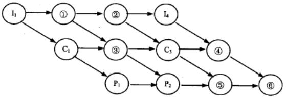

# 2014年系统架构师考试科目一：综合知识

**题目1：** 某计算机系统中有一个CPU、一台输入设备和一台输出设备，假设系统中有四个作业T1、T2、T3 和T4，系统采用优先级调度，且T1 的优先级>T2 的优先级>T3 的优先级>T4的优先级。每个作业具有三个程序段：输入Ii、计算Ci 和输出Pi(i=1,2,3,4)，其执行顺序为Ii→Ci→Pi。这四个作业各程序段并发执行的前驱图如下所示。图中①、②、③分别为( )，④、⑤、⑥分别为( )。(1)A．I2、C2、C4

B. I2、I3、C2
C. C2、P3、C4
D. C2、P3、P4
(2)A．C2、C4、P4
B. I2、I3、C4
C. I3、P3、P4
D. C4、P3、P4

**正确答案：** ：B、D

---

**题目2：** 某文件系统文件存储采用文件索引节点法。假设磁盘索引块和磁盘数据块大小均为1KB，每个文件的索引节点中有8 个地址项iaddr[0]～iaddr[7]，每个地址项大小为4 字节，其中iaddr[0]～iaddr[5]为直接地址索引，iaddr[6]是一级间接地址索引，iaddr[7]是二级间接地址索引。如果要访问icwutil.dll 文件的逻辑块号分别为0、260 和518，则系统应分别采用( )。该文件系统可表示的单个文件最大长度是( )KB。(1)A．直接地址索引、一级间接地址索引和二级间接地址索引

B. 直接地址索引、二级间接地址索引和二级间接地址索引
C. 一级间接地址索引、一级间接地址索引和二级间接地址索引
D. 一级间接地址索引、二级间接地址索引和二级间接地址索引
(2)A．518
B. 1030
C. 16514
D. 65798

**正确答案：** A、D
**解析：** 因为磁盘索引块和磁盘数据块大小均为1KB，每个地址项大小为4 字节，所以每个磁盘索引块和磁盘数据块可存放1KB/4=256 个物理地址块。计算直接地址索引，0-5 存放6 个物理块号，对应文件长度6*1KB，对应逻辑块号0—5。计算一级间接地址索引，256*1KB，对应逻辑块号5+1—256+5=6—261。计算二级间接地址索引，256*256*1KB，对应逻辑块号261+1—65797。总计6*1KB+256*1KB+256*256*1KB=65798KB。

---

**题目3：** 设关系模式R(U,F)，其中u 为属性集，F 是U 上的一组函数依赖，那么函数依赖的公理系统(Armstrong 公理系统)中的合并规则是指( )为F 所蕴涵。

A. 若A→B，B→C，则A→C
B. 若Y⊆X⊆U，则X→Y
C. 若A→B，A→C，则A→BC
D. 若A→B，C⊆B，贝A→C

**正确答案：** （未提供）
**解析：** A 选项对应的是传递律B 选项对应的是自反律C 选项对应的是合并规则D 选项对应的是分解规则(C 从B 中分解出来，构成函数依赖)。

---

**题目4：** 若关系模式R 和S 分别为：R(A,B,C,D)、S(B,C,E,F)，则关系R 与S 自然联结运算后的属性列有( 1 )个，与表达方式π1,2,5,6(σ3<6(R▷◁S))等价的SQL 语句为：SELECT ( 2 ) FROM R, S WHERE ( 3 ) ; (1)A．4

B. 6
C. 7
D. 8
(2)A．A,R.C,E,F
B. A,C,S.B,S.E
C. A,C,S.B,S.C
D. R.A,R.C,S.B,S.C
(3)A．R.B=S.B AND R.C=S.C AND RC<S.B
B. R.B=S.B AND R.C=S.C AND R.C<S.F
C. R.B=S.B OR R.C=S.C OR R.C<S.B
D. R.B=S.B OR R.C=S.C OR R.C<S.F

**正确答案：** B、A、B
**解析：** 自然连接后，(A, R.B, R.C, D, E, F)，6 列。σ3<6，自然连接后，选取第3 列分量<第6 列分量所在行。

---

**题目5：** 计算机采用分级存储体系的主要目的是为了( )。

A. 解决主存容量不足的问题
B. 提高存储器读写可靠性
C. 提高外设访问效率
D. 解决存储的容量、价格和速度之间的矛盾

**正确答案：** D
**解析：** 分级存储体系中，速度快的存储器，单位价格高，而速度慢的存储器，单位价格低，所以利用分级方式，能得到很好的性价比。

---

**题目6：** 以下嵌入式处理器类型中不具备内存管理单元(MMU)的是( )，嵌入式操作系统( )可以运行在它上面。

A. PowerPC750
B. ARM920T
C. Cortex-M3
D. MIPS32 24K
A. Linux
B. VxWorks653
C. uC/OS-II
D. Windows CE

**正确答案：** C、C，纯记忆，战术性掌握
**解析：** ARM Cortex-M3 处理器结合了多种突破性技术，令芯片供应商提供超低费用的芯片，仅33000 门的内核性能可达1.2DMIPS/MHz。该处理器还集成了许多紧耦合系统外设，令系统能满足下一代产品的控制需求。Cortex 的优势在于低功耗、低成本、高性能3 者的结合。这种处理器是不带MMU 的。

---

**题目7：** 以下关于嵌入式数据库管理系统的描述不正确的是( )。

A. 嵌入式数据库管理系统一般只为前端应用提供基本的数据支持
B. 嵌入式数据库管理系统一般支持实时数据的管理
C. 嵌入式数据库管理系统一般不支持多线程并发操作
D. 嵌入式数据库管理系统一般只提供本机服务接口

**正确答案：** C
**解析：** 嵌入式数据库管理系统(Embedded DataBase Management System, EDBMS)就是在嵌入式设备上使用的DBMS。由于用到EDBMS 的嵌入式系统多是移动信息设备，例如，掌上电脑、PDA、车载设备等移动通信设备，位置固定的嵌入式设备很少用到，因此，嵌入式数据库也称为移动数据库或嵌入式移动数据库。EDBMS 的作用主要是解决移动计算环境下数据的管理问题，移动数据库是移动计算环境中的分布式数据库。嵌入式数据库管理系统一般只提供本机服务接口且只为前端应用提供基本的数据支持。

---

**题目8：** IETF 定义的集成服务(IntServ)把Internet 服务分成了三种服务质量不同的类型，这三种服务不包括( )。

A. 保证质量的服务：对带宽、时延、抖动和丢包率提供定量的保证
B. 尽力而为的服务：这是一般的Internet 服务，不保证服务质量
C. 负载受控的服务：提供类似于网络欠载时的服务，定性地提供
D. 突发式服务：如果有富余的带宽，网络保证满足服务质量的需求

**正确答案：** D
**解析：** IETF 集成服务(Intsery)工作组根据服务质量的不同，把玩temat 服务分成了三种类型。保证质量的服务(Guranteed services)：对带宽、时延、抖动和丢包率提供定量的保证。控制负载的服务(Controlled—load services)：提供一种类似于网络欠载情况下的服务，这是一种定性的指标。尽力而为的服务(Best-Effort)：这是Intemet 提供的一般服务，基本上无任何质量保证。

---

**题目9：** 按照网络分层设计模型，通常把局域网设计为3 层，即核心层、汇聚层和接入层，以下关于分层网络功能的描述中，不正确的是( )。

A. 核心层设备负责数据包过滤、策略路由等功能
B. 汇聚层完成路由汇总和协议转换功能
C. 接入层应提供一部分管理功能，例如MAC 地址认证、计费管理等
D. 接入层负责收集用户信息，例如用户IP 地址、MAC 地址、访问日志等

**正确答案：** （未提供）
**解析：** 数据包过滤与策略路由的功能是由汇聚层来完成的，而非核心层。

---

**题目10：** 结构化布线系统分为六个子系统，其中水平子系统( )。

A. 由各种交叉连接设备以及集线器和交换机等设备组成
B. 连接了干线子系统和工作区子系统，
C. 由终端设备到信息插座的整个区域组成
D. 实现各楼层设备间子系统之间的互连

**正确答案：** （未提供）
**解析：** 水平子系统是指的，从楼层管理间到信息插口这一段，它连接了垂直干线子系统与工作区子系统。

---

**题目11：** 在实际应用中，用户通常依靠评价程序来测试系统的性能。以下评价程序中，( )的评测准确程度最低。事务处理性台昱委员会(Transaction Processing Performance Council, TPC)是制定商务应用基准程序(benchmark)标准规范、性能和价格度量，并管理测试结果发布的非营利组织，其发布的TPC-C 是( )的基准程序。(1)A．核心程序

B. 真实程序
C. 合成基准程序
D. 小型基准程序
(2)A．决策支持
B. 在线事务处理
C. 企业信息服务
D. 联机分析处理

**正确答案：** C、B
**解析：** 在大多数情况下，为测试新系统的性能，用户必须依靠评价程序来评价机器的性能。对于真实程序、核心程序、小型基准程序和合成基准程序来说，其评测程度依次递减。把应用程序中用的最多、最频繁的那部分核心程序作为评价计算机性能的标准程序，称为基准测试程序(Benchmark)。事务处理性能委员会(Transaction Processing Performance Council,TPC)是制定商务应用基准程序(Benchmark)标准规范、性能和价格度量，并管理测试结果发布的非营利组织，其发布的TPC-C 是在线事务处理的基准程序，TPC-D 是决策支持的基准程序。

---

**题目12：** 企业信息化一定要建立在企业战略规划基础之上，以企业战略规划为基础建立的企业管理模式是建立( )的依据。

A. 企业战略数据模型
B. 企业业务运作模型
C. 企业信息系统架构
D. 企业决策支持

**正确答案：** A

---

**题目13：** ERP 是对企业物流资源，资金流资源和信息流资源进行全面集成管理的管理信息系统。在ERP 五个层次的计划中，( )根据经营计划的生产目标制定，是对企业经营计划的细化；( )说明了在一定时期内生产什么，生产多少和什么时候交货，它的编制是ERP的主要工作内容；( )能够帮助企业尽早发现企业生产能力的瓶颈，为实现企业的生产任务提供能力方面的保障。(1)A．销售管理计划

B. 生产预测计划
C. 生产计划大纲
D. 主生产计划
(2)A．经营计划
B. 车间作业计划
C. 物料需求计划
D. 主生产计划
(3)A．采购与库存计划
B. 能力需求计划
C. 物料需求计划
D. 质量管理计划

**正确答案：** （未提供）
**解析：** ERP 是对企业物流、资金流和信息流资源进行全面集成管理的管理信息系统生产预测计划是对市场需求进行比较准确的预测，是经营计划、生产计划大纲和主生产计划编制的基础；销售管理计划是针对企业的销售部门的相关业务进行管理，属于最高层计划的范畴，是企业最重要的决策层计划之一；生产计划大纲根据经营计划的生产目标制定，是对企业经营计划的细化；主生产计划说明了在一定时期内生产什么，生产多少和什么时候交货，它的编制是ERP的主要工作内容；物料需求计划是对主生产计划的各个项0 所需的全部制造件和全部采购件的网络支持计划和时间进度计划；能力需求计划是对物料需求计划所需能力进行核算的一种计划管理方法，能够帮助企业尽早发现企业生产能力的瓶颈，为实现企业的生产任务提供能力帮面的保障。

---

**题目14：** 集成平台是支持企业信息集成的支撑环境，包括硬件、软件、软件工具和系统。集成平台的基本功能中，( )实现不同数据库系统之间的数据交换、互操作、分布数据管理和共享信息模型定义；( )能够为应用提供数据交换和访问操作，使各种不同的系统能够相互协作。(1)A．数据通信服务

B. 信息集成服务
C. 应用集成服务
D. 操作集成服务
(2)A．数据通信服务
B. 信息集成服务
C. 应用集成服务
D. 操作集成服务

**正确答案：** （未提供）
**解析：** 企业集成平台是一个支持复杂信息环境下信息系统开发、集成、协同运行的软件支撑环境，包括硬件、软件、软件工具和系统。基本功能包括：数据通信服务：提供分布环境下透明的同步/异步通信服务功能;信息集成服务：为应用提供透明的信息访问服务，实现异种数据库系统之间数据的交换、互操作、分布数据管理和共享信息模型定义：应用集成服务：通过高层应用编程接口来实现对相应应用程序的访问，能够为应用提供数据交换和访问操作，使各种不同的系统能够相互协作；二次开发工具：是集成平台提供的一组帮助用户开发特定应用程序的支持工具；平台运行管理工具：是企业集成平台的运行管理和控制模块。

---

**题目15：** 商业智能是企业对商业数据的搜集、管理和分析的系统过程，主要技术包括( )。

A. 数据仓库、联机分析和数据挖掘
B. 数据采集、数据清洗和数据挖掘
C. 联机分析、多维度分析和跨维度分析
D. 数据仓库、数据挖掘和业务优化重组

**正确答案：** （未提供）
**解析：** 商业智能的核心技术包括：数据仓库、数据挖掘、联机分析处理。

---

**题目16：** 系统建议方案中不应该包含的内容是( )。

A. 问题陈述
B. 项目范围
C. 候选方案及其可行性分析
D. 系统详细设计方案

**正确答案：** D
**解析：** 作为一份正式文档，系统建议方案至少应该包含以下内容：①前置部分。包括标题、目录和摘要。摘要部分以1〜2 页的篇幅总结整个系统建议方案报告，提供系统方案中的重要事件、地点、任务和原因，以及系统方案是如何实现的等信息。②系统概述。包括系统建议方案报告的目的、对问题的陈述、项目范围和报告内容的叙述性解释。③系统研究方法。简要地解释系统建议方案报告中包含的信息是如何得到的，研究工作是如何进行的。④候选系统方案及其可行性分析。系统阐述每个候选系统方案，并对每个方案进行可行性评价。⑤建议方案。在对各个候选系统方案进行可行性评价之后，通常会推荐一个解决方案，并且要给出推荐该解决方案的理由。⑥结论。简要地描述摘要的内容，再次指出系统开发的目标和所建议的系统方案。同时，需要再次强调项目的必要性和可行性，以及系统建议方案报告的价值。⑦附录。系统分析师认为阅读者可能会感兴趣的所有信息，但这些信息对于理解系统建议方案报告的内容来说不是必要的。

---

**题目17：** 下列关于联合需求计划(Joint Requirement Planning, JRP)的叙述中，不正确的是( )。

A. 在JRP 实施之前，应制定详细的议程，并严格遵照议程进行
B. 在讨论期间尽量避免使用专业术语
C. JRP 是一种相对来说成本较高但十分有效的需求获取方法
D. JRP 的主要目的是对需求进行分析和验证

**正确答案：** （未提供）
**解析：** JRP 是一种相对来说成本较高的需求获取方法(而非需求分析与验证的方法)，但也是十分有效的一种。它通过联合各个关键用户代表、系统分析师、开发团队代表一起，通过有组织的会议来讨论需求。通常该会议的参与人数为6～18 人，召开时间为1～5 小时。JRP 的主要意图是收集需求，而不是对需求进行分析和验证。实施JRP 时应把握以下主要原则：(1)在JRP 实施之前，应制订详细的议程，并严格遵照议程进行。(2)按照既定的时间安排进行。(3)尽量完整地记录会议期间的内容。(4)在讨论期间尽量避免使用专业术语。(5)充分运用解决冲突的技能。(6)会议期间应设置充分的间歇时间。(7)鼓励团队取得一致意见。

---

**题目18：** 在结构化分析方法中，用( )表示功能模型，用( )表示行为模型。

A. ER 图
B. 用例图
C. DFD
D. 对象图
A. 通信图
B. 顺序图
C. 活动图
D. 状态转换图

**正确答案：** （未提供）
**解析：** 在结构化分析中，主要进行三个方面的建模：功能建模、行为建模和数据建模。功能建模一般采用DFD(数据流图，Data Flow Diagram)，行为建模一般采用状态转换图，数据建模一般采用ER 图。

---

**题目19：** 下列关于敏捷方法的叙述中，错误的是( )。

A. 与传统方法相比，敏捷方法比较适合需求变化大或者开发前期对需求不是很清晰的项目
B. 敏捷方法尤其适合于开发团队比较庞大的项目
C. 敏捷方法的思想是适应性，而不是预设性
D. 敏捷方法以原型开发思想为基础，采用迭代式增量开发

**正确答案：** （未提供）
**解析：** 敏捷方法适合于开发团队较小的项目。

---

**题目20：** 下列关于用户界面设计的叙述中，错误的是( )。

A. 界面交互模型应经常进行修改
B. 界面的视觉布局应该尽量与真实世界保持一致
C. 所有可视信息的组织需要按照统一的设计标准
D. 确保用户界面操作和使用的一致性

**正确答案：** A
**解析：** 用户界面设计的3 条黄金规则为：让用户拥有控制权；减少用户的记忆负担；保持界面一致。

---

**题目21：** 在软件的使用过程中，用户往往会对软件提出新的功能与性能要求。为了满足这些要求，需要修改或再开发软件。在这种情况下进行的维护活动称为( )。

A. 改正性维护
B. 适应性维护
C. 完善性维护
D. 预防性维护

**正确答案：** （未提供）
**解析：** 根据维护的原因不同，可以将软件维护分为以下4 种：①改正性维护。为了识别和纠正软件错误、改正软件性能上的缺陷、排除实施中的误使用，应当进行的诊断和改正错误的过程称为改正性维护。②适应性维护。在使用过程中，外部环境(新的硬、软件配置)、数据环境(数据库、数据格式、数据输入/输出方法、数据存储介质)可能发生变化。为使软件适应这种变化而修改软件的过程称为适用性维护。③完善性维护。在软件的使用过程中，用户往往会对软件提出新的功能与性能要求。为了满足这些要求，需要修改或再开发软件，以扩充软件功能、增强软件性能、改进加工效率、提髙软件的可维护性。这种情况下进行的维护活动成为完善性维护。④预防性维护。指预先提髙软件的可维护性、可靠性等，为以后进一步改进软件打下良好基础。采用先进的软件工程方法对需要维护的软件或软件中的某一部分(重新)进行设计、编码和测试。

---

**题目22：** 一组对象以定义良好但是复杂的方式进行通信，产生的相互依赖关系结构混乱且难以理解。采用( )模式，用一个特定对象来封装一系列的对象交互，从而使各对象不需要显式地相互引用，使其耦合松散，而且可以独立地改变它们之间的交互。

A. 解释器(Interpreter)
B. 策略(Strategy)
C. 中介者(Mediator)
D. 迭代器(Iterator)

**正确答案：** （未提供）
**解析：** 解释器(interpreter)模式。解释器模式属于类的行为型模式，描述了如何为语言定义一个文法，如何在该语言中表示一个句子，以及如何解释这些句子，这里的“语言”是使用规定格式和语法的代码。解释器模式主要用在编译器中，在应用系统开发中很少用到。策略(strategy)模式。策略模式是一种对象的行为型模式，定义一系列算法，并将每一个算法封装起来，并让它们可以相互替换。策略模式让算法独立于使用它的客户而变化，其目的是将行为和环境分隔，当出现新的行为时，只需要实现新的策略类。中介者(mediator)模式。中介者模式是一种对象的行为型模式，通过一个中介对象来封装一系列的对象交互。中介者使得各对象不需要显式地相互引用，从而使其耦合松散，而且可以独立地改变它们之间的交互。中介者对象的存在保证了对象结构上的稳定，也就是说，系统的结构不会因为新对象的引入带来大量的修改工作。迭代器(iterator)模式。迭代器模式是一种对象的行为型模式，提供了一种方法来访问聚合对象，而不用暴露这个对象的内部表示。迭代器模式支持以不同的方式遍历一个聚合对象，复杂的聚合可用多种方法来进行遍历；允许在同一个聚合上可以有多个遍历，每个迭代器保持它自己的遍历状态，因此，可以同时进行多个遍历操作。扩展：设计模式分类：创建型模式、结构型模式、行为型模式。

---

**题目23：** 某广告公司的宣传产品有宣传册、文章、传单等多种形式，宣传产品的出版方式包括纸质方式、CD、DVD、在线发布等。现要求为该广告公司设计一个管理这些宣传产品的应用，采用( )设计模式较为合适，该模式( )。(1)A．Decorator

B. Adapter
C. Bridge
D. Facade
(2)A．将一系列复杂的类包装成一个简单的封闭接口
B. 将抽象部分与它的实现部分分离，使它们都可以独立地变化
C. 可在不影响其他对象的情况下，以动态、透明的方式给单个对象添加职责
D. 将一个接口转换为客户希望的另一个接口

**正确答案：** （未提供）
**解析：** 本题考点是设计模式，不同的设计模式可以应用于不同的场景，在本题题干部分提到宣传产品有多种表现形式，又有多种媒介，如果用一棵类树来表达，必然会带来“类爆炸”(题目中增加一种媒介，代码实现中需要增加多个类)的问题，所以使用桥接模式是合适的。桥接模式的最核心特点便是：将抽象部分与它的实现部分分离，使它们都可以独立地变化。

---

**题目24：** 在UML 提供的系统视图中，( )是逻辑视图的一次执行实例，描述了并发与同步结构；( )是最基本的需求分析模型。

A. 进程视图
B. 实现视图
C. 部署视图
D. 用例视图
A. 进程视图
B. 实现视图
C. 部署视图
D. 用例视图

**正确答案：** （未提供）
**解析：** UML 对系统架构的定义是系统的组织结构，包括系统分解的组成部分，以及它们的关联性、交互机制和指导原则等提供系统设计的信息。具体来说，就是指以下5 个系统视图：(1)逻辑视图(设计视图)。逻辑视图也称为设计视图，它表示了设计模型中在架构方面具有重要意义的部分，即类、子系统、包和用例实现的子集。(2)进程视图。进程视图是可执行线程和进程作为活动类的建模，它是逻辑视图的一次执行实例，描述了并发与同步结构。(3)实现视图。实现视图对组成基于系统的物理代码的文件和构件进行建模。(4)部署视图。部署视图把构件部署到一组物理节点上，表示软件到硬件的映射和分布结构。(5)用例视图。用例视图是最基本的需求分析模型。

---

**题目25：** 在静态测试中，主要是对程序代码进行静态分析。“数据初始化、赋值或引用过程中的异常”属于静态分析中的( )。

A. 控制流分析
B. 数据流分析C．接口分析
D. 表达式分析

**正确答案：** （未提供）
**解析：** 静态分析(static analysis)是一种对代码的机械性的、程式化的特性分析方法。静态分析一般常用软件工具进行，包括控制流分析、数据流分析、接口分析等。用数据流图来分析数据处理的异常现象(数据异常)，这些异常包括初始化、赋值、或引用数据等的序列的异常。使用控制流图系统地检查程序的控制结构。按照结构化程序规则和程序结构的基本要求进行程序结构检查。控制流图描述了程序元素和它们的执行顺序之间的联系。一个程序元素通常是一个条件、一个简单的语句，或者一块语句(多个连续语句)。程序的接口分析涉及子程序以及函数之间的接口一致性，包括检查形参与实参类型、个数、维数、顺序的一致性。当子程序之间的数据或控制传递使用公共变量块或全局变量时，也应检查它们的一致性。

---

**题目26：** 下列关于软件调试与软件测试的叙述中，正确的是( )。

A. 软件测试的目的是找出存在的错误，软件调试的目的是定位并修正错误
B. 软件测试的结束过程不可预计，软件调试使用预先定义的过程
C. 软件调试的过程可以实现设计
D. 软件测试不能描述过程或持续时间

**正确答案：** A
**解析：** 测试才是有预先定义的过程，设计好了测试用例，也有预期的结果，然后输入数据，核对结果是否正确就行了。调试是不可预期的。

---

**题目27：** 在单元测试中，( )。

A. 驱动模块用来调用被测模块，自顶向下的单元测试中不需要另外编写驱动模块
B. 桩模块用来模拟被测模块所调用的子模块，自顶向下的单元测试中不需要另外编写
桩模块
C. 驱动模块用来模拟被测模块所调用的子模块，自底向上的单元测试中不需要另外编
写驱动模块。
D. 桩模块用来调用被测模块，自底向上的单元测试中不需要另外编写桩模块

**正确答案：** A，战术性掌握

---

**题目28：** 以下关于软件架构设计重要性的描述，( )是错误的。

A. 软件架构设计能够满足系统的性能、安全性、可维护性等品质
B. 软件架构设计能够帮助项目干系入(Stakeholder)更好地理解软件结构
C. 软件架构设计能够帮助架构师更好地捕获和细化系统需求
D. 软件架构设计能够有效地管理系统的复杂性，并降低系统维护费用

**正确答案：** （未提供）
**解析：** 软件架构设计不能捕获需求，软件架构设计是在需求捕获并进行分析之后开展的工作。

---

**题目29：** 将系统需求模型转换为架构模型是软件系统需求分析阶段的一项重要工作，以下描述中，( )是在转换过程中需要关注的问题。

A. 如何通过多视图模型描述软件系统的架构
B. 如何确定架构模型中有哪些元素构成
C. 如何采用表格或用例映射保证转换的可追踪性。
D. 如何通过模型转换技术，将高层架构模型逐步细化为细粒度架构模型

**正确答案：** （未提供）
**解析：** 从本质上看，需求和软件架构设计面临的是不同的对象：一个是问题空间；另一个是解空间。保持两者的可追踪性和转换，一直是软件工程领域追求的目标。从软件需求模型向SA 模型的转换主要关注两个问题：1、如何根据需求模型构建软件架构模型；2、如何保证模型转换的可追踪性。本题中选项A 与B 是软件架构设计阶段需要考虑的问题，而选项D 是软件架构实现阶段中需要考虑的问题。

---

**题目30：** 在构件组装过程中需要检测并解决架构失配问题。其中( )失配主要包括由于系统对构件基础设施、控制模型和数据模型的假设存在冲突引起的失配。( )失配包括由手系统对构件交互协议、构件连接时数据格式的假设存在冲突引起的失配。

A. 构件
B. 模型
C. 协议
D. 连接子
A. 构件
B. 模型
C. 协议
D. 连接子

**正确答案：** （未提供）
**解析：** 检测并消除体系结构失配：体系结构失配问题由David Garlan 等人在1995 年提出。失配是指在软件复用的过程中，由于待复用构件对最终系统的体系结构和环境的假设(assumption)与实际状况不同而导致的冲突。在构件组装阶段失配问题主要包括：(1)由构件引起的失配，包括由于系统对构件基础设施、构件控制模型和构件数据模型的假设存在冲突引起的失配；(2)由连接子引起的失配，包括由于系统对构件交互协议、连接子数据模型的假设存在冲突引起的失配；(3)由于系统成分对全局体系结构的假设存在冲突引起的失配等。要解决失配问题，首先需要检测出失配问题，并在此基础上通过适当的手段消除检测出的失配问题。

---

**题目31：** “4+1”视图主要用于描述系统逻辑架构，最早由Philippe Kruchten 于1995 年提出。其中( )视图用于描述对象模型，并说明系统应该为用户提供哪些服务。当采用面向对象的设计方法描述对象模型时，通常使用( )表达类的内部属性和行为，以及类集合之间的交互关系；采用( )定义对象的内部行为。

A. 逻辑
B. 过程
C. 开发
D. 物理
A. 对象图
B. 活动图
C. 状态图
D. 类图
A. 对象图
B. 活动图
C. 状态图
D. 类图

**正确答案：** A、D、B
**解析：** “4+1”视图模型从五个不同的视角来描述软件架构，每个视图只关心系统的一个侧面，五个视图结合在一起才能反映软件架构的全部内容。(1)逻辑视图。逻辑视图主要支持系统的功能需求，即系统提供给最终用户的服务。(2)开发视图。开发视图也称为模块视图，在UML 中被称为实现视图，它主要侧重于软件模块的组织和管理。开发视图要考虑软件内部的需求。(3)进程视图。进程视图侧重于系统的运行特性，主要关注一些非功能性需求，例如，系统的性能和可用性等。进程视图强调并发性、分布性、系统集成性和容错能力。(4)物理视图。物理视图在UML 中被称为部署视图，它主要考虑如何把软件映射到硬件上，它通常要考虑到解决系统拓扑结构、系统安装和通信等问题。(5)场景。场景可以看作是那些重要系统活动的抽象，它使四个视图有机联系起来，从某种意义上说场景是最重要的需求抽象。场景视图对应UML 中的用例视图。下面是题目选项中几种UML 图的解释，从中可以了解题目所描述的，是哪一种UML图。(1)对象图(object diagram)。对象图描述一组对象及它们之间的关系。对象图描述了在类图中所建立的事物实例的静态快照。和类图一样，这些图给出系统的静态设计视图或静态进程视图，但它们是从真实案例或原型案例的角度建立的。(2)活动图(activity diagram)。活动图将进程或其他计算结构展示为计算内部一步步的控制流和数据流。活动图专注于系统的动态视图。它对系统的功能建模和业务流程建模特别重要，并强调对象间的控制流程。(3)状态图(state diagram)。状态图描述一个状态机，它由状态、转移、事件和活动组成。状态图给出了对象的动态视图。它对于接口、类或协作的行为建模尤为重要，而且它强调事件导致的对象行为，这非常有助于对反应式系统建模。(4)类图(class diagram)。类图描述一组类、接口、协作和它们之间的关系。在OO 系统的建模中，最常见的图就是类图。类图给出了系统的静态设计视图，活动类的类图给出了系统的静态进程视图。4+1”视图

---

**题目32：** 特定领域软件架构(Domain Specific Software Architecture, DSSA)是在一个特定应用领域中，为一组应用提供组织结构参考的标准软件体系结构。参加DSSA 的人员可以划分为多种角色，其中( )的任务是控制整个领域分析过程，进行知识获取，将获取的知识组织到领域模型中；( )的任务是根据领域模型和现有系统开发出DSSA，并对DSSA的准确性和一致性进行验证。

A. 领域专家
B. 领域分析者
C. 领域设计者
D. 领域实现者
A. 领域专家
B. 领域分析者
C. 领域设计者
D. 领域实现者

**正确答案：** B、C
**解析：** 参与DSSA 的人员可以划分为四种角色：领域专家、领域分析师、领域设计人员和领域实现人员。1、领域专家领域专家可能包括该领域中系统的有经验的用户、从事该领域中系统的需求分析、设计、实现以及项目管理的有经验的软件工程师等。领域专家的主要任务包括提供关于领域中系统的需求规约和实现的知识，帮助组织规范的、一致的领域字典，帮助选择样本系统作为领域工程的依据，复审领域模型、DSSA 等领域工程产品，等等。领域专家应该熟悉该领域中系统的软件设计和实现、硬件限制、未来的用户需求及技术走向等。2、领域分析人员领域分析人员应由具有知识工程背景的有经验的系统分析员来担任。领域分析人员的主要任务包括控制整个领域分析过程，进行知识获取，将获取的知识组织到领域模型中，根据现有系统、标准规范等验证领域模型的准确性和一致性，维护领域模型。领域分析人员应熟悉软件重用和领域分析方法；熟悉进行知识获取和知识表示所需的技术、语言和工具；应具有一定的该领域的经验，以便于分析领域中的问题及与领域专家进行交互；应具有较高的进行抽象、关联和类比的能力；应具有较高的与他人交互和合作的能力。3、领域设计人员领域设计人员应由有经验的软件设计人员来担任。领域设计人员的主要任务包括控制整个软件设计过程，根据领域模型和现有的系统开发出DSSA，对DSSA 的准确性和一致性进行验证，建立领域模型和DSSA 之间的联系。领域设计人员应熟悉软件重用和领域设计方法；熟悉软件设计方法；应有一定的该领域的经验，以便于分析领域中的问题及与领域专家进行交互。4、领域实现人员领域实现人员应由有经验的程序设计人员来担任。领域实现人员的主要任务包括根据领域模型和DSSA，或者从头开发可重用构件，或者利用再工程的技术从现有系统中提取可重用构件，对可重用构件进行验证，建立DSSA 与可重用构件间的联系。领域实现人员应熟悉软件重用、领域实现及软件再工程技术；熟悉程序设计；具有一定的该领域的经验。

---

**题目33：** 某公司欲开发一个用于分布式登录的服务端程序，使用面向连接的TCP 协议并发地处理多客户端登录请求。用户要求该服务端程序运行在Linux、Solaris 和WindowsNT 等多种操作系统平台之上，而不同的操作系统的相关API 函数和数据都有所不同。针对这种情况，公司的架构师决定采用“包装器外观(Wrapper Facade)”架构模式解决操作系统的差异问题。具体来说，服务端程序应该在包装器外观的实例上调用需要的方法，然后将请求和请求的参数发送给( )，调用成功后将结果返回。使用该模式( )。(1)A．客户端程序

B. 操作系统API 函数
C. TCP 协议API 函数
D. 登录连接程序
(2)A．提高了底层代码访问的一致性，但降低了服务端程序的调用性能
B. 降低了服务端程序功能调用的灵活性，但提高了服务端程序的调用性能
C. 降低了服务端程序的可移植性，但提高了服务端程序的可维护性
D. 提高了系统的可复用性，但降低了系统的可配置性

**正确答案：** （未提供）
**解析：** 针对题目给出的情况，公司的架构师决定采用“包装器外观”架构模式解决操作系统的差异问题。具体来说，服务端程序应该在包装器外观的实例上调用需要的方法，然后将请求和请求的参数发送给操作系统API 函数，调用成功后将结果返回。使用该模式提高了底层代码访问的一致性，但降低了服务端程序的调用性能。

---

**题目34：** 软件架构风格描述某一特定领域中的系统组织方式和惯用模式，反映了领域中众多系统所共有的( )特征。对于语音识别、知识推理等问题复杂、解空间很大、求解过程不确定的这一类软件系统。通常会采用( )架构风格。(1)A．语法和语义

B. 结构和语义
C. 静态和动态
D. 行为和约束
(2)A．管道-过滤器
B. 解释器
C. 黑板
D. 过程控制

**正确答案：** （未提供）
**解析：** 软件架构风格是描述某一特定应用领域中系统组织方式的惯用模式。架构风格定义一个系统家族，即一个架构定义一个词汇表和一组约束。词汇表中包含一些构件和连接件类型，而这组约束指出系统是如何将这些构件和连接件组合起来的。架构风格反映了领域中众多系统所共有的结构和语义特性，并指导如何将各个模块和子系统有效地组织成一个完整的系统。对软件架构风格的研究和实践促进对设计的重用，一些经过实践证实的解决方案也可以可靠地用于解决新的问题。对于语音识别、知识推理等问题复杂、解空间很大、求解过程不确定的这一类软件系统，是黑板风格的经典应用。

---

**题目35：** 在对一个软件系统的架构进行设计与确认之后，需要进行架构复审。架构复审的目的是为了标识潜在的风险，及早发现架构设计中的缺陷和错误。在架构复审过程中，主要由( )决定架构是否满足需求、质量需求是否在设计中得到体现。

A. 系统分析师与架构师
B. 用户代表与领域专家
C. 系统拥有者与项目经理
D. 系统开发与测试人员

**正确答案：** （未提供）
**解析：** 架构复审一词来自于ABSD(基于架构的软件设计)。在ABSD 中，架构设计、文档化和复审是一个迭代过程。从这个方面来说，在一个主版本的软件架构分析之后，要安排一次由外部人员（用户代表和领域专家）参加的复审。复审的目的是标识潜在的风险，及早发现架构设计中的缺陷和错误，包括架构能否满足需求、质量需求是否在设计中得到体现、层次是否清晰、构件的划分是否合理、文档表达是否明确、构件的设计是否满足功能与性能的要求等等。由外部人员进行复审的目的是保证架构的设计能够公正地进行检验，使组织的管理者能够决定正式实现架构。

---

**题目36：** 某公司欲开发一个在线交易系统，在架构设计阶段，公司的架构师识别出3 个核心质量属性场景。其中“当系统面临断电故障后，需要在1 小时内切换至备份站点并恢复正常运行”主要与( )质量属性相关，通常可采用( )架构策略实现该属性；“在并发用户数量为1000 人时，用户的交易请求需要在0.5 秒内得到响应”主要与( )质量属性相关，通常可采用( )架构策略实现该属性；“对系统的消息中间件进行替换时，替换工作需要在5 人/月内完成”主要与( )质量属性相关，通常可采用( )架构策略实现该属性。

A. 性能
B. 安全性
C. 可用性
D. 可修改性
A. 操作隔离
B. 资源调度
C. 心跳
D. 内置监控器
A. 性能
B. 易用性
C. 可用性
D. 互操作性
A. 主动冗余
B. 资源调度
C. 抽象接口
D. 记录/回放
A. 可用性
B. 安全性
C. 可测试性
D. 可修改性
A. 接口-实现分离
B. 记录/回放
C. 内置监控器
D. 追踪审计

**正确答案：** （未提供）
**解析：** 本题主要考查考生对质量属性的理解和质量属性实现策略的掌握。对于题干描述：“当系统面临断电故障后，需要在1 小时内切换至备份站点并恢复正常运行”主要与可用性质量属性相关，通常可采用心跳、Ping/Echo、主动冗余、被动冗余、选举等架构策略实现该属性；“在并发用户数量为1000 人时，用户的交易请求需要在0.5秒内得到响应”，主要与性能这一质量属性相关，实现该属性的常见架构策略包括：增加计算资源、减少计算开销、引入并发机制、采用资源调度等。“对系统的小熊中间件进行替换时，替换工作需要在5 人/月内完成”主要与可修改性质量属性相关，通常可采用接口-实现分离、抽象、信息隐藏等架构策略实现该属性。

---

**题目37：** 识别风险、非风险、敏感点和权衡点是进行软件架构评估的重要过程。“改变业务数据编码方式会对系统的性能和安全性产生影响”是对( )的描述，“假设用户请求的频率为每秒1 个，业务处理时间小于30 毫秒，则将请求响应时间设定为1 秒钟是可以接受的”是对( )的描述。

A. 风险点
B. 非风险
C. 敏感点
D. 权衡点
A. 风险点
B. 非风险
C. 敏感点
D. 权衡点

**正确答案：** （未提供）
**解析：** 风险点：架构设计中潜在的、存在问题的架构决策所带来的隐患。敏感点：为了实现某种特定的质量属性，一个或多个构件所具有的特性。权衡点：影响多个质量属性的特性，是多个质量属性的敏感点。风险点与非风险点不是以标准专业术语形式出现的，只是一个常规概念，即可能引起风险的因素，可称为风险点。某个做法如果有隐患，有可能导致一些问题，则为风险点；而如果某件事是可行的可接受的，则为非风险点。

---

**题目38：** 体系结构权衡分析方法(Architecture Tradeoff Analysis Method, ATAM)是一种常见的系统架构评估框架，该框架主要关注系统的( )，针对性能( )安全性和可修改性，在系统开发之前进行分析、评价与折中。

A. 架构视图
B. 架构描述
C. 需求说明
D. 需求建模
A. 可测试性
B. 可用性
C. 可移植性
D. 易用性

**正确答案：** C、B
**解析：** 本题主要考查考生对基于场景的架构分析方法（Scenarios-based Architecture Analysis Method，SAAM）的掌握和理解。SAAM 是卡耐基梅隆大学软件工程研究所的Kazman 等人于1983 年提出的一种非功能质量属性的架构分析分析方法，是最早形成文档并得到广泛应用的软件架构分析方法。SAAM 的主要输入是问题描述、需求说明和架构描述，其分析过程主要包括场景开发、架构描述、单个场景评估、场景交互和总体评估。

---

**题目39：** 以下关于软件著作权产生时间的表述中，正确的是( )。

A. 自软件首次公开发表时
B. 自开发者有开发意图时
C. 自软件开发完成之日时
D. 自获得软件著作权登记证书时

**正确答案：** （未提供）
**解析：** 一般来讲，一个软件只有开发完成并固定下来才能享有软件著作权。如果一个软件一直处于开发状态中，其最终的形态并没有固定下来，则法律无法对其进行保护。因此，条例(法律)明确规定软件著作权自软件开发完成之日起产生。当然，现在的软件开发经常是一项系统工程，一个软件可能会有很多模块，而每一个模块能够独立完成某一项功能。自该模块开发完成后就产生了著作权。所以说，自该软件开发完成后就产生了著作权。

---

**题目40：** 甲公司接受乙公司委托开发了一项应用软件，双方没有订立任何书面合同。在此情况下，( )享有该软件的著作权。

A. 甲公司
B. 甲、乙共用
C. 乙公司
D. 甲、乙均不

**正确答案：** （未提供）
**解析：** 委托开发，在未约定的情况下，著作权归创作方。

---

**题目41：** 软件商标权的保护对象是指( )。

A. 商业软件
B. 软件商标
C. 软件注册商标
D. 已使用的软件商标

**正确答案：** C

---

**题目42：** 下列攻击方式中，( )不是利用TCP/IP 漏洞发起的攻击。

A. SQL 注入攻击
B. Land 攻击
C. Ping of Death
D. Teardrop 攻击

**正确答案：** （未提供）
**解析：** 1、SQL 注入攻击SQL 注入攻击是黑客对数据库进行攻击的常用手段之一。随着B/S 模式应用开发的发展，使用这种模式编写应用程序的程序员也越来越多。但是由于程序员的水平及经验也参差不齐，相当大一部分程序员在编写代码的时候，没有对用户输入数据的合法性进行判断，使应用程序存在安全隐患。用户可以提交一段数据库查询代码，根据程序返回的结果，获得某些他想得知的数据，这就是所谓的SQL Injection，即SQL 注入。该种攻击方式与TCP/IP 漏洞无关。2、Land 攻击land 攻击是一种使用相同的源和目的主机和端口发送数据包到某台机器的攻击。结果通常使存在漏洞的机器崩溃。在Land 攻击中，一个特别打造的SYN 包中的源地址和目标地址都被设置成某一个服务器地址，这时将导致接受服务器向它自己的地址发送SYN 一ACK 消息，结果这个地址又发回ACK 消息并创建一个空连接，每一个这样的连接都将保留直到超时掉。对Land 攻击反应不同，许多UNIX 系统将崩溃，而Windows NT 会变的极其缓慢（大约持续五分钟）。3、Ping of Death 攻击在因特网上，ping of death 是一种拒绝服务攻击，方法是由攻击者故意发送大于65535字节的ip 数据包给对方。TCP/IP 的特征之一是碎裂；它允许单一IP 包被分为几个更小的数据包。在1996 年，攻击者开始利用那一个功能，当他们发现一个进入使用碎片包可以将整个IP 包的大小增加到ip 协议允许的65536 比特以上的时候。当许多操作系统收到一个特大号的ip 包时候，它们不知道该做什么，因此，服务器会被冻结、当机或重新启动。4、Teardrop 攻击Teardrop 攻击是一种拒绝服务攻击。是基于UDP 的病态分片数据包的攻击方法，其工作原理是向被攻击者发送多个分片的IP 包（IP 分片数据包中包括该分片数据包属于哪个数据包以及在数据包中的位置等信息），某些操作系统收到含有重叠偏移的伪造分片数据包时将会出现系统崩溃、重启等现象。

---

**题目43：** 下列安全协议中( )是应用层安全协议。

A. IPSec
B. L2TP
C. PAP
D. HTTPS

**正确答案：** A

---

**题目44：** 生产某种产品有两个建厂方案：(1)建大厂，需要初期投资500 万元。如果产品销路好，每年可以获利200 万元；如果销路不好，每年会亏损20 万元。(2)建小厂，需要初期投资200 万元。如果产品销路好，每年可以获利100 万元；如果销路不好，每年只能获利20 万元。市扬调研表明，未来2 年这种产品销路好的概率为70%。如果这2 年销路好，则后续5年销路好的概率上升为80%；如果这2 年销路不好，则后续5 年销路好的概率仅为10%。为取得7 年最大总收益，决策者应( )。

A. 建大厂，总收益超500 万元
B. 建大厂，总收益略多于300 万元
C. 建小厂，总收益超500 万元
D. 建小厂，总收益略多于300 万元

**正确答案：** B

---

**题目45：** Software architecture reconstruction is an interpretive, jnteractive, and iterative process including many activities. ( ) involves analyzing a system's existing design and implementation artifacts to construct a model of it. The result is used in the following activities to construct(结构) a view of the system. The database construction activity converts the ( ) contained in the view into a standard format for storage in a database. The ( ) activity involves defining and manipulating(控制) the information stored(存储的) in database to reconcile, augment(增强), and establish(建立) connections between the elements. Reconstruction consists of two primary activities: ( ) and ( ). The former provides a mechanism for the user to manipulate architectural elements, and the latter provides facilities for architecture reconstruction. (1)A．Reverse engineering

B. Information extraction
C. Requirements analysis
D. Source code analysis
(2)A．actors and use cases
B. processes and data
C. elements and relations
D. schemas and tables
(3)A．database normalization
B. schema definition
C. database optimization
D. view fusion
(4)A．architecture analysis and design
B. domain analysis and static modeling
C. visualization and interaction
D. user requirements modeling
(5)A．pattern definition and recognition
B. architecture design and implementation
C. system architecture modeling
D. dynamic modeling and reconstruction
软件架构重用是一个解释性、交互式和反复迭代的过程，包括了多项活动。信息提取通
过分析系统现有设计和实现工件来构造它的模型。其结果用于在后续活动中构造系统的视
图。数据库构建活动把模型中包含的元素和关系转换为数据库中的标准存储格式。视图融合
活动包括定义和操作数据库中存储的信息，理顺、加强并建立起元素之间的连接。重构由两
个主要活动组成；可视化和交互及模式定义和识别。前者提供了一种让用户操作架构元素的
机制，后者则提供了用于架构重构的设施。

**正确答案：** B、C、D、C、A

---
