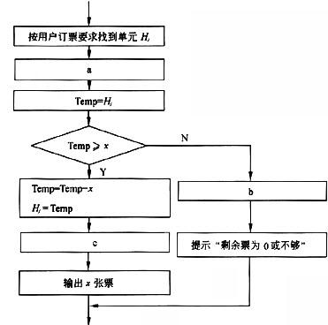
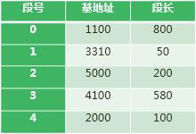
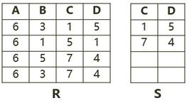
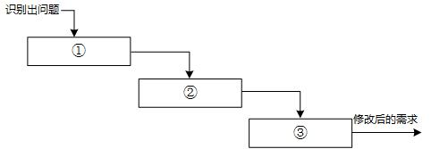
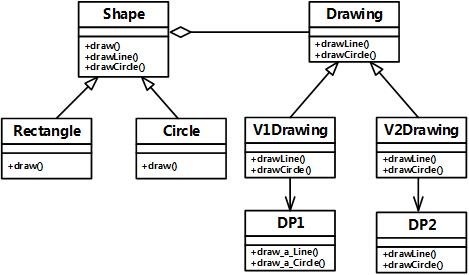
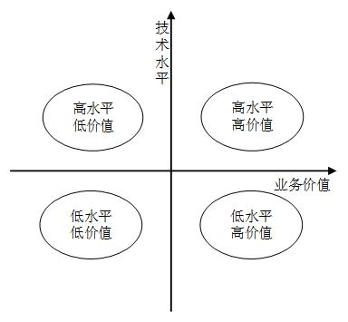
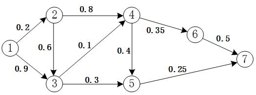

# 2015年系统架构师考试科目一：综合知识

**题目1：** 某火车票销售系统有n 个售票点，该系统为每个售票点创建一个进程Pi(i=1，2，…，n)。假设Hi(j=1，2+，…，m)单元存放某日某车次的剩余票数，Temp 为Pi 进程的临时工作单元，x 为某用户的订票张数。初始化时系统应将信号量S 赋值为( ) 。Pi 进程的工作流程如下，若用P 操作和V 操作实现进程间的同步与互斥，则图中a、b 和c 应分别填入( ) 。(1)A. 0

B. 1
C. 2
D. 3
(2)A. P(S),V(S)和V(S)
B. P(S),P(S)和V(S)
C. V(S),P(S)和P(S)
D. V(S),V(S)和P(S)

**正确答案：** （未提供）
**解析：** 第一空正确答案是1，因为公共数据单元马是一个临界资源，最多允许1 个终端进程使用，因此需要设置一个互斥信号量S，初值等于1。第二空的正确答案是P(S)、V(S)和V(S)，因为进入临界区时执行P 操作，退出临界区时执行V 操作。（个人理解临界区就是菱形判断条件）。

---

**题目2：** 假设系统采用段式存储管理方法，进程P 的段表如下所示。逻辑地址（）不能转换为对应的物理地址；不能转换为对应的物理地址的原因是进行（）。(1)

A. (0,790)和(2,88) B.(1,30)和(3,290)
C. (2,88)和(4,98)
D. (0,810)
和
(4,120)
(2)
A. 除法运算时除数为零
B. 算术运算时有溢出
C. 逻辑地址到物理地址转换时地址越界
D. 物理地址到逻辑地址转换时地址越界

**正确答案：** （未提供）
**解析：** 给定段地址(x，y)，其中：x 为段号，y 为段内地址。将(x，y)转换为物理地址的方法是：根据段号;c 查段表一判断段长；如果小于段长，则物理地址=基地址-段内地址y，否则地址越界。第一问正确的选项为D，第二问正确的选项为C。因为段地址(0，810)中，0 段的段长为800，段内地址810 大于段长，故地址越界。段地址(4，120)中，4 段的段长为100，段内地址120 大于段长，故地址越界。

---

**题目3：** 若系统中存在n 个等待事务Ti（i =0,1，2，…，n-1），其中：T0 正等待被T1 锁住的数据项A1，T1 正等待被T2 锁住的数据项A2，…，Ti 正等待被Ti+1 锁住的数据项Ai+1，…，Tn-1 正等待被T0 锁住的数据项A0，则系统处于（）状态。

A. 封锁
B. 死锁
C. 循环
D. 并发处理

**正确答案：** A
**解析：** 题目所描述的情况为环路等待，此时系统处于死锁状态。

---

**题目4：** 在分布式数据库中包括分片透明、复制透明、位置透明和逻辑透明等基本概念，其中：（）是指局部数据模型透明，即用户或应用程序无需知道局部场地使用的是哪种数据模型。

A. 分片透明
B. 复制透明
C. 位置透明
D. 逻辑透明

**正确答案：** D
**解析：** 本题考查对分布式数据库基本概念的理解。分片透明是指用户或应用程序不需要知道逻辑上访问的表具体是怎么分块存储的。复制透明是指采用复制技术的分布方法，用户不需要知道数据是复制到哪些节点，如何复制的位置透明是指用户无须知道数据存放的物理位置。逻辑透明，即局部数据模型透明，是指用户或应用程序无须知道局部场地使用的是哪种数据模型。

---

**题目5：** 若关系R、S 如下图所示，则关系R 与S 进行自然连接运算后的元组个数和属性列数分别为( )；关系代数表达式    S R    6 3 4 ,1与关系代数表达式( )等价。(1)

A. 6 和6
B. 4 和6
C. 3 和6
D. 3 和4
(2)
A. πA,D(σC=D(R×S))
B. πA,R.D(σS.C=R.D(R×S))
C. πA,R.D(σR.C=S.D(R×S))
D. πA,R.D(σS.C=S.D(R×S))

**正确答案：** （未提供）
**解析：** 【第一问解析】A B C D 6 3 1 5 6 5 7 4 6 3 7 4【第二问解析】：(解析、计算结果)其中S R结果为A B C D C D 6 3 1 5 1 5 6 3 1 5 7 4 6 1 5 1 1 5 6 1 5 1 7 4 6 5 7 4 1 5 6 5 7 4 7 4 6 3 7 4 1 5 6 3 7 4 7 4   S R  6 3：上述结果中行的第3 个属性等于第6 个属性，即R.C=S.D，结果为：A B C D C D 6 1 5 1 1 5  4 1 ：对上述结果投影第1 个和第4 个属性列，即R 中的A（记作A：只有R 中有A）、R 中的D（记作R.D），结果为A D 6 1

---

**题目6：** 在嵌入式操作系统中，板级支持包BSP 作为对硬件的抽象，实现了（）。

A. 硬件无关性，操作系统无关性
B. 硬件有关性，操作系统有关性
C. 硬件无关性，操作系统有关性
D. 硬件有关性，操作系统无关性

**正确答案：** B
**解析：** 本题考查嵌入式系统的基础知识。板级支持包(BSP，也称为硬件抽象层HAL)一般包含相关底层硬件的初始化、数据的输入/输出操作和硬件设备的配置等功能，它主要具有以下两个特点：硬件相关性：因为嵌入式实时系统的硬件环境具有应用相关性，而作为上层软件与硬件平台之间的接口，BSP 需为操作系统提供操作和控制具体硬件的方法。操作系统相关性：不同的操作系统具有各自的软件层次结构，因此不同操作系统具有特定的硬件接口形式。

---

**题目7：** 以下描述中，（）不是嵌入式操作系统的特点。

A. 面向应用，可以进行裁剪和移植
B. 用于特定领域，不需要支持多任务
C. 可靠性高，无需人工干预独立运行，并处理各类事件和故障
D. 要求编码体积小，能够在嵌入式系统的有效存储空间内运行

**正确答案：** B
**解析：** 嵌入式操作系统是应用于嵌入式系统，实现软硬件资源的分配，任务调度，控制、协调并发活动等的操作系统软件。它除了具有一般操作系统最基本的功能如多任务调度、同步机制等之外，通常还会具备以下适用于嵌入式系统的特性：面向应用，可以进行检查和移植，以支持开放性和可伸缩性的体系结构；强实时性，以适应各种控制设备及系统；硬件适用性，对于不同硬件平台提供有效的支持并实现统一的设备驱动接高可靠性，运行时无须用户过多干预，并处理各类事件和故障；编码体积小，通常会固化在嵌入式系统有限的存储单元中。

---

**题目8：** 嵌入式软件设计需要考虑（）以保障软件良好的可移植性。

A. 先进性
B. 易用性
C. 硬件无关性
D. 可靠性

**正确答案：** C
**解析：** 备选答案中，只有硬件无关性与可移植性相关。事实上，现在很多嵌入式系统开发对此非常重视，例如进行电视机顶盒开发，以前解码使用硬件芯片解码的做法比较普遍，现在随着嵌入式系统CPU 运算能力的提升，人们开始将硬件解码改为软件解码，为的就是解决移植过程中由于解码芯片型号不同带来的问题。

---

**题目9：** 下列说法中正确的是（）。

A. 半双工总线只在一个方向上传输信息,全双工总线可在两个方向上轮流传输信息
B. 半双工总线只在一个方向上传输信息，全双工总线可在两个方向上同时传输信息
C. 半双工总线可在两个方向上轮流传输信息，全双工总线可在两个方向上同时传输信息
D. 半双工总线可在两个方向上同时传输信息，全双工总线可在两个方向上轮流传输信息

**正确答案：** （未提供）
**解析：** 对端到端通信总线的信号传输方向与方式的分类定义如下：单工是指A 只能发信号，而B 只能接收信号，通信是单向的。半双工是指A 能发信号给B，B 也能发信号给A，但这两个过程不能同时进行。全双工比半双工又进了一步，在A 给B 发信号的同时，B 也可以给A 发信号，这两个过程可以同时进行互不影响。

---

**题目10：** 假如有3 块容量是80G 的硬盘做RAID 5 阵列，则这个RAID 5 的容量是（）；而如果有2 块80G 的盘和1 块40G 的盘，此时RAID 5 的容量是（）。

A. 240G
B. 160G
C. 80G
D. 40G
A. 40G
B. 80G
C. 160G
D. 200G

**正确答案：** （未提供）
**解析：** RAID 5 是一种存储性能、数据安全和存储成本兼顾的存储解决方案。这种方案中数据信息与校验信息的配比是N+1 方案，即N 份数据，1 份校验信息。所以用3 块容量为80G 的硬盘实际数据容量为160G。当3 盘不同容量的盘做RAID 时，会以最小容量的盘为准，所以2 块80G 和1 块40G的盘视为3 块40G 的盘，所以容量为(3-1)*40 = 80G。

---

**题目11：** 以下关于IPv6 的论述中，正确的是（）。

A. IPv6 数据包的首部比IPv4 复杂
B. IPv6 的地址分为单播、广播和任意播3 种
C. IPv6 的地址长度为128 比特
D. 每个主机拥有唯一的IPv6 地址

**正确答案：** C
**解析：** 选项A 分组头格式得到简化：IPv4 头中的很多字段被丢弃，IPv6 头中字段的数量从12个降到了8 个，中间路由器必须处理的字段从6 个降到了4 个，这样就简化了路由器的处理过程，提高了路由选择的效率。选项B：IPv6 地址分为单播地址、组播地址和任意播地址。选项C：IPv6 的地址长度为128 比特，IPv4 为32 比特。选项D：不一定每个主机拥有唯一的IPv6 地址。

---

**题目12：** 以下关于软件架构风格与系统性能的关系叙述中，错误的是（）。

A. 对于采用层次化架构风格的系统，划分的层次越多，系统的性能越差
B. 对于采用隐式调用架构风格的系统，可以通过处理函数的并发调用提高系统处理性能
C. 采用面向对象架构风格的系统，可以通过引入对象管理层提高系统性能
D. 对于采用解释器架构风格的系统，可以通过部分解释代码预先编译的方式提高系统性
能

**正确答案：** （未提供）
**解析：** 引入对象管理层不但不能提高性能，反而会降低系统性能。这个道理与分层模型中增加层次是一样的。

---

**题目13：** 为了测试新系统的性能，用户必须依靠评价程序来评价机器的性能，以下四种评价程序，（）评测的准确程度最低。

A. 小型基准程序
B. 真实程序
C. 核心程序
D. 合成基准程序

**正确答案：** （未提供）
**解析：** 相对于小型基准程序、真实程序和核心程序，用合成基准程序评测的准确程度最低。真实程序、核心程序、小型基准程序和合成基准程序，其评测准确程度依次递减。

---

**题目14：** 供应链中的信息流覆盖了从供应商、制造商到分销商，再到零售商等供应链中的所有环节，其信息流分为需求信息流和供应信息流，（）属于需求信息流，（）属于供应信息流。

A. 库存记录
B. 生产计划
C. 商品入库单
D. 提货发运单
A. 客户订单
B. 采购合同
C. 完工报告单
D. 销售报告

**正确答案：** B、C
**解析：** 当需求信息(如客户订单、生产计划和采购合同等)从需方向供方流动时，便引发物流。同时，供应信息(如入库单、完工报告单、库存记录、可供销售量和提货发运单等)又同物料一起沿着供应链从供方向需方流动。

---

**题目15：** 电子政务的主要应用模式中不包括（）。

A. 政府对政府（Government To Government）
B. 政府对客户（Government To Customer）
C. 政府对公务员（Government To Employee）
D. 政府对企业（Government To Business）

**正确答案：** （未提供）
**解析：** 电子政务的主要模式有4 种：政府对政府(Government To Government);政府对公务员(Government To Employee)；政府对企业(Government To Business)；政府对公民(Government To Citizen)。

---

**题目16：** 电子商务系统中参与电子商务活动的实体包括（）。

A. 客户、商户、银行和认证中心
B. 客户、银行、商户和政府机构
C. 客户、商户、银行和物流企业
D. 客户、商户、政府和物流企业

**正确答案：** （未提供）
**解析：** 电子商务分五个方面，即电子商情广告、电子选购与交易、电子交易凭证.的交换、电子支付与结算，以及网上售后服务等。参与电子商务的实体有4 类：客户(个人消费者或集团购买)、商户(包括销售商、制造商和储运商)、银行(包括发行和收单行)及认证中心。

---

**题目17：** 商业智能系统的处理过程包括四个主要阶段：数据预处理通过（1）实现企业原始数据的初步整合；建立数据仓库是后续数据处理的基础；数据分析是体现系统智能的关键，主要采用（2）和（3）技术，前者能够实现数据的上卷、下钻和旋转分析，后者利用隐藏的知识，通过建立分析模型预测企业未来发展趋势；数据展现主要完成数据处理结果的可化。(1)A.数据映射和关联

B. 数据集市和数据立方体
C. 数据抽取、转换和装载
D. 数据清洗和数据集成
(2)A.知识库
B. 数据挖掘
C. 联机事务处理
D. 联机分析处理
(3)A.知识库
B. 数据挖掘
C. 联机事务处理
D. 联机分析处理

**正确答案：** C、D、B
**解析：** 商业智能系统的处理过程包括数据预处理、建立数据仓库、数据分析及数据展现4 个主要阶段。数据预处理是整合企业原始数据的第一步，包括数据的抽取、转换和装载三个过程。建立数据仓库则是处理海量数据的基础。数据分析是体现系统智能的关键，一般采用OLAP和数据挖掘技术。联机分析处理不仅进行数据汇总/聚集，同时还提供切片、切块、下钻、上卷和旋转等数据分析功能，用户可以方便地对海量数据进行多维分析。数据挖掘的目标则是挖掘数据背后隐藏的知识，通过关联分析、聚类和分类等方法建立分析模型，预测企业未来发展趋势和将要面临的问题。在海量数据和分析手段增多的情况下，数据展现则主要保障系统分析结果的可视化。

---

**题目18：** 关于项目范围管理描述，正确的是（）。

A. 项目范围是指信息系统产品或者服务所应包含的功能
B. 项目范围描述是产品范围说明书的重要组成部分
C. 项目范围定义是信息系统要求的度量
D. 项目范围定义是生产项目计划的基础

**正确答案：** D
**解析：** A 选项描述的，准确来讲，是产品范围。D 选项中的项目范围定义，在整个项目的生命周期中，会有多轮的精化，在进行其它方面分计划制定时，范围是基础。

---

**题目19：** 项目配置管理中，配置项的状态通常包括（）。

A. 草稿、正式发布和正在修改
B. 草稿、技术评审和正式发布
C. 草稿、评审或审批、正式发布
D. 草稿、正式发布和版本变更

**正确答案：** A
**解析：** 配置项的状态有3 种：“草稿”（Draft）、“正式发布”（Released）和“正在修改”（Changing）。

---

**题目20：** 下列叙述中，不满足好的需求陈述要求的是（）。

A. 每一项需求都必须完整、准确地描述即将要开发的功能
B. 需求必须能够在系统及其运行环境的能力和约束条件内实现
C. 每一项需求记录的功能都必须是用户的真正的需要
D. 所有需求都应被视为同等重要

**正确答案：** （未提供）
**解析：** 所有需求不应被视为同等重要的，不同干系人，提出的不同需求重要程度不一样，如果同样对待，会导致系统最终无法满足需求。

---

**题目21：** 一个大型软件系统的需求总是有变化的。为了降低项目开发的风险，需要一个好的变更控制过程。如下图所示的需求变更管理过程中，①②③处对应的内容应是（1）；自动化工具能够帮助变更控制过程更有效地运作，（2）是这类工具应具有的特性之一。(1)A.问题分析与变更描述，变更分析与成本计算，变更实现

B. 变更描述与变更分析，成本计算，变更实现
C. 问题分析与变更描述，变更分析，变更实现
D. 变更描述，变更分析，变更实现
(2)A.自动维护系统的不同版本
B. 支持系统文档的自动更新
C. 自动判定变更是否能够实施
D. 记录每一个状态变更的日期及变更者

**正确答案：** A、D

---

**题目22：** 处理流程设计是系统设计的重要内容。以下关于处理流程设计工具的叙述中，不正确的是（）。

A. 程序流程图（PFD）用于描速系统中每个模块的输入，输出和数据加工
B. N-S 图容易表示嵌套关系和层次关系，并具有强烈的结构化特征
C. IPO 图的主体是处理过程说明，可以采用流程图、判定树/表等来进行描述
D. 问题分析图（PAD）包含5 种基本控制结构，并允许递归使用

**正确答案：** （未提供）
**解析：** 程序流程图(Program How Diagram，PFD)，N-S 图与PFD 类似，IPO 图是由IBM 公司发起并逐步完善的一种流程描述工具。用于描述系统中每个模块的输入，输出和数据加工的图是IPO 图，而非程序流程图。答案：A。

---

**题目23：** 用例（use case）用来描述系统对事件做出响应时所采取的行动。用例之间是具有相关性的。在一个会员管理系统中，会员注册时可以采用电话和邮件两种方式。用例“会员注册”和“电话注册”、“邮件注册”之间是（）关系。

A. 包含（include）
B. 扩展(extend)
C. 泛化（generalize）D.依赖（depends on）

**正确答案：** ：C
**解析：** 包含：当可以从两个或两个以上的用例中提取公共行为时，应该使用包含的关系来表示它们。扩展：如果一个用例明显地混合了两种或者两种以上的不同场景，即根据情况可能发生多种分支，则可以将这个用例分为一个基本用例和一个或多个扩展用例，这样可能会使描述更加清晰。这种情况下才是扩展关系。比如导出数据模块，有导出excel，导出word 等，这些导出与模块之间是扩展。泛化：当多个用例共同拥有一种类似的结构和行为时，可以将他们的共性抽象成为父用例泛化关系是从另一个角度来看的继承关系，也就是说，当两个用例之间可能存在父子关系时，可判定为泛化关系。在本题中，“电话注册”与“邮件注册”都属于“会员注册”，他们是“会员注册”的具体形式，所以存在父子关系，可判定为泛化关系。

---

**题目24：** 某软件公司欲开发一个绘图软件，要求使用不同的绘图程序绘制不同的图形。在明确用户需求后，该公司的架构师决定采用Bridge 模式实现该软件，并设计UML 类图如下图所示。图中与Bridge 模式中的“Abstraction”角色相对应的类是（），与“Implementor”角色相对应的类是（）。

A. Shape
B. Drawing
C. Rectangle
D. V2Drawing
A. Shape
B. Drawing
C. Rectangle
D. V2Drawing

**正确答案：** ：A、B
**解析：** 桥接模式将抽象部分与它的实现部分分离，使它们都可以独立地变化。它是一种对象结构型模式，又称为柄体(Handle and Body)模式或接口(Interface)模式。桥接模式类似于多重继承方案，但是多重继承方案往往违背了类的单一职责原则，其复用性比较差，桥接模式是比多重继承方案更好的解决方法。桥接模式的结构如下图所示，其中：图中与Bridge 模式中的“Abstraction”角色相对应的类是Shape，与“Implementor”角色相对应的类是Drawing。

---

**题目25：** RUP 强调采用（1）的方式来开发软件，这样做的好处是（2）。(1)A.原型和螺旋

B. 螺旋和增量
C. 迭代和增量
D. 快速和迭代
(2)A.在软件开发的早期就可以对关键的，影响大的风险进行处理
B. 可以避免需求的变更
C. 能够非常快速地实现系统的所有需求
D. 能够更好地控制软件的质量

**正确答案：** ：C、A
**解析：** RUP（统一软件开发过程，Rational Unified Process），RUP 的三个核心特点是：以架构为中心，用例驱动，增量与迭代。其中增量与迭代的好处是：降低了在一个增量上的开支风险。如果开发人员重复某个迭代，那么损失只是这一个开发有误的迭代的花费。降低了产品无法按照既定进度进入市场的风险。通过在开发早期就确定风险，可以尽早来解决而不至于在开发后期匆匆忙忙。加快了整个开发工作的进度。因为开发人员清楚问题的焦点所在，他们的工作会更有效率。由于用户的需求并不能在一开始就作出完全的界定，它们通常是在后续阶段中不断细化的。因此，迭代过程这种模式使适应需求的变化会更容易些。

---

**题目26：** 在面向对象设计的原则中、（）原则是指抽象不应该依赖予细节，细节应该依赖于抽象，即应针对接口编程，而不是针对实现编程。

A. 开闭
B. 里氏替换
C. 最少知识
D. 依赖倒置

**正确答案：** （未提供）
**解析：** 单一职责原则：设计目的单一的类。开放-封闭原则：对扩展开放，对修改封闭。李氏(Liskov)替换原则：子类可以替换父类。依赖倒置原则：要依赖于抽象，而不是具体实现；针对接口编程，不要针对实现编程。接口隔离原则：使用多个专门的接口比使用单一的总接口要好。组合重用原则：要尽量使用组合，而不是继承关系达到重用目的。迪米特(Demeter)原则(最少知识法则)：一个对象应当对其他对象有尽可能少的了解。

---

**题目27：** 对于遗留系统的评价框架如下图所示，那么处于“高水平、低价值”区的遗留系统适合于采用的演化策略为（）。

A. 淘汰
B. 继承
C. 改造
D. 集成

**正确答案：** （未提供）

---

**题目28：** （）的目的是检查模块之间，以及模块和已集成的软件之间的接口关系，并验证已集成的软件是否符合设计要求。其测试的技术依据是（）。

A. 单元测试
B. 集成测试
C. 系统测试
D. 回归测试
A. 软件详细设计说明书
B. 技术开发合同
C. 软件概要设计文档
D. 软件配置文档

**正确答案：** （未提供）
**解析：** 根据国家标准GB/T15532-2008，软件测试可分为单元测试、集成测试、配置项测试、系统测试、验收测试和回归测试等类别。单元测试也称为模块测试，测试的对象是可独立编译或汇编的程序模块、软件构件或面向对象软件中的类(统称为模块)，其目的是检查每个模块能否正确地实现设计说明中的功能、性能、接口和其他设计约束等条件，发现模块内可能存在的各种差错。单元测试的技术依据是软件详细设计说明书。集成测试的目的是检查模块之间，以及模块和己集成的软件之间的接口关系，并验证已集成的软件是否符合设计要求。集成测试的技术依据是软件概要设计文档。系统测试的对象是完整的、集成的计算机系统，系统测试的目的是在真实系统工作环境下，验证完整的软件配置项能否和系统正确连接，并满足系统/子系统设计文档和软件开发合同规定的要求。系统测试的技术依据是用户需求或开发合同。配置项测试的对象是软件配置项，配置项测试的目的是检验软件配置项与软件需求规格说明的一致性。确认测试主要验证软件的功能、性能和其他特性是否与用户需求一致。验收测试是指针对软件需求规格说明，在交付前以用户为主进行的测试。回归测试的目的是测试软件变更之后，变更部分的正确性和对变更需求的复合型，以及软件原有的、正确的功能、性能和其他规定的要求的不损害性。

---

**题目29：** 软件架构风格是描述某一特定应用领域中系统组织方式的惯用模式。架构风格反映领域中众多系统所共育的结构和（），强调对架构（）的重用。

A. 语义特性
B. 功能需求
C. 质量属性
D. 业务规则
A. 分析
B. 设计
C. 实现
D. 评估

**正确答案：** ：A、B
**解析：** 软件架构设计的一个核心问题是能否使用重复的架构模式，即能否达到架构级的软件重用。也就是说，能否在不同的软件系统中，使用同一架构。基于这个目的，学者们开始研究和实践软件架构的风格和类型问题。软件架构风格是描述某一特定应用领域中系统组织方式的惯用模式。它反映了领域中众多系统所共有的结构和语义特性，并指导如何将各个模块和子系统有效地组织成一个完整的系统。按这种方式理解，软件架构风格定义了用于描述系统的术语表和一组指导构件系统的规则。对软件架构风格的研究和实践促进了对设计的复用，一些经过实践证实的解决方案也可以可靠地用于解决新的问题。架构风格的不变部分使不同的系统可以共享同一个实现代码。只要系统是使用常用的、规范的方法来组织，就可使别的设计者很容易地理解系统的架构。例如，如果某人把系统描述为"客户/服务器"模式，则不必给出设计细节，我们立刻就会明白系统是如何组织和工作的。

---

**题目30：** 软件架构是降低成本、改进质量、按时和按需交付产品的关键因素。软件架构设计需满足系统的（），如性能、安全性和可修改性等，并能够指导设计人员和实现人员的工作。

A. 功能需求
B. 性能需求
C. 质量属性
D. 业务属性

**正确答案：** （未提供）
**解析：** 软件架构是降低成本、改进质量、按时和按需交付产品的关键因素，软件架构设计需要满足系统的质量属性，如性能、安全性和可修改性等，软件架构设计需要确定组件之间的依赖关系，支持项目计划和管理活动，软件架构能够指导设计人员和实现人员的工作。一般在设计软件架构之初，会根据用户需求，确定多个候选架构，并从中选择一个较优的架构，并随着软件的开发，对这个架构进行微调，以达到最佳效果。

---

**题目31：** 架构描述语言(Architecture Description Language，ADL）是一种为明确说明软件系统的概念架构和对这些概念架构建模提供功能的语言。ADL 主要包括以下组成部分：组件、组件接口、（）和架构配置。

A. 架构风格
B. 架构实现
C. 连接件
D. 组件约束

**正确答案：** （未提供）
**解析：** 架构描述语言(Architecture Description Language，ADL)是一种为明确说明软件系统的概念架构和对这些概念架构建模提供功能的语言。ADL 主要包括以下组成部分：组件、组件接口、连接件和架构配置。ADL 对连接件的重视成为区分ADL 和其他建模语言的重要特征之一。

---

**题目32：** 基于架构的软件开发(Architecture Based Software Development，ABSD)强调由商业、质量和功能需求的组合驱动软件架构设计。它强调采用（）描述软件架构，用（）来描述需求。(1)A.类图和序列图

B. 视角与视图
C. 构建和类图
D. 构建与功能
(2)A.用例与类图
B. 用例与视角
C. 用例与质量场景
D. 视角与质量场景

**正确答案：** ：B、C
**解析：** 根据定义，基于软件架构的开发(Architecture Based Software Development，ABSD)强调由商业、质量和功能需求的组合驱动软件架构设计。它强调采用视角和视图来描述软件架构，采用用例和质量属性场景来描述需求。

---

**题目33：** 某公司拟开发一个地面清洁机器人。机器人的控制者首先定义清洁任务和任务之间的关系，机器人接受任务后，需要响应外界环境中触发的一些突发事件，根据自身状态进行动态调整，最终自动完成任务。针对上述需求，该机器人应该采用（）架构风格最为合适。

A. 面向对象
B. 主程序-子程序
C. 规则系统
D. 管道-过滤器

**正确答案：** （未提供）
**解析：** 规则系统属于虚拟机风格的一种，在本题中要求机器人的控制者首先定义清洁任务和任务之间的关系，然后由机器人执行，这说明机器人能对自定义的一些逻辑进行解析，这是虚拟机风格的一大特色。

---

**题目34：** 某公司拟开发一个语音识别系统，其语音识别的主要过程包括分割原始语音信号、识别音素、产生候选词、判定语法片断、提供语义解释等，每个过程都需要进行基于先验知识的条件判断并进行相应的识别动作。针对该系统的特点，采用（）架构风格最为合适。

A. 解释器
B. 面向对象
C. 黑板
D. 隐式调用

**正确答案：** （未提供）
**解析：** 语音识别的处理是黑板风格的经典应用实例。

---

**题目35：** 某公司拟开发了个轿车巡航定速系统，系统需要持续测量车辆当前的实时速度，并根据设定的期望速度启动控制轿车的油门和刹车。针对上述需求，采用（）架构风格最为合适。

A. 解释器
B. 过程控制
C. 分层
D. 管道-过滤器

**正确答案：** （未提供）
**解析：** 根据题目描述，轿车巡航定速系统是一个十分典型的控制系统，其特点是不断采集系统当前状态，与系统中的设定状态进行对比，并通过将当前状态与设定状态进行对比从而进行控制。因此对比4 个候选项，过程控制特别适合求解这类问题。

---

**题目36：** 某公司拟开发一套在线游戏系统，该系统的设计目标之一是支持用户自行定义游戏对象属性，行为和对象之间的交互关系。为了实现上述目标，公司应该采用（）架构风格最为合适。

A. 管道-过滤器
B. 隐式调用
C. 主程序-子程序
D. 解释器

**正确答案：** （未提供）
**解析：** 依据题目要求拟开发的在线游戏需要自定义对象之间的交互，这样必须有机制能支持系统对新定义的规则进行解析，这需要用到虚拟机风格，构造一个虚拟机对规则进行解析，所以在此应选择归属于虚拟机风格的解释器。

---

**题目37：** 某公司为其研发的硬件产品设计实现了一种特定的编程语言，为了方便开发者进行软件开发，公司拟开发一套针对该编程语言的集成开发环境，包括代码编辑、语法高亮、代码编译、运行调试等功能。针对上述描述，该集成开发环境应采用（）架构风格最为合适。

A. 管道-过滤器
B. 数据仓储
C. 主程序-子程序
D. 解释器

**正确答案：** （未提供）
**解析：** 现代编译器的集成开发环境一般采用数据仓储（即以数据为中心的架构风格）架构风格进行开发，其中心数据就是程序的语法树。

---

**题目38：** 软件架构设计包括提出架构模型，产生架构设计和进行设计评审等活动，是一个迭代的过程。架构设计主要关注软件组件的结构、属性和（），并通过多种（）全面描述特定系统的架构。

A. 实现方式
B. 交互作用
C. 设计方案
D. 测试方式
A. 对象
B. 代码
C. 文档
D. 视图

**正确答案：** （未提供）
**解析：** 软件架构设计包括提出架构模型、产生架构设计和进行设计评审等活动，是一个迭代的过程。架构设计主要关注软件组件的结构、属性和交互作用，并通过多种视图全面描述特定系统的架构。

---

**题目39：** 特定领域软件架构（Domain Specific Software Architecture, DSSA）以一个特定问题领域为对象，形成由领域参考模型，参考需求，（1）等组成的开发基础架构，支持一个特定领域中多个应用的生成。DSSA 的基本活动包括领域分析、领域设计和领域实现。其中领域分析的主要目的是获得（2），从而描述领域中系统之间共同的需求，即领域需求；领域设计的主要目标是获得（3），从而描述领域模型中表示需求的解决方案；领域实现的主要目标是开发和组织可重用信息，并实现基础软件架构。(1)A.参考设计

B. 参考规约
C. 参考架构
D. 参考实现
(2)A.领域边界
B. 领域信息
C. 领域对象
D. 领域模型
(3)A.特点领域软件需求
B. 特定领域软件架构
C. 特定领域软件设计模型
D. 特定领域软件重用模型

**正确答案：** ：C、D、B
**解析：** 特定领域软件架构(Domain Specific Software Architecture，DSSA)以一个特定问题领域为对象，形成由领域参考模型、参考需求、参考架构等组成的开发基础架构，其目标是支持一个特定领域中多个应用的生成。DSSA 的基本活动包括领域分析、领域设计和领域实现。其中领域分析的主要目的是获得领域模型，领域模型描述领域中系统之间共同的需求，即领域需求；领域设计的主要目标是获得DSSA，DSSA 描述领域模型中表示需求的解决方案；领域实现的主要目标是依据领域模型和DSSA 开发和组织可重用信息，并对基础软件架构进行实现。

---

**题目40：** 某公司欲开发一个网上商城系统，在架构设计阶段，公司的架构师识别出3 个核心质量属性场景，其中“系统主站断电后，能够在2 分钟内自动切换到备用站点，并恢复正常运行”主要与（）质量属性相关，通常可采用（）架构策略实现该属性；“在并发用户数不超过1000 人时，用户的交易请求应该在0.5s 内完成”主要与（）质量属性相关通常可采用（）架构策略实现该属性；“系统应该能够抵挡恶意用户的入侵行为，并进行报警和记录”主要与（）质量属性相关，通常可采用（）架构策略实现该属性。

A. 性能
B. 可用性
C. 易用性
D. 可修改性
A. 主动冗余
B. 信息隐藏
C. 抽象接口
D. 记录/回放
A. 可测试性
B. 易用性
C. 性能
D. 互操作性
A. 操作串行化
B. 资源调度
C. 心跳
D. 内置监控器
A. 可用性
B. 安全性
C. 可测试性
D. 可修改性
A. 内置监控器
B. 记录/回放
C. 追踪审计
D. 维护现有接口

**正确答案：** ：B 、A、C、B、B、C
**解析：** “系统主站断电后，能够在2 分钟内自动切换到备用站点，并恢复正常运行”，表达的是在出问题后的恢复能力，属于可用性范畴。主动冗余是提高可用性的有效手段。“在并发用户数不超过1000 人时，用户的交易请求应该在0.5s 内完成”，这是对性能的量化指标，属于性能的范畴。有效的资源调度能提升性能。“系统应该能够抵挡恶意用户的入侵行为，并进行报警和记录”，这是安全方面的要求，在系统中，一般会用日志记录相关信息，然后通过对日志进行的审计能了解相关情况。

---

**题目41：** 架构权衡分析方法(Architecture Tradeoff Analysis Method, ATAM)是在基于场景的架构分析方法（Scenarios-based Architecture Analysis Method, SAAM）基础之上发展起来的，主要包括场景和需求收集、（1），属性模型构造和分析，属性模型折中等四个阶段。ATAM 方法要求在系统开发之前，首先对这些质量属性进行（2）和折中。(1) A.架构视图和场景实现

B. 架构风格和场景分析
C. 架构设计和目标分析
D. 架构描述和需求评估
(2)A.设计
B. 实现
C. 测试
D. 评价

**正确答案：** （未提供）
**解析：** 本题主要考查考生对架构权衡分析方法(Architecture Tradeoff Analysis Method，ATAM)的掌握和理解。ATAM 是在基于场景的架构分析方法(Scenarios-based Architecture Analysis Method，SAAM)基础之上发展起来的。主要包括场景和需求收集、架构视图和场景实现、属性模型构造和分析、属性模型折中等4 个阶段。ATAM 方法要求在系统开发之前，首先对这些质量属性进行评价和折中。

---

**题目42：** 用户提出需求并提供经费，委托软件公司开发软件。双方商定的协议（委托开发合同）中未涉及软件著作权归属，其软件著作权应由（）享有。

A. 用户
B. 用户、软件公司共有
C. 软件公司
D. 经裁决所确认的一方

**正确答案：** ：C
**解析：** 《计算软件保护条例》第二章，第十一条规定：接受他人委托开发的软件，其著作权的归属由委托人与受托人签订书面合同约定；无书面合同或者合同未作明确约定的，其著作权由受托人享有。

---

**题目43：** 某摄影家创作一件摄影作品出版后，将原件出售给了某软件设计师。软件设计师不慎将原件毁坏；则该件摄影作品的著作权（）享有。

A. 仍然由摄影家
B. 由摄影家和软件设计师共同
C. 由软件设计师
D. 由摄影家或软件设计师申请的一方

**正确答案：** ：A
**解析：** 《著作权法实施条例》第十七条规定：“著作权法第十八条关于美术作品原件所有权的转移不视作作品著作权的转移的规定适用于任何原件所有权可能转移的作品。作品原件的合法所有人如不是著作权人，他要想将作品发表，必须经过著作权人的许可。”。摄影作品属于美术作品的一类，这种作品的著作权不会因为原件所有权的转移而转移，所以由始至终，著作权一直由摄影家享有。

---

**题目44：** 软件设计师王某在其公司的某一综合信息管理系统软件开发项目中、承担了大部分程序设计工作。该系统交付用户，投入试运行后，王某辞职离开公司，并带走了该综合信息管理系统的源程序，拒不交还公司。王某认为综合信息管理系统源是他独立完成的，他是综合信息管理系统源程序的软件著作权人。王某的行为（）。

A. 侵犯了公司的软件著作权
B. 未侵犯公司的软件著作权
C. 侵犯了公司的商业秘密权
D. 不涉及侵犯公司的软件著作权

**正确答案：** ：A
**解析：** 王某完成的软件由于是公司安排的任务，在公司完成的，所以会被界定为职务作品，这个作品的软件著作权归公司拥有。

---

**题目45：** 某高校欲构建财务系统，使得用户可通过校园网访问该系统。根据需求，公司给出如下2 套方案。方案一：1)出口设备采用一台配置防火墙板卡的核心交换机，并且使用防火墙策略将需要对校园网做应用的服务器进行地址映射；2)采用4 台高性能服务器实现整体架构，其中3 台作为财务应用服务器、1 台作为数据备份管理服务器；3)通过备份管理软件的备份策略将3 台财务应用服务器的数据进行定期备份。方案二：1)出口设备采用1 台配置防火墙板卡的核心交换机，并且使用防火墙策略将需要对校园网做应用的服务器进行地址映射；2)采用2 台高性能服务器实现整体架构，服务器采用虚拟化技术，建多个虚拟机满足财务系统业务需求。当一台服务器出现物理故障时将业务迁移到另外一台物理服务器上。与方案一相比，方案二的优点是（1）。方案二还有一些缺点，下列不属于其缺点的是（2）。(1)A.网络的安全性得到保障

B. 数据的安全性得到保障
C. 业务的连续性得到保障
D. 业务的可用性得到保障
(2) A.缺少企业级磁盘阵列，不能将数据进行统一的存储与管理
B. 缺少网闸，不能实现财务系统与Internet 的物理隔离
C. 缺少安全审计，不便于相关行为的记录、存储与分析
D. 缺少内部财务用户接口，不便于快速管理与维护

**正确答案：** ：C、B
**解析：** 与方案一相比，方案二服务器采用虚拟化技术，当一台服务器出现物理故障时将业务迁移到另外一台物理服务器上，保障了业务的连续性。网络的安全性、数据的安全性、业务的可用性都没有发生实质性变化。当然方案二还有一些缺陷。首先缺少将数据进行统一的存储鱼管理的企业级磁盘阵列；其次缺少安全审计，不便于相关行为的记录、存储与分析；而且缺少内部财务用户接口，不便于快速管理与维护。但是如果加网闸，就不能实现对财务系统的访问。不能实现用户可通过校园网对财务系统的访问。

---

**题目46：** 甲、乙、丙、丁4 人加工A、B 、C、D 四种工件所需工时如下表所示。指派每人加工一种工件，四人加工四种工件其总工时最短的最优方案中，工件B 应由（）加工。A B C D甲14 9 4 15乙11 7 7 10丙13 2 10 5丁17 9 15 3

A. 甲
B. 乙
C. 丙
D. 丁

**正确答案：** ：D

---

**题目47：** 小王需要从①地开车到⑦地，可供选择的路线如下图所示。图中，各条箭线表示路段及其行驶方向，箭线旁标注的数字表示该路段的拥堵率（描述堵车的情况，即堵车概率）。拥堵率=1-畅通率，拥堵率=0 时表示完全畅通，拥堵率=1 时表示无法行驶。根据该图，小主选择拥堵情况最少（畅通情况最好）的路线是（）。

A. ①②③④⑤⑦
B. ①②③④⑥⑦
C. ①②③⑤⑦
D. ①②④⑥⑦

**正确答案：** ：C
**解析：** 方案①②③④⑤⑦的畅通概率为：(1-0.2)*(1-0.6)*(1-0.1)*(1-0.4)*(1-0.25)= 0.1296方案①②③④⑥⑦的畅通概率为：(1-0.2)*(1-0.6)*(1-0.1)*(1-0.35)*(1-0.5)= 0.0936方案①②③⑤⑦的畅通概率为：(1-0.2)*(1-0.6)*(1-0.3)*(1-0.25)= 0.168方案①②④⑥⑦的畅通概率为：(1-0.2)*(1-0.8)*(1-0.35)*(1-0.5)= 0.052

---

**题目48：** The objective of ( )is to determine what parts of the application software will be assigned to what hardware.The major software components of the system being developed have to be identified and then allocated to the various hardware components on which the system will operate. All software systems can be divided into four basic functions. The first is( ). Most information systems require data to be stored and retrieved,whether a small file,such as a memo produced by a word processor,or a large database,such as one that stores an organization’s accounting records. The second function is the ( ),the processing required to access data,which often means database queries in Structured Query Language. The third function is the ( ),which is the logic documented in the DFDs,use cases,and functional requirements.The fourth function is the presentation logic,the display of information to the user and the acceptance of the user’s commands.The three primary hardware components of a system are ( ). (1)A.architecture design

B. modular design
C. physical design
D. distribution design
(2)A.data access components
B. database management system
C. data storage
D. data entities
(3) A.data persistence
B. data access objects
C. database connection
D. dataaccess logic
(4) A.system requirements
B. system architecture
C. application logic
D. application program
(5)A.computers,cables and network
B. clients,servers,and network
C. CPUs,memories and I/O devices
D. CPUs,hard disks and I/O devices

**正确答案：** ：A、C、D、C、B
**解析：** 架构设计的目标是确定应用软件的哪些部分将分配到何种硬件。识别出正在开发系统的主要软件构件并分配到系统将要运行的硬件构件。所有软件系统可分为四项基本功能。第一项是数据存储。大多数信息系统需要数据进行存储并检索，不论是一个小文件，比如一个字处理器产生的一个备忘录，还是一个大型数据库，比如存储一个企业会计记录的数据库。第二项功能是数据访问逻辑，处理过程需要访问数据，这通常是指用SQL 进行数据库查询。第三项功能是应用程序逻辑，这些逻辑通过数据流图，用例和功能需求来记录。第四项功能是表示逻辑，给用户显示信息并接收用户命令。一个系统的三类主要硬件构件是客户机、服务器和网络。

---
