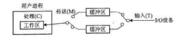
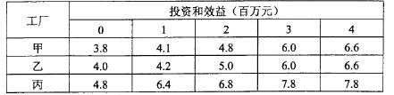

# 2016年系统架构师考试科目一：综合知识

**题目1：** 在嵌入式系统的存储部件中，存取速度最快的是（）。

A. 内存
B. 寄存器组
C. Flash
D. Cache

**正确答案：** （未提供）
**解析：** 本题考查嵌入式系统存储结构的基础知识嵌入式系统的存储结构采用分级的方法来设计，从而使得整个存储系统分为四级，即寄存器组、高速缓冲(Cache)、内存(包括Flash)和外存，它们在存取速度上依次递减，而在存储容量上逐级递增。存取速度：寄存器> Cache > 内存> 硬盘> 光盘> 软盘。

---

**题目2：** 实时操作系统（RTOS）内核与应用程序之间的接口称为（）。

A. I/O 接口
B. PCI
C. API
D. GUI

**正确答案：** （未提供）
**解析：** API：所有操作系统（不仅仅只是嵌入式操作系统）给应用程序提供的接口。GUI：图形用户界面，又称图形用户接口，是用户与操作系统之间的接口。

---

**题目3：** 嵌入式处理器是嵌入式系统的核心部件，一般可分为嵌入式微处理器(MPU)、微控制器(MCU)、数字信号处理器(DSP)和片上系统(SOC)。以下叙述中，错误的是（）。

A. MPU 在安全性和可靠性等方面进行增强，适用于运算量较大的智能系统
B. MCU 典型代表是单片机，体积小从而使功耗和成本下降
C. DSP 处理器对系统结构和指令进行了特殊设计，适合数字信号处理
D. SOC 是一个有专用目标的集成电路，其中包括完整系统并有嵌入式软件的全部内容

**正确答案：** （未提供）
**解析：** (1)、MPU 采用增强型通用微处理器。由于嵌入式系统通常应用于环境比较恶劣的环境中，因而MPU 在工作温度、电磁兼容性以及可靠性方面的要求较通用的标准微处理器高。但是，MPU 在功能方面与标准的微处理器基本上是一样的。A 是错的。(2)、MCU 又称单片微型计算机(Single Chip Microcomputer)或者单片机，是指随着大规模集成电路的出现及其发展，将计算机的CPU、RAM、ROM、定时计数器和多种I/O 接口集成在一片芯片上，形成芯片级的计算机，为不同的应用场合做不同组合控制。B 是对的。(3)、DSP 是一种独特的微处理器，是以数字信号来处理大量信息的器件。其实时运行速度可达每秒数以千万条复杂指令程序，远远超过通用微处理器，它的强大数据处理能力和高运行速度，是最值得称道的两大特色。C 也是对的。(4)、SOC 称为系统级芯片，也有称片上系统,意指它是一个产品，是一个有专用目标的集成电路，其中包含完整系统并有嵌入软件的全部内容。D 也是对的。

---

**题目4：** 某计算机系统输入/输出采用双缓冲工作方式，其工作过程如下图所示，假设磁盘块与缓冲区大小相同，每个盘块读入缓冲区的时间T 为10 s ，缓冲区送用户区的时间M 为6 s ，系统对每个磁盘块数据处理时间C 为2 s 。若用户需要将大小为10 个磁盘块的Docl 文件逐块从磁盘读入缓冲区，并送用户区进行处理，那么采用双缓冲需要花费的时间为（）s ，比使用单缓冲节约了（）s 时间。

A. 100
B. 108
C. 162
D. 180
A. 0
B. 8
C. 54
D. 62

**正确答案：** （未提供）
**解析：** 单缓冲区：假定从磁盘把一块数据输入到缓冲区的时间为T，操作系统将该缓冲区中的数据传送到用户区的时间为M，而CPU 对这一块数据处理的时间为C。由于T 和C 是可以并行的，当T>C 时，系统对每一块数据的处理时间为M+T，反之则为M+C，故可把系统对每一块数据的处理时间表示为max(C, T)+M。单缓冲区执行时间：(10+6+2)+(10-1)*(10+6)=162 s 双缓冲区：系统处理一块数据的时间可以粗略地认为是max(C, T)。双缓冲区执行时间：(10+6+2)+(10-1)*10=108 s 双缓冲比单缓冲节省162-108=54 s 。

---

**题目5：** 某文件系统文件存储采用文件索引节点法。假设文件索引节点中有8 个地址项iaddr[0]～iaddr[7]，每个地址项大小为4 字节，其中地址项iaddr[0]～iaddr[5]为直接地址索引，iaddr[6]是一级间接地址索引，iaddr[7]是二级间接地址索引，磁盘索引块和磁盘数据块大小均为4KB。该文件系统可表示的单个文件最大长度是（）KB。若要访问iclsClient.dll 文件的逻辑块号分别为6、520 和1030，则系统应分别采用（）。(1)A．1030

B. 65796
C. 1049606
D. 4198424
(2)A.直接地址索引、一级间接地址索引和二级间接地址索引
B. 直接地址索引、二级间接地址索引和二级间接地址索引
C. 一级间接地址索引、一级间接地址索引和二级间接地址索引
D. 一级间接地址索引、二级间接地址索引和二级间接地址索引

**正确答案：** （未提供）
**解析：** 第一问：因为磁盘索引块和磁盘数据块大小均为4KB，每个地址项大小为4 字节，所以每个磁盘索引块和磁盘数据块可存放4KB/4=1024 个物理地址块。计算直接地址索引，0-5 存放6 个物理块号，对应文件长度6*4KB，对应逻辑块号0—5。计算一级间接地址索引，1024*4KB，对应逻辑块号5+1—1024+5=6—1029。计算二级间接地址索引，1024*1024*4KB，对应逻辑块号1030 及以上。总计6*4KB+1024*4KB+1024*1024*4KB=4198424KB。第二问：由第一问对应的逻辑号，可得逻辑块号6、520 和1030 分别对应一级间接地址索引、一级间接地址索引、二级间接地址索引。

---

**题目6：** 给定关系模式R（A，B，C，D，E）、S（D，E，F，G）和π1,2,4,6（R ⋈S），经过自然连接和投影运算后的属性列数分别为（）。

A. 9 和4
B. 7 和4
C. 9 和7
D. 7 和7

**正确答案：** （未提供）
**解析：** R 与S 进行自然连接后，结果属性集为：A,B,C,D,E,F,G。投影操作后，结果为：A,B,D,F。

---

**题目7：** 给定关系R（A1，A2，A3，A4）上的函数依赖集F={A1→A2A5，A2→A3A4，A3→ A2}，R 的候选关键字为（）。函数依赖（）∈F+。

A. A5→A1A2
B. A4→A1A2
C. A3→A2A4
D. A2→A1A5
根据函数依赖图可以看出C 选项能走通。

**正确答案：** （未提供）
**解析：** 第一问：解法一：A1 只出现在左边，是候选关键字；A4、A5 只出现在右边，不是候选关键字。且A1 的闭包等于R。所以A1 为候选关键字。解法二：通过绘制函数依赖图可以了解到，从A1 出发，可以遍历全图，所以候选关键字为A1。第二问：函数依赖（）∈F+：通俗一点，就是从F 函数依赖集能推导出来的依赖关系。

---

**题目8：** 假设某证券公司的股票交易系统中有正在运行的事务，此时，若要转储该交易系统数据库中的全部数据，则应采用（）方式。

A. 静态全局转储
B. 动态全局转储
C. 静态增量转储
D. 动态增量转储

**正确答案：** （未提供）
**解析：** 从题目中“系统中有正在运行的事务”可知应采用动态方式，从题目中“全部数据”可知应是全局转储，所以应采用：动态全局转储。

---

**题目9：** IETF 定义的区分服务（DiffServ）模型要求每个IP 分组都要根据IPv4 协议头中的（）字段加上一个DS 码点，然后内部路由器根据DS 码点的值对分组进行调度和转发。

A. 数据报生存期
B. 服务类型
C. 段偏置值
D. 源地址

**正确答案：** （未提供）
**解析：** 区分服务是为解决服务质量问题在网络上将用户发送的数据流按照它对服务质量的要求划分等级的一种协议。区分服务将具有相同特性的若干业务流汇聚起来，为整个汇聚流提供服务，而不是面向单个业务流来提供服务。每个IP 分组都要根据其QoS(Quality of Service，服务质量)需求打上一个标记，这种标记称为DS 码点，可以利用IPv4 协议头中的服务类型字段，或者IPv6 协议头中的通信类别字段来实现，这样就维持了现有的IP 分组格式不变。

---

**题目10：** 在IPv6 无状态自动配置过程中，主机将其（14）附加在地址前缀1111 1110 10 之后，产生一个链路本地地址。

A. IPv4 地址
B. MAC 地址
C. 主机名
D. 随机产生的字符串

**正确答案：** （未提供）
**解析：** IPv6 地址的格式前缀(FP)用于表示地址类型或子网地址，用类似于IPv4 的CIDR(无类别域间路由，Classless Inter-Domain Routing)表示方法表示。链路本地地址：前缀为1111 1110 10，用于同一链路的相邻节点间的通信。相当于IPv4 的自动专用IP 地址。为实现IP 地址的自动配置，IPv6 主机将MAC 地址附加在地址前缀1111 1110 10 之后，产生一个链路本地地址。

---

**题目11：** 如果管理距离为15，则（）。

A. 这是一条静态路由
B. 这是一台直连设备
C. 该路由信息比较可靠
D. 该路由代价较小

**正确答案：** （未提供）
**解析：** 管理距离是指一种路由协议的路由可信度。每一种路由协议按可靠性从高到低，依次分配一个信任等级，这个信任等级就叫管理距离。正常情况下，管理距离越小，它的优先级就越高，也就是可信度越高。一个管理距离是一个从0-255 的整数值，0 是最可信赖的，而255 则意味着不会有业务量通过这个路由。由此可见，管理距离是与信任相关的，只有选项C 是相符的。

---

**题目12：** 把应用程序中应用最频繁的那部分核心程序作为评价计算机性能的标准程序，称为（）程序。（）不是对Web 服务器进行性能评估的主要指标。

A. 仿真测试
B. 核心测试
C. 基准测试
D. 标准测试
A. 丢包率
B. 最大并发连接数
C. 响应延迟
D. 吞吐量

**正确答案：** （未提供）
**解析：** 第一问：本题考查基本概念，应用最频繁的那部分核心程序作为评价计算机性能的标准程序，称为基准测试程序。仿真测试：模拟软件的真实使用环境。其他两个暂未找到定义。第二问：作为承载Web 应用的Web 服务器，对其进行性能评估时，主要关注最大并发连接数、响应延迟、吞吐量等指标。相对来说，对个别数据的丢包率并不是很关心，可作为网络的相关指标。

---

**题目13：** ERP（Enterprise Resource Planning）是建立在信息技术的基础上，利用现代企业的先进管理思想，对企业的物流、资金流和（20）流进行全面集成管理的管理信息系统，为企业提供决策、计划、控制与经营业绩评估的全方位和系统化的管理平台。在ERP 系统中，（）管理模块主要是对企业物料的进、出、存进行管理。

A. 产品
B. 人力资源
C. 信息
D. 加工
A. 库存
B. 物料
C. 采购
D. 销售

**正确答案：** （未提供）
**解析：** 第一问：本题考查到的，是信息化的“三流”：信息流，资金流，物流。第二问：采购与库存管理是ERP 的基本模块。其中采购管理模块是对采购工作——从采购订单产生至货物收到的全过程进行组织、实施与控制。库存管理（Inventory Management，IM）模块则是对企业物料的进、出、存进行管理。

---

**题目14：** 项目的成本管理中，（B）将总的成本估算分配到各项活动和工作包上，来建立一个成本的基线。

A. 成本估算
B. 成本预算
C. 成本跟踪
D. 成本控制

**正确答案：** （未提供）

---

**题目15：** （）是关于项目开发管理正确的说法。

A. 需求文档、设计文档属于项目管理和机构支撑过程域产生的文档
B. 配置管理是指一个产品在其生命周期各个阶段所产生的各种形式和各种版本的文档、
计算机程序、部件及数据的集合
C. 项目时间管理中的过程包括活动定义、活动排序、活动的资源估算、活动历时估算、
制定进度计划以及进度控制
D. 操作员指南属于系统文档

**正确答案：** ：C
**解析：** 项目管理和机构支撑过程域产生的文档：如工作计划、项目质量报告、项目跟踪报告等。这些文档虽然不是产品的组成部分，但是值得保存。配置管理是通过技术和行政手段对产品及其开发过程和生命周期进行控制、规范的一系列措施和过程。操作员指南属于用户文档。

---

**题目16：** （）在软件开发机构中被广泛用来指导软件过程改进。

A. 能力成熟度模型（Capacity Maturity Model）
B. 关键过程领域（Key Process Areas）
C. 需求跟踪能力链（Traceability Link）
D. 工作分解结构（Work Breakdown Structure）

**正确答案：** （未提供）
**解析：** CMM 即软件开发能力成熟度模型，是用来指导软件过程改进的。

---

**题目17：** （）是关于需求管理正确的说法。

A. 为达到过程能力成熟度模型第二级，组织机构必须具有3 个关键过程域
B. 需求的稳定性不属于需求属性
C. 需求变更的管理过程遵循变更分析和成本计算、问题分析和变更描述、变更实现的顺
序
D. 变更控制委员会对项目中任何基线工作产品的变更都可以做出决定

**正确答案：** （未提供）
**解析：** 为了达到过程能力成熟度模型的第二级，组织机构必须具有6 个关键过程域，故A 选项错误。例如，在文档中考虑和明确如下属性：创建需求的时间、需求的版本号、创建需求的作者、负责认可该软件需求的人员、需求状态、需求的原因和根据、需求涉及的子系统、需求涉及的产品版本号、使用的验证方法或者接受的测试标准、产品的优先级或者重要程度、需求的稳定性。故B 选项错误。需求的变更遵循以下流程：问题分析和变更描述、变更分析和成本计算、变更实现。故C 选项错误。

---

**题目18：** 螺旋模型在（）的基础上扩展而成。

A. 瀑布模型
B. 原型模型
C. 快速模型
D. 面向对象模型

**正确答案：** （未提供）

---

**题目19：** （）适用于程序开发人员在地域上分布很广的开发团队。（）中，编程开发人员分成首席程序员和“类”程序员。(1)、A.水晶系列（Crystal）开发方法

B. 开放式源码（Open source）开发方法
C. SCRUM 开发方法
D. 功用驱动开发方法（FDD）
(2)、A.自适应软件开发（ASD）
B. 极限编程（XP）开发方法
C. 开放统—过程开发方法（OpenUP）
D. 功用驱动开发方法（FDD）
A. D，区别太复杂，选择性放弃。

**正确答案：** （未提供）

---

**题目20：** 在软件系统工具中，版本控制工具属于（），软件评价工具属于（）。

A. 软件开发工具
B. 软件维护工具
C. 编码与排错工具
D. 软件管理和软件支持工具
A. 逆向工程工具
B. 开发信息库工具C.编码与排错工具
D. 软件管理和软件支持工具

**正确答案：** （未提供）
**解析：** 通常可以按软件过程活动将软件工具分为软件开发工具、软件维护工具、软件管理和软件支持工具。软件开发工具：需求分析工具、设计工具、编码与排错工具。软件维护工具：版本控制工具、文档分析工具、开发信息库工具、逆向工程工具、再工程工具。软件管理和软件支持工具：项目管理工具、配置管理工具、软件评价工具、软件开发工具的评价和选择。

---

**题目21：** 面向对象的分析模型主要由（）、用例与用例图、领域概念模型构成；设计模型则包含以包图表示的软件体系结构图、以交互图表示的（）、完整精确的类图、针对复杂对象的状态图和描述流程化处理过程的（）等。

A. 业务活动图
B. 顶层架构图
C. 数据流模型
D. 实体联系图
A. 功能分解图
B. 时序关系图
C. 用例实现图
D. 软件部署图
A. 序列图
B. 协作图
C. 流程图
D. 活动图

**正确答案：** （未提供）
**解析：** 本题考查的是教程“4.4.2 面向对象的分析设计”的内容。面向对象的分析模型主要由顶层架构图、用例与用例图、领域概念模型构成。设计模型则包含以包图表示的软件体系结构图、以交互图表示的用例实现图、完整精确的类图、针对复杂对象的状态图和用以描述流程化处理过程的活动图等。

---

**题目22：** 面向构件的编程(Component Oriented Programming，COP)关注于如何支持建立面向构件的解决方案。面向构件的编程所需要的基本支持包括（35）。

A. 继承性、构件管理和绑定、构件标识、访问控制
B. 封装性、信息隐藏、独立部署、模块安全性
C. 多态性、模块封装性、后期绑定和装载、安全性
D. 构件抽象、可替代性、类型安全性、事务管理

**正确答案：** （未提供）
**解析：** “面向构件的编程需要下列基本的支持：多态性（可替代性）、模块封装性（高层次信息的隐藏）、后期的绑定和装载（部署独立性）、安全性（类型和模块安全性）。

---

**题目23：** CORBA（Common Object Request Broker Architecture,公共对象请求代理体系结构，通用对象请求代理体系结构）构件模型中，（）的作用是在底层传输平台与接收调用并返回结果的对象实现之间进行协调，（）是最终完成客户请求的服务对象实现。

A. 伺服对象激活器
B. 适配器激活器
C. 伺服对象定位器
D. 可移植对象适配器POA
A. CORBA 对象
B. 分布式对象标识
C. 伺服对象Servant
D. 活动对象映射表

**正确答案：** （未提供）

---

**题目24：** 关于构件的描述，正确的是（）。

A. 构件包含了一组需要同时部署的原子构件
B. 构件可以单独部署，原子构件不能被单独部署
C. 一个原子构件可以同时在多个构件家族中共享
D. 一个模块可以看作带有单独资源的原子构件

**正确答案：** （未提供）

---

**题目25：** 面向服务系统构建过程中，（）用于实现Web 服务的远程调用，（）用来将分散的、功能单一的Web 服务组织成一个复杂的有机应用。(1)、A.UDDI（Universal Description，Discovery and Integration）

B. WSDL（Web Service Description Language)
C. SOAP（Simple Object Access Protocol）
D. BPEL（Business Process Execution Language）
(2)、A.UDDI（Universal Description，Discovery and Integration）
B. WSDL（Web Service Description Language）
C. SOAP（Simple Object Access Protocol）
D. BPEL（Business Process Execution Language）

**正确答案：** ：C、D
**解析：** UDDI 用于Web 服务注册和服务查找；WSDL 用于描述Web 服务的接口和操作功能；SOAP 为建立Web 服务和服务请求之间的通信提供支持。BPEL 翻译成中文的意思是面向Web 服务的业务流程执行语言，也有的文献简写成BPEL4WS，它是一种使用Web 服务定义和执行业务流程的语言。使用BPEL，用户可以通过组合、编排和协调Web 服务自上而下地实现面向服务的体系结构（SOA）。BPEL 提供了一种相对简单易懂的方法，可将多个Web 服务组合到一个新的复合服务（称作业务流程）中。

---

**题目26：** 基于JavaEE 平台的基础功能服务构建应用系统时，（）可用来集成遗产系统。

A. JDBC、JCA 和Java IDL
B. JDBC、JCA 和JMS
C. JDBC、JMS 和Java IDL
D. JCA、JMS 和Java IDL

**正确答案：** ：D
**解析：** JCA 标准化连接子是由J2EE 1.3 首先提出的，它位于J2EE 应用服务器和企业信息系统（EIS）之间，比如数据库管理、企业资源规划（ERP）、企业资产管理（EAM）和客户关系管理（CRM）系统。不是用Java 开发的企业应用或者在J2EE 框架内的应用都可以通过JCA 连接。JMS 是Java 对消息系统的访问机制，但它本身并不实现消息。JMS 支持点对点分发的消息队列，也支持多个目标订阅的消息主题。当消息发布给一个主题的适合，消息就会发送给所有那个主题的订阅者。JMS 支持各种消息类型（二进制、流、名－值表、序列化的对象和文本）。通过声明与SQL 的WHERE 相近的句段，可以建立消息的过滤器。Java IDL 即idltojava 编译器就是一个ORB，可用来在Java 语言中定义、实现和访问CORBA 对象。Java IDL 支持的是一个瞬间的CORBA（Common Object Request Broker Architecture,公共对象请求代理体系结构，通用对象请求代理体系结构）对象，即在对象服务器处理过程中有效。实际上，Java IDL 的ORB 是一个类库而已，并不是一个完整的平台软件，但它对Java IDL 应用系统和其他CORBA 应用系统之间提供了很好的底层通信支持，实现了OMG 定义的ORB 基本功能。

---

**题目27：** 软件集成测试将已通过单元测试的模块集成在一起，主要测试模块之间的协作性。从组装策略而言，可以分为（）。集成测试计划通常是在（）阶段完成，集成测试一般采用黑盒测试方法。(1)A.批量式组装和增量式组装

B. 自顶向下和自底向上组装
C. 一次性组装和增量式组装
D. 整体性组装和混合式组装
(2)A.软件方案建议
B. 软件概要设计
C. 软件详细设计
D. 软件模块集成

**正确答案：** （未提供）
**解析：** 第一问：集成测试按照组装策略可分为一次性组装和增量式组装，增量式组装测试效果更好。集成测试按照集成方式可非渐增量式、渐增量式。第二问：集成测试计划一般在概要设计阶段完成。

---

**题目28：** （）架构风格可以概括为通过连接件绑定在一起按照一组规则运作的并行构件。

A. C2
B. 黑板系统
C. 规则系统
D. 虚拟机

**正确答案：** （未提供）
**解析：** C2 体系结构风格可以概括为：通过连接件绑定在一起的按照一组规则运作的并行构件网络。

---

**题目29：** DSSA (特定领域的软件架构，domain-specific software architecture)是在一个特定应用领域中为一组应用提供组织结构参考的软件体系结构，参与DSSA 的人员可以划分为4种角色，包括领域专家、领域设计人员、领域实现人员和（），其基本活动包括领域分析、领域设计和（）。

A. 领域测试人员
B. 领域顾问
C. 领域分析师
D. 领域经理
A. 领域建模
B. 架构设计
C. 领域实现
D. 领域评估

**正确答案：** （未提供）

---

**题目30：** （）不属于可修改性考虑的内容。

A. 可维护性
B. 可扩展性
C. 结构重构
D. 可变性

**正确答案：** （未提供）
**解析：** 可修改性包含四个方面。可维护性(maintainability)、可扩展性(extendibility)、结构重组(reassemble）、可移植性(portability)。

---

**题目31：** 某公司拟为某种新型可编程机器人开发相应的编译器。该编译过程包括词法分析、语法分析、语义分析和代码生成四个阶段，每个阶段产生的结果作为下一个阶段的输入，且需独立存储。针对上述描述，该集成开发环境应采用（）架构风格最为合适。

A. 管道-过滤器
B. 数据仓储
C. 主程序-子程序
D. 解释器

**正确答案：** （未提供）
**解析：** “每个阶段产生的结果作为下一个阶段的输入”是典型的数据流架构风格的特点，选项中仅有管道-过滤器属于这种风格。

---

**题目32：** 软件架构风格是描述某一特定应用领域中系统组织方式的惯用模式。一个体系结构定义了一个词汇表和一组（）。架构风格反映领域中众多系统所共有的结构和（）。

A. 约束
B. 连接件
C. 拓扑结构
D. 规则
A. 语义特征
B. 功能需求
C. 质量属性
D. 业务规则

**正确答案：** （未提供）

---

**题目33：** 某公司拟开发一个扫地机器人。机器人的控制者首先定义清洁流程和流程中任务之间的关系，机器人接受任务后，需要响应外界环境中触发的一些突发事件，根据自身状态进行动态调整，最终自动完成任务。针对上述需求，该机器人应该采用（）架构风格最为合适。

A. 面向对象
B. 主程序-子程序
C. 规则系统
D. 管道-过滤器

**正确答案：** （未提供）
**解析：** 在本题所述的应用环境中，强调了自定义流程，然后按自定义流程来执行，这属于虚拟机风格的特征，备选答案中，仅有C 选项属于虚拟机风格。

---

**题目34：** 某企业内部现有的主要业务功能已封装成为Web 服务。为了拓展业务范围，需要将现有的业务功能进行多种组合，形成新的业务功能。针对业务灵活组合这一要求，采用（）架构风格最为合适。

A. 规则系统
B. 面向对象
C. 黑板
D. 解释器

**正确答案：** （未提供）
**解析：** 在本题所述的应用环境中，强调了自定义流程，然后按自定义流程来执行，这属于虚拟机风格的特征，备选答案中，仅有C 选项属于虚拟机风格。

---

**题目35：** 某公司拟开发一个语音搜索系统，其语音搜索系统的主要工作过程包括分割原始语音信号、识别音素、产生候选词、判定语法片断、提供搜索关键词等，每个过程都需要进行基于先验知识的条件判断并进行相应的识别动作。针对该系统的特点，采用（）架构风格最为合适。

A. 分层系统
B. 面向对象
C. 黑板
D. 隐式调用

**正确答案：** （未提供）
**解析：** 语音识别是黑板风格的经典应用。

---

**题目36：** 设计模式基于面向对象技术，是人们在长期的开发实践中良好经验的结晶，提供了一个简单、统一的描述方法，使得人们可以复用这些软件设计办法、过程管理经验。按照设计模式的目的进行划分，现有的设计模式可以分为创建型、（）和行为型三种类型。其中（）属于创建型模式，（）属于行为型模式。（）模式可以将一个复杂的组件分成功能性抽象和内部实现两个独立的但又相关的继承层次结构，从而可以实现接口与实现分离。

A. 合成型
B. 组合型
C. 结构型
D. 聚合型
A. Adaptor
B. Facade
C. Command
D. Singleton
A. Decorator
B. Composite
C. Memento
D. Builder
A. Prototype
B. Flyweight
C. Adapter
D. Bridge

**正确答案：** （未提供）
**解析：** 设计模式包括：创建型、结构型、行为型三大类别。Singleton 是单例模式，属于创建型设计模式。Memento 是备忘录模式，属于行为型设计模式。Bridge 是桥接模式，它的特点是实现接口与实现分离。

---

**题目37：** 某公司欲开发一个智能机器人系统，在架构设计阶段，公司的架构师识别出3 个核心质量属性场景。其中“机器人系统主电源断电后，能够在10 秒内自动启动备用电源并进行切换，恢复正常运行”主要与（1）质量属性相关，通常可采用（2）架构策略实现该属性；“机器人在正常运动过程中如果发现前方2 米内有人或者障碍物，应在1 秒内停止并在2 秒内选择一条新的运行路径”主要与（3）质量属性相关，通常可采用（4）架构策略实现该属性；“对机器人的远程控制命令应该进行加密，从而能够抵挡恶意的入侵破坏行为，并对攻击进行报警和记录”主要与（5）质量属性相关，通常可采用（6）架构策略实现该属性。(1)

A. 可用性B.性能C.易用性D.可修改性
(2)
A. 抽象接口B.信息隐藏C.主动冗余D.记录/回放
(3)
A. 可测试性B.易用性C.互操作性D.性能
(4)
A. 资源调度B.操作串行化C.心跳D.内置监控器
(5)
A. 可用性B.安全性C.可测试性D.可修改性
(6)
A. 内置监控器B.追踪审计C.记录/回放D.维护现有接口

**正确答案：** （未提供）
**解析：** “机器人系统主电源断电后，能够在10 秒内自动启动备用电源并进行切换，恢复正常运行”属于可用性，因为场景描述的是故障恢复问题。主动冗余是可用性的常见策略。“对机器人的远程控制命令应该进行加密，从而能够抵挡恶意的入侵破坏行为，并对攻击进行报警和记录”属于安全性，常见的策略是追踪审计。答案：A、C、D、A、B、B。

---

**题目38：** DES 加密算法的密钥长度为56 位，三重DES 的密钥长度为（）位。

A. 168
B. 128
C. 112
D. 56

**正确答案：** （未提供）
**解析：** DES 加密算法的密钥长度为56 位，三重DES 要用到2 个DES 的密钥，所以长度为112 位。

---

**题目39：** 下列攻击方式中，流量分析属于（）方式。

A. 被动攻击
B. 主动攻击
C. 物理攻击
D. 分发攻击

**正确答案：** （未提供）
**解析：** 在被动攻击(passive attack)中，攻击者的目的只是获取信息，这就意味着攻击者不会篡改信息或危害系统。系统可以不中断其正常运行。常见的被动攻击包括：窃听和流量分析。主动攻击(active attack)可能改变信息或危害系统。威胁信息完整性和有效性的攻击就是主动攻击。主动攻击通常易于探测但却难于防范，因为攻击者可以通过多种方法发起攻击。常见的主动攻击包括：篡改、伪装、重放、拒绝服务攻击。

---

**题目40：** 软件著作权保护的对象不包括（）。

A. 源程序
B. 目标程序
C. 用户手册
D. 处理过程

**正确答案：** （未提供）
**解析：** 软件著作权中规定：开发软件所用的思想、处理过程、操作方法或者数学概念不受保护。

---

**题目41：** M 公司购买了N 画家创作的一幅美术作品原件。M 公司未经N 画家的许可，擅自将这幅美术作品作为商标注册，并大量复制用于该公司的产品上。M 公司的行为侵犯了N画家的（）。

A. 著作权
B. 发表权
C. 商标权
D. 展览权

**正确答案：** （未提供）

---

**题目42：** M 软件公司的软件产品注册商标为N，为确保公司在市场竞争中占据优势，对员工进行了保密约束。此情形下，（）的说法是错误的。

A. 公司享有商业秘密权
B. 公司享有软件著作权
C. 公司享有专利权
D. 公司享有商标权

**正确答案：** （未提供）
**解析：** 在题目的描述中，未体现出有申请专利的行为，所以不享有专利权。

---

**题目43：** 某公司有4 百万元资金用于甲、乙、丙三厂追加投资。各厂获得不同投资款后的效益见下表。适当分配投资（以百万元为单位）可以获得的最大的总效益为（69）百万元。

A. 15.1
B. 15.6
C. 16.4
D. 16.9

**正确答案：** （未提供）

---

**题目44：** The objective of（1）is to determine what parts of the application software will be assigned to what hardware. The major software components of the system being developed have to be identified and then allocated to the various hardware components on which the system will operate. All software systems can be divided into four basic functions. The first is（2）.Most information systems require data to be stored and retrieved, whether a small file,such as a memo produced by a word processor, or a large database, such as one that stores an organization’s accounting records.The second function is the（3）,the processing required to access data, which often means database queries in Structured Query Language. The third function is the （4）,which is the logic documented in the DFDs, use cases,and functional requirements.The fourth function is the presentation logic,the display of information to the user and the acceptance of the user’s commands.The three primary hardware components of a system are（5）.（1）A.architecture design

B. modular design
C. physical design
D. distribution design
（2）A.data access components
B. database management system
C. data storage
D. data entities
（3）A.data persistence
B. data access objects
C. database connection
D. data access logic
（4）A.system requirements
B. system architecture
C. application logic
D. application program
（5）A.computers,cables and network
B. clients,servers,and network
C. CPUs,memories and I/O devices
D. CPUs,hard disks and I/O devices

**正确答案：** A、C、D、C、B
**解析：** 架构设计的目标是确定应用软件的哪些部分将分配到何种硬件。识别出正在开发系统的主要软件构件并分配到系统将要运行的硬件构件。所有软件系统可分为四项基本功能。第一项是数据存储。大多数信息系统需要数据进行存储并检索，不论是一个小文件，比如一个字处理器产生的一个备忘录，还是一个大型数据库，比如存储一个企业会计记录的数据库。第二项功能是数据访问逻辑，处理过程需要访问数据，这通常是指用SQL 进行数据库查询。第三项功能是应用程序逻辑，这些逻辑通过数据流图，用例和功能需求来记录。第四项功能是表示逻辑，给用户显示信息并接收用户命令。一个系统的三类主要硬件构件是客户机、服务器和网络。

---
