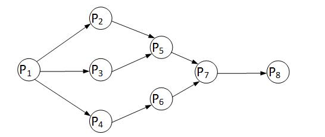
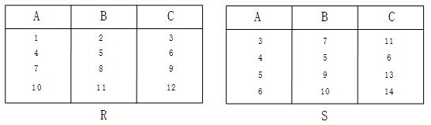
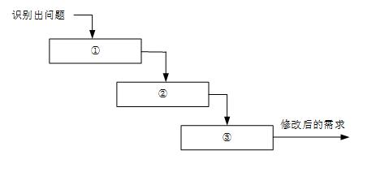
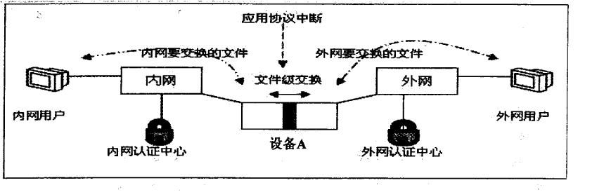

# 2017年系统架构师考试科目一：综合知识

**题目1：** 某计算机系统采用5 级流水线结构执行指令，设每条指令的执行由取指令(2 ∆t )、分析指令(1∆t )、取操作数(3∆t )、运算(1∆t )和写回结果(2∆t ) 组成，并分别用5 个子部完成，该流水线的最大吞吐率为( ) ;若连续向流水线输入10 条指令，则该流水线的加速比为( ) 。(1)A. 1 Δt 9 1 B. Δt 3 1 C. Δt 2 1 D. Δt 1 (2)A. 1:10

B. 2:1
C. 5:2
D. 3:1

**正确答案：** ：B、C
**解析：** 理论流水线执行时间=(2 t +1 t +3 t +1 t +2 t )+max(2 t ，1 t ，3 t ，1 t ，2 t ) *(n-1) = 9 t +(n-1)*3 t ;第一问：1 n n最大吞吐率：      lim Δt 3 Δt 6 t nΔ 3 Δt 3 1) (n- Δt+ 9 n第二问：10 条指令使用流水线的执行时间=9 t +(10-1)*3 t =36 t 。10 条指令不用流水线的执行时间=9 t *10=90 t 。加速比=使用流水线的执行时间/不使用流水线的执行时间=90 t /36 t  = 5:2。

---

**题目2：** DMA (直接存储器访问)工作方式是在( )之间建立起直接的数据通路。

A. CPU 与外设
B. CPU 与主存
C. 主存与外设
D. 外设与外设

**正确答案：** ：C
**解析：** 直接主存存取（Direct Memory Access，DMA）是指数据在主存与I/O 设备间的直接成块传送，即在主存与I/O 设备间传送数据块的过程中，不需要CPU 作任何干涉，只需在过程开始启动（即向设备发出“传送一块数据”的命令）与过程结束（CPU 通过轮询或中断得知过程是否结束和下次操作是否准备就绪）时由CPU 进行处理，实际操作由DMA 硬件直接完成，CPU 在传送过程中可做其它事情。

---

**题目3：** RISC(精简指令系统计算机）的特点不包括：( )。

A. 指令长度固定，指令种类尽量少
B. 寻址方式尽量丰富，指令功能尽可能强
C. 增加寄存器数目，以减少访存次数
D. 用硬布线电路实现指令解码，以尽快完成指令译码

**正确答案：** ：B
**解析：** RISC 与CISC 的对比表所示：指令系统类型指令寻址方式实现方式其他CISC（复杂）数量多，使用频率差别大，可变长格式支持多种微程序控制技术研制周期长RISC（精简）数量少，使用频率接近，支持方式少增加了通优化编译，定长格式，大部分为单周期指令，操作寄存器，只有Load/Store用寄存器；硬布线逻辑控制为主；适合采用流水线有效支持高级语言寻址方式尽量丰富不是RISC 的特点，而是CISC 的特点。

---

**题目4：** 以下关于RTOS (实时操作系统)的叙述中，不正确的是( )。

A. RTOS 不能针对硬件变化进行结构与功能上的配置及裁剪
B. RTOS 可以根据应用环境的要求对内核进行裁剪和重配
C. RTOS 的首要任务是调度一切可利用的资源来完成实时控制任务
D. RTOS 实质上就是一个计算机资源管理程序，需要及时响应实时事件和中断

**正确答案：** ：A
**解析：** 实时系统的正确性依赖于运行结果的逻辑正确性和运行结果产生的时间正确性，即实时系统必须在规定的时间范围内正确地响应外部物理过程的变化。实时多任务操作系统是根据操作系统的工作特性而言的。实时是指物理进程的真实时间。实时操作系统是指具有实时性，能支持实时控制系统工作的操作系统。首要任务是调度一切可利用的资源来完成实时控制任务，其次才着眼于提高计算机系统的使用效率，重要特点是要满足对时间的限制和要求。一个实时操作系统可以在不破坏规定的时间限制的情况下完成所有任务的执行。任务执行的时间可以根据系统的软硬件的信息而进行确定性的预测。也就是说，如果硬件可以做这件工作，那么实时操作系统的软件将可以确定性的做这件工作。实时操作系统可根据实际应用环境的要求对内核进行裁剪和重新配置，根据不同的应用，其组成有所不同。

---

**题目5：** 前趋图(Precedence Graph) 是一个有向无环图，记为：→={(Pi，Pj )|Pi must complete before Pj may strat}，假设系统中进程P={P1，P2，P3，P4，P5，P6，P7，P8}，且进程的前驱图如下：那么前驱图可记为：( )。

A. →={(P2 ，P1) ，(P3 ，P1) ，(P4 ，P1) ，(P6 ，P4) ，(P7 ，P5) ，(P7 ，P6) ，(P8 ，P7)}
B. →={(P1，P2)，(P1，P3)，(P1，P4)，(P2，P5)，(P5，P7)，(P6，P7)，(P7，P8 )}
C. →={(P1，P2)，(P1，P3)，(P1，P4)，(P2，P5)，(P3，P5)，(P4，P6)，(P5，P7)，(P6，P7)，
(P7，P8)}
D. →={(P2，P1)，(P3，P1)，(P4，P1)，(P5，P2)，(P5，P2)，(P5，P3)，(P6，P4)，(P7，P5)，
(P7，P6)，(P8，P7)}

**正确答案：** ：C

---

**题目6：** 在磁盘上存储蝶的排列方式会影响I/O 服务的总时间。假设每磁道划分成10 个物理块，每块存放1 个逻辑记录。逻辑记录R1，R2，...，RI0 存放在同一个磁道上，记录的安排顺序如下表所示:物理块1 2 3 4 5 6 7 8 9 10逻辑记录R1 R2 R3 R4 R5 R6 R7 R8 R9 R10假定磁盘的旋转速度为30ms/周，磁头当前处在R1 的开始处。若系统顺序处理这些记录，使用单缓冲区，每个记录处理时间为6ms，则处理这10 个记录的最长时间为( ) ;若对信息存储进行优化分布后，处理10 个记录的最少时间为( )。

A. 189ms
B. 208ms
C. 289ms
D. 306ms
A. 60 ms
B. 90 ms
l09ms
D. 180ms

**正确答案：** ：D、B
**解析：** 根据题意“每磁道划分成10 个物理块，每块存放1 个逻辑记录”和“磁盘的旋转速度为30ms/周”得，系统读取每一个逻辑记录的时间t1=30ms/10=3ms。本题是一个较为复杂的磁盘原理问题，我们可以通过模拟磁盘的运行来进行分析求解。运作过程为：1、读取R1：耗时3ms。读取完，磁头位于R2 的开始位置。2、处理R1：耗时6ms。处理完，磁头位于R4 的开始位置。3、旋转定位到R2 开始位置：耗时24ms(间隔8 个)。4、读取R2：耗时3ms。读取完，磁头位于R3 的开始位置。5、处理R2：耗时6ms。处理完，磁头位于R5 的开始位置。6、旋转定位到R3 开始位置：耗时24ms。……从以上分析可以得知，读取并处理R1 一共需要9ms。而从R2 开始，多了一个旋转定位时间，R2 旋转定位到读取并处理一共需要33ms，后面的R3 至R10 与R2 的情况一致。所以一共耗时：9+33*9=306ms。本题后面一问要求计算处理10 个记录的最少时间。其实只要把记录间隔存放，就能达到这个目标。在物理块1 中存放R1，在物理存4 中存放R2，在物理块7 中存放R3，依此类推，这样可以做到每条记录的读取与处理时间之和均为9ms，所以处理10 条记录一共90ms。

---

**题目7：** 给定关系模式R(U，F)，其中: 属性集U={A1 ，A2，A3，A4，A5，A6}，函数依赖集F={A1→A2，A1→A3，A3→A4，A1A5→A6}。关系模式R 的候选码为( )，由于R 存在非主属性对码的部分函数依赖，所以R 属于( )。

A. A1A3
B. A1A4
C. A1A5
D. A1A6
A. 1NF
B. 2NF
C. 3NF
D. BCNF

**正确答案：** ：C、A
**解析：** 要求关系模式的候选码，可以先将函数依赖画成图的形式：从图很直观的可以看出，入度为零的结点是A1 与A5，从这两个结点的组合出发，能遍历全图，所以A1A5组合键为候选码。题目后一问是一个概念性问题，2NF 的规定是消除非主属性对码的部分函数依赖。本题已明确告知未消除该依赖，说明未达到2NF，只能选1NF。

---

**题目8：** 给定元组演算表达式R*={t│(Эu)(R(t)∧S(u)∧t[3]<u[2])} ，若关系R、S 如下图所示，则（）。

A. R*={(3，7，11)，(5，9，13)，(6，10，14)}
B. R*={(3，7，11)，(4，5，6)，(5，9，13)，(6，10，14)}
C. R*={(1，2，3)，(4，5，6)，(7，8，9)}
D. R*={(1，2，3)，(4，5，6)，(7，8，9)，(10，11，12)}

**正确答案：** ：C
**解析：** 题目中表达式：存在从关系R 中选择的元组t 的C 列上的分量，大于关系S 中的一个元组u 在B 列上的分量。t[3]<u[2]：R 中每行的第三个分量（R 的第3 列）<S 中每行的第二个分量t[3]={3，6，9，12}，u[2]={7，5，9，10} t[3]中的3<{7，5，9，10}中的7，5，9，10，满足要求。t[3]中的6<{7，5，9，10}中的7，9，10，满足要求。t[3]中的9<{7，5，9，10}中的10，满足要求。t[3]中的12 不满足要求。存在：只要满足u[2]中一个分量就行。所以t[3]<u[2] = {(1，2，3)，(4，5，6)，(7，8，9)}

---

**题目9：** 分布式数据库两阶段提交协议中的两个阶段是指( )。

A. 加锁阶段、解锁阶段
B. 获取阶段、运行阶段
C. 表决阶段、执行阶段
D. 扩展阶段、收缩阶段

**正确答案：** ：C
**解析：** 所谓的两个阶段是指：第一阶段：准备阶段(表决阶段)和第二阶段：提交阶段（执行阶段）。准备阶段(表决阶段)：事务协调者(事务管理器)给每个参与者(资源管理器)发送Prepare 消息，每个参与者要么直接返回失败(如权限验证失败)，要么在本地执行事务，写本地的redo 和undo 日志，但不提交，到达一种“万事俱备，只欠东风”的状态。提交阶段（执行阶段）：如果协调者收到了参与者的失败消息或者超时，直接给每个参与者发送回滚(Rollback)消息；否则，发送提交(Commit)消息；参与者根据协调者的指令执行提交或者回滚操作，释放所有事务处理过程中使用的锁资源。(注意:必须在最后阶段释放锁资源)

---

**题目10：** 下面可提供安全电子邮件服务的是( )。

A. RSA
B. SSL
C. SET
D. S/MIME

**正确答案：** ：D
**解析：** MIME(Multipurpose Internet Mail Extensions)中文名为：多用途互联网邮件扩展类型。S/MIME (Secure Multipurpose Internet Mail Extensions)是对MIME 在安全方面的扩展。它可以把MIME 实体(比如数字签名和加密信息等)封装成安全对象。增强安全服务，例如具有接收方确认签收的功能，这样就可以确保接收者不能否认已经收到过的邮件。还可以用于提供数据保密、完整性保护、认证和鉴定服务等功能。S/MIME 只保护邮件的邮件主体，对头部信息则不进行加密，以便让邮件成功地在发送者和接收者的网关之间传递。扩展：

---

**题目11：** 网络逻辑结构设计的内容不包括( )。

A. 逻辑网络设计图
B. IP 地址方案
C. 具体的软硬件、广域网连接和基本服务
D. 用户培训计划

**正确答案：** ：D
**解析：** 利用需求分析和现有网络体系分析的结果来设计逻辑网络结构，最后得到一份逻辑网络设计文档，输出内容包括以下几点：1、逻辑网络设计图2、IP 地址方案3、安全方案4、招聘和培训网络员工的具体说明5、对软硬件、服务、员工和培训的费用初步估计物理网络设计是对逻辑网络设计的物理实现，通过对设备的具体物理分布、运行环境等确定，确保网络的物理连接符合逻辑连接的要求。输出如下内容：1、网络物理结构图和布线方案2、设备和部件的详细列表清单3、软硬件和安装费用的估算4、安装日程表，详细说明服务的时间以及期限5、安装后的测试计划6、用户的培训计划由此可以看出D 选项的工作是物理网络设计阶段的任务。

---

**题目12：** 某企业通过一台路由器上联总部，下联4 个分支结构，设计人员分配给下级机构一个连续的地址空间，采用一个子网或者超网段表示。这样的主要作用是( )。

A. 层次化路由选择
B. 易于管理和性能优化
C. 基于故障排查
D. 使用较少的资源

**正确答案：** A
**解析：** 层次化路由的含义是指对网络拓扑结构和配置的了解是局部的，一台路由器不需要知道所有的路由信息，只需要了解其管辖的路由信息，层次化路由选择需要配合层次化的地址编码。而子网或超网就属于层次化地址编码行为。

---

**题目13：** 对计算机评价的主要性能指标有时钟频率、( )、运算精度和内存容量等。对数据库管理系统评价的主要性能指标有( )、数据库所允许的索引数量和最大并发实物处理能力等。(1)A.丢包率

B. 端口吞吐量
C. 可移植性
D. 数据处理速率
(2)A.MIPS
B. 支持协议和标准
C. 最大连接数
D. 时延抖动

**正确答案：** D、C
**解析：** 对计算机性能评价指标有：时钟频率（主频）；运算速度；运算精度；内存的存储容量；存储器的存取周期；数据处理速率；吞吐率；各种响应时间；各种利用率；平均故障响应时间；兼容性；可扩充性；性能价格比。衡量数据库管理系统的主要性能指标包括数据库本身和管理系统两部分，有：数据库的大小、数据库中表的数量、单个表的大小、表中允许的记录（行）数量、单个记录（行）的大小、表上所允许的索引数量、数据库所允许的索引数量、最大并发事务处理能力、负载均衡能力、最大连接数等等。扩展：评价网络的性能指标有：设备级性能指标；网络级性能指标；应用级性能指标；用户级性能指标；吞吐量。评价操作系统的性能指标有：系统的可靠性、系统的吞吐率（量）、系统响应时间、系统资源利用率、可移植性。Web 服务器的性能指标有：最大并发连接数、响应延迟、吞吐量。

---

**题目14：** 用于管理信息系统规划的方法有很多，其中( )将整个过程看成是一个“信息集合”，并将组织的战略目标转变为管理信息系统的战略目标。( )通过自上而下地识别企业目标、企业过程和数据，然后对数据进行分析，自下而上地设计信息系统。(1)A.关键成功因素法

B. 战略目标集转化法
C. 征费法
D. 零线预算法
(2)A.企业信息分析与集成法
B. 投资回收法
C. 企业系统规划法
D. 阶石法
用于管理信息系统规划的方法很多，主要是关键成功因素法（Critical Success Factors，CSF）、战略目标集
转化法（Strategy Set Transformation，SST）和企业系统规划法（Business System Planning，BSP）。其它还有
企业信息分析与集成技术（BIAIT）、产出/方法分析（E/MA）、投资回收法（ROI）、征费法（chargout）、零
线预算法、阶石法等。用得最多的是前面三种。

**正确答案：** （未提供）

---

**题目1：** 关键成功因素法（CSF）在现行系统中，总存在着多个变量影响系统目标的实现，其中若干个因素是关键的和主要的（即关键成功因素）。通过对关键成功因素的识别，找出实现目标所需的关键信息集合，从而确定系统开发的优先次序。关键成功因素来自于组织的目标，通过组织的目标分解和关键成功因素识别、性能指标识别，一直到产生数据字典。识别关键成功因素，就是要识别联系于组织目标的主要数据类型及其关系。不同的组织的关键成功因素不同，不同时期关键成功因素也不相同。当在一个时期内的关键成功因素解决后，新的识别关键成功因素又开始。关键成功因素法能抓住主要矛盾，使目标的识别突出重点。由于经理们比较熟悉这种方法，使用这种方法所确定的目标，因而经理们乐于努力去实现。该方法最有利于确定企业的管理目标。

**正确答案：** （未提供）

---

**题目2：** 战略目标集转化法（SST）把整个战略目标看成是一个“信息集合”，由使命、目标、战略等组成，管理信息系统的规划过程即是把组织的战略目标转变成为管理信息系统的战略目标的过程。战略目标集转化法从另一个角度识别管理目标，它反映了各种人的要求，而且给出了按这种要求的分层，然后转化为信息系统目标的结构化方法。它能保证目标比较全面，疏漏较少，但它在突出重点方面不如关键成功因素法。

**正确答案：** （未提供）

---

**题目3：** 企业系统规划法（BSP）信息支持企业运行。通过自上而下地识别系统目标、企业过程和数据，然后对数据进行分析，自下而上地设计信息系统。该管理信息系统支持企业目标的实现，表达所有管理层次的要求，向企业提供一致性信息，对组织机构的变动具有适应性。企业系统规划法虽然也首先强调目标，但它没有明显的目标导引过程。它通过识别企业“过程”引出了系统目标，企业目标到系统目标的转化是通过企业过程/数据类等矩阵的分析得到的。

**正确答案：** B、C

---

**题目15：** 组织信息化需求通常包含三个层次，其中( )需求的目标是提升组织的竞争能力，为组织的可持续发展提供支持环境。( )需求包含实现信息化战略目标的需求、运营策略的需求和人才培养的需求三个方面。技术需求主要强调在信息层技术层面上对系统的完善、升级、集成和整合提出的需求。

A. 战略
B. 发展
C. 人事
D. 财务
A. 规划
B. 运作
C. 营销
D. 管理

**正确答案：** （未提供）
**解析：** 一般说来，信息化需求包含3 个层次，即战略需求、运作需求和技术需求。一是战略需求。组织信息化的目标是提升组织的竞争能力、为组织的可持续发展提供一个支持环境。从某种意义上来说，信息化对组织不仅仅是服务的手段和实现现有战略的辅助工具；信息化可以把组织战略提升到一个新的水平，为组织带来新的发展契机。特别是对于企业，信息化战略是企业竞争的基础。二是运作需求。组织信息化的运作需求是组织信息化需求非常重要且关键的一环，它包含三方面的内容：一是实现信息化战略目标的需要；二是运作策略的需要。三是人才培养的需要。三是技术需求。由于系统开发时间过长等问题在信息技术层面上对系统的完善、升级、集成和整合提出了需求。也有的组织，原来基本上没有大型的信息系统项目，有的也只是一些单机应用，这样的组织的信息化需求，一般是从头开发新的系统。

---

**题目16：** 项目范围管理中，范围定义的输入包括( )。

A. 项目章程、项目范围管理计划、产品范围说明书和变更申请
B. 项目范围描述、产品范围说明书、生产项目计划和组织过程资产
C. 项目章程、项目范围管理计划、组织过程资产和批准的变更申请
D. 生产项目计划、项目可交付物说明、信息系统要求说明和项目质量标准

**正确答案：** C
**解析：** 在初步项目范围说明书中已文档化的主要的可交付物、假设和约束条件的基础上准备详细的项目范围说明书，是项目成功的关键。范围定义的输入包括以下内容：①项目章程。如果项目章程或初始的范围说明书没有在项目执行组织中使用，同样的信息需要进一步收集和开发，以产生详细的项目范围说明书。②项目范围管理计划。③组织过程资产。④批准的变更申请。

---

**题目17：** 项目配置管理中，产品配置是指一个产品在其生命周期各个阶段所产生的各种形式和各种版本的文档、计算机程序、部件及数据的集合。该集合中的每一个元素称为该产品配置中的一个配置顶，( )不属于产品组成部分工作成果的配置顶。

A. 需求文档
B. 设计文档
C. 工作计划
D. 源代码

**正确答案：** （未提供）
**解析：** 配置项是构成产品配置的主要元素，配置项主要有以下两大类：1）属于产品组成部分的工作成果：如需求文档、设计文档、源代码和测试用例等；2）属于项目管理和机构支撑过程域产生的文档：如工作计划、项目质量报告和项目跟踪报告等。这些文档虽然不是产品的组成部分，但是值得保存。所以选项C 的工作计划虽可充当配置项，但不属于产品组成部分工作成果的配置项。

---

**题目18：** 以下关于需求陈述的描述中，( )是不正确的。

A. 每一项需求都必须完整、准确地描述即将要开发的功能
B. 需求必须能够在系统及其运行环境的能力和约束条件内实现
C. 每一项需求记录的功能都必须是用户的真正的需要
D. 在良好的需求陈述中，所有需求都应被视为同等重要

**正确答案：** D
**解析：** 需求是应该分优先等级的，不能把所有需求都视为同等重要。

---

**题目19：** 一个好的变更控制过程，给项目风险承担者提供了正式的建议变更机制。如下图所示的需求变更管理过程中，①②③处对应的内容应分别是( )。

A. 问题分析与变更描述、变更分析与成本计算、变更实现
B. 变更描述与成本计算、变更分析、变更实现
C. 问题分析与变更分析、成本计算、变更实现
D. 变更描述、变更分析与变更实现、成本计算

**正确答案：** A
**解析：** 在需求管理过程中需求的变更是受严格管控的，其流程为：1、问题分析和变更描述。这是识别和分析需求问题或者一份明确的变更提议，以检查它的有效性，从而产生一个更明确的需求变更提议。2、变更分析和成本计算。使用可追溯性信息和系统需求的一般知识，对需求变更提议进行影响分析和评估。变更成本计算应该包括对需求文档的修改、系统修改的设计和实现的成本。一旦分析完成并且确认，应该进行是否执行这一变更的决策。3、变更实现。这要求需求文档和系统设计以及实现都要同时修改。如果先对系统的程序做变更，然后再修改需求文档，这几乎不可避免地会出现需求文档和程序的不一致。

---

**题目20：** 软件过程是制作软件产品的一组活动以及结果，这些活动主要由软件人员来完成，主要包括( )。软件过程模型是软件开发实际过程的抽象与概括，它应该包括构成软件过程的各种活动。软件过程有各种各样的模型，其中，( )的活动之间存在因果关系，前一阶段工作的结果是后一段阶段工作的输入描述。(1)A.软件描述、软件开发和软件测试

B. 软件开发、软件有效性验证和软件测试
C. 软件描述、软件设计、软件实现和软件测试
D. 软件描述、软件开发、软件有效性验证和软件进化
(2)A.瀑布模型
B. 原型模式
C. 螺旋模型
D. 基于构建的模型

**正确答案：** D、A
**解析：** 软件过程模型的基本概念：软件过程是制作软件产品的一组活动以及结果，这些活动主要由软件人员来完成，软件活动主要有：(1)软件描述。必须定义软件功能以及使用的限制。(2)软件开发。也就是软件的设计和实现，软件工程人员制作出能满足描述的软件。(3)软件有效性验证。软件必须经过严格的验证，以保证能够满足客户的需求。(4)软件进化。软件随着客户需求的变化不断地改进。瀑布模型的特点是因果关系紧密相连，前一个阶段工作的结果是后一个阶段工作的输入。或者说，每一个阶段都是建筑在前一个阶段正确结果之上，前一个阶段的错漏会隐蔽地带到后一个阶段。这种错误有时甚至可能是灾难性的。因此每一个阶段工作完成后，都要进行审查和确认，这是非常重要的。历史上，瀑布模型起到了重要作用，它的出现有利于人员的组织管理，有利于软件开发方法和工具的研究。

---

**题目21：** 以下关于敏捷方法的叙述中，( )是不正确的。

A. 敏捷型方法的思考角度是"面向开发过程"的
B. 极限编程是著名的敏捷开发方法
C. 敏捷型方法是"适应性"而非"预设性"
D. 敏捷开发方法是迭代增量式的开发方法

**正确答案：** （未提供）
**解析：** 敏捷方法是面向对象的，而非面向过程。

---

**题目22：** 软件系统工具的种类繁多，通常可以按照软件过程活动将软件工具分为( ) 。

A. 需求分析工具、设计工具和软件实现工具
B. 软件开发工具、软件维护工具、软件管理工具和软件支持工具
C. 需求分析工具、设计工具、编码与排错工具和测试工具
D. 设计规范工具、编码工具和验证工具

**正确答案：** B
**解析：** 软件系统工具的种类繁多，很难有统一的分类方法。通常可以按软件过程活动将软件工具分为软件开发工具、软件维护工具、软件管理和软件支持工具。软件开发工具：需求分析工具、设计工具、编码与排错工具。软件维护工具：版本控制工具、文档分析工具、开发信息库工具、逆向工程工具、再工程工具。软件管理和软件支持工具：项目管理工具、配置管理工具、软件评价工具、软件开发工具的评价和选择。

---

**题目23：** UNIX 的源代码控制工具(source Code control System，SCCS )是软件项目开发中常用的( )。

A. 源代码静态分析工具
B. 文档分析工具
C. 版本控制工具
D. 再工程工具

**正确答案：** C
**解析：** 版本控制软件提供完备的版本管理功能，用于存储、追踪目录（文件夹）和文件的修改历史，是软件开发者的必备工具，是软件公司的基础设施。版本控制软件的最高目标，是支持软件公司的配置管理活动，追踪多个版本的开发和维护活动，及时发布软件。SCCS 是元老级的版本控制软件，也叫配置管理软件。

---

**题目24：** 结构化程序设计采用自顶向下、逐步求精及模块化的程序设计方法，通过( )三种基本的控制结构可以构造出任何单入口单出口的程序。

A. 顺序、选择和嵌套
B. 顺序、分支和循环
C. 分支、并发和循环
D. 跳转、选择和并发

**正确答案：** （未提供）
**解析：** 结构化程序设计的三种基本控制结构就是：顺序、分支和循环。

---

**题目25：** 面向对象的分析模型主要由顶层架构图、用例与用例图和( )构成：设计模型则包含以( )表示的软件体系机构图、以交互图表示的用例实现图、完整精确的类图、描述复杂对象的( )和用以描述流程化处理过程的活动图等。(1)A.数据流模型

B. 领域概念模型
C. 功能分解图
D. 功能需求模型
(2)A.模型试图控制器
B. 组件图
C. 包图
D. 2 层、3 层或N 层
(3)A.序列图
B. 协作图
C. 流程图
D. 状态图

**正确答案：** （未提供）
**解析：** 面向对象的分析模型主要由顶层架构图、用例与用例图、领域概念模型构成；设计模型则包含以包图表示的软件体系结构图、以交互图表示的用例实现图、完整精确的类图、针对复杂对象的状态图和用以描述流程化处理过程的活动图等。

---

**题目26：** 软件构件是一个独立可部署的软件单元，与程序设计中的对象不同，构件( )。

A. 是一个实例单元，具有唯一的标志
B. 可以利用容器管理自身对外的可见状态
C. 利用工厂方法(如构造函数)来创建自己的实例
D. 之间可以共享一个类元素

**正确答案：** C
**解析：** 构件的特性是:（1）独立部署单元；（2）作为第三方的组装单元；（3）没有（外部的）可见状态。一个构件可以包含多个类元素，但是一个类元素只能属于一个构件。将一个类拆分进行部署通常没什么意义。对象的特性是：（1）一个实例单元，具有唯一的标志。（2）可能具有状态，此状态外部可见。（3）封装了自己的状态和行为。

---

**题目27：** 为了使一个接口的规范和实现该接口的构件得到广泛应用，需要实现接口的标准化。接口标准他是对( )的标准化。

A. 保证接口唯一性的命名方案
B. 接口中消息模式、格式和协议
C. 接口中所接收的数据格式
D. 接口消息适用语境

**正确答案：** B
**解析：** 接口标准化是对接口中消息的格式、模式和协议的标准化。它不是要将接口格式化为参数化操作的集合，而是关注输入输出的消息的标准化，它强调当机器在网络中互连时，标准的消息模式、格式、协议的重要性。这也是因特网（IP, UDP,TCP,SNMP, 等等）和Web（HTTP, HTML, 等等）标准的主要做法。为了获得更广泛的语义，有必要在一个单一通用的消息格式语境中标准化消息模式。这就是XML 的思想。XML 提供了一种统一的数据格式。

---

**题目28：** OMG 接口定义语言IDL 文件包含了六种不同的元素，( )是一个IDL 文件核心的内容，( )将映射为Java 语言中的包(package)或c++语言中的命名空间(Namespace)。

A. 模块定义
B. 消息结构
C. 接口描述
D. 值类型
A. 模块定义
B. 消息结构
C. 接口描述
D. 值类型

**正确答案：** D、A
**解析：** 暂无。

---

**题目29：** 应用系统构建中可以采用多种不同的技术，( )可以将软件某种形式的描述转换为更高级的抽象表现形式，而利用这些获取的信息，( )能够对现有系统进行修改或重构，从而产生系统的一个新版本。(1)A.逆向工程((Reverse Engineering)

B. 系统改进(System Improvement)
C. 设计恢复(DesignRecovery )
D. 再工程(Re-engineering)
(2)A.逆向工程((Reverse Engineering)
B. 系统改进(System Improvement)
C. 设计恢复(Design Recovery )
D. 再工程(Re-engineering)

**正确答案：** A、D
**解析：** 所谓软件的逆向工程就是分析已有的程序，寻求比源代码更高级的抽象表现形式。一般认为，凡是在软件生命周期内将软件某种形式的描述转换成更为抽象形式的活动都可称为逆向工程。与之相关的概念是：重构（restructuring），指在同一抽象级别上转换系统描述形式；设计恢复（design recovery)，指借助工具从已有程序中抽象出有关数据设计、总体结构设计和过程设计的信息（不一定是原设计）；再工程（re-engineering），也称修复和改造工程，它是在逆向工程所获信息的基础上修改或重构已有的系统，产生系统的一个新版本。

---

**题目30：** 系统移植也是系统构建的一种实现方法，在移植工作中，( )需要最终确定移植方法。

A. 计划阶段
B. 准备阶段
C. 转换阶段
D. 验证阶段

**正确答案：** A
**解析：** 移植工作大体上分为计划阶段、准备阶段、转换阶段、测试阶段、验证阶段。1、计划阶段，在计划阶段，要进行现有系统的调查整理，从移植技术、系统内容（是否进行系统提炼等）、系统运行三个方面，探讨如何转换成新系统，决定移植方法，确立移植工作体制及移植日程。2、准备阶段，在准备阶段要进行移植方面的研究，准备转换所需的资料。该阶段的作业质量将对以后的生产效率产生很大的影响。3、转换阶段，这一阶段是将程序设计和数据转换成新机器能根据需要工作的阶段。提高转换工作的精度，减轻下一阶段的测试负担是提高移植工作效率的基本内容。4、测试阶段，这一阶段是进行程序单元、工作单元测试的阶段。在本阶段要核实程序能否在新系统中准确地工作。所以，当有不能准确工作的程序时，就要回到转换阶段重新工作。5、验证阶段，这是测试完的程序使新系统工作，最后核实系统，准备正式运行的阶段。

---

**题目31：** 软件确认测试也称为有效性测试，主要验证( )。确认测试计划通常是在需求分析阶段完成的。根据用户的参与程度不同，软件确认测试通常包括( )。(1)A.系统中各个单元模块之间的协作性

B. 软件与硬件在实际运行环境中能否有效集成
C .软件功能、性能及其它特性是否与用户需求一致
D. 程序模块能否正确实现详细设计说明中的功能、性能和设计约束等要求
(2)A.黑盒测试和白盒测试
B. 一次性组装测试和增量式组装测试
C. 内部测试、Alpha、Beta 和验收测试
D. 功能测试、性能测试、用户界面测试和安全性测试

**正确答案：** C、C
**解析：** 软件确认测试一种针对需求的测试，是用户参与的测试。它主要验证软件功能、性能及其它特性是否与用户需求一致。

---

**题目32：** 在基于体系结构的软件设计方法中，采用( )来描述软件架构，采用( )但来描述功能需求，采用( )来描述质量需求。

A. 类图和序列图
B. 视角与视图
C. 构件和类图
D. 构件与功能
A. 类图
B. 视角
C. 用例
D. 质量场景
A. 连接件
B. 用例
C. 质量场景
D. 质量属性

**正确答案：** B、C、C
**解析：** 根据基于软件架构的设计的定义，基于软件架构的设计（Architecture Based Software Development，ABSD）强调由商业、质量和功能需求的组合驱动软件架构设计。它强调采用视角和视图来描述软件架构，采用用例和质量属性场景来描述需求。进一步来说，用例描述的是功能需求，质量属性场景描述的是质量需求（或侧重于非功能需求）。

---

**题目33：** 体系结构文档化有助于辅助系统分析人员和程序员去实现体系结构。体系结构文档化过程的主要输出包括( )。

A. 体系结构规格说明、测试体系结构需求的质量设计说明书
B. 质量属性说明书、体系结构描述
C. 体系结构规格说明、软件功能需求说明
D. 多视图体系结构模型、体系结构验证说明

**正确答案：** ：A
**解析：** 体系结构文档化过程的主要输出结果是体系结构规格说明和测试体系结构需求的质量设计说明书这两个文档。软件体系结构的文档要求与软件开发项目中的其他文档是类似的。文档的完整性和质量是软件体系结构成功的关键因素。文档要从使用者的角度进行编写，必须分发给所有与系统有关的开发人员，且必须保证开发者手上的文档是最新的。

---

**题目34：** 软件架构风格描述某一特定领域中的系统组织方式和惯用模式，反映了领域中众多系统所共有的( )特征。对于语音识别、知识推理等问题复杂、解空间很大、求解过程不确定的这一类软件系统，通常会采用( )架构风格。对于因数据输入某个构件，经过内部处理，产生数据输出的系统，通常会采用( )架构风格。

A. 语法和语义
B. 结构和语义
C. 静态和动态
D. 行为和约束
A. 管道-过滤器
B. 解释器
C. 黑板
D. 过程控制
A. 事件驱动系统
B. 黑板
C. 管道-过滤器
D. 分层系统

**正确答案：** B、C、C
**解析：** 体系结构风格反映了领域中众多系统所共有的结构和语义特性，并指导如何将各个模块和子系统有效地组织成一个完整的系统。语音识别是黑板风格的经典应用场景。输入某个构件，经过内部处理，产生数据输出的系统，正是数据流架构风格，选项中属于数据流风格的只有管道-过滤器。

---

**题目35：** 某公司拟开发一个VIP 管理系统，系统需要根据不同商场活动，不定期更新VIP 会员的审核标准和VIP 折扣系统。针对上述需求，采用( )架构风格最为合适。

A. 规则系统
B. 过程控制
C. 分层
D. 管道-过滤器

**正确答案：** （未提供）
**解析：** 根据题目的意思，拟开发的VIP 管理系统中VIP 会员审核标准要能随时改变，灵活定义。在这方面虚拟机风格最为擅长，而属于虚拟机风格的只有A 选项。

---

**题目36：** 某公司拟开发一个新闻系统，该系统可根据用户的注册兴趣，向用户推送其感兴趣的新闻内容，该系统应该采用( )架构风格最为合适。

A. 事件驱动系统
B. 主程序-子程序
C. 黑板
D. 管道-过滤器

**正确答案：** （未提供）
**解析：** 根据题目的意思，用户会注册自己的兴趣，然后系统也会把新闻按兴趣分类，如果某个新闻事件发生，可以通过事件来触发推送动作，将新闻推送给对其感兴趣的用户。这是典型的事件驱动系统应用场景。

---

**题目37：** 系统中的构件和连接件都有一个顶部和一个底部，构件的顶部应连接到某连接件的底部，构件的底部则应连接到某连接的顶部，构件和构件之间不允许直接连接，连接件直接连接时，必须由其中一个的底部连接到另一个的顶部。上述构件和连接件的组织规则描述的是( )架构风格。

A. 管道-过滤器
B. 分层系统
C. C2
D. 面向对象

**正确答案：** C
**解析：** C2 体系结构风格可以概括为：通过连接件绑定在一起按照一组规则运作的并行构件网络。C2 风格中的系统组织规则如下。

---

**题目38：** 按照设计模式的目的进行划分，现有的设计模式可以分为三类。其中创建型模式通过采用抽象类所定义的接口，封装了系统中对象如何创建、组合等信息，其代表有( )模式等；( )模式主要用于如何组合己有的类和对象以获得更大的结构，其代表有Adapter 模式等；( )模式主要用于对象之间的职责及其提供服务的分配方式，其代表有( )模式等。

A. Decorator
B. Flyweight
C. Command
D. Singleton
A. 合成型
B. 组合型
C. 结构型
D. 聚合型
A. 行为型
B. 交互型
C. 耦合性
D. 关联型
A. Prototype
B. Facade
C. Proxy
D. Visitor

**正确答案：** D、C、A、D
**解析：** 设计模式包括：创建型、结构型、行为型三大类别。Singleton 是单例模式，属于创建型设计模式。Adapter 是适配器模式，属于结构型设计模式。Visitor 是访问者模式，属于行为型设计模式。

---

**题目39：** 某公司欲开发一个在线交易网站，在架构设计阶段，公司的架构师识别出3 个核心质量属性场景。其中"网站正常运行时，用户发起的交易请求应该在3 秒内完成" 主要与( )质量属性相关，通常可采用( )架构策略实现该属性; "在线交易主站岩机后，能够在3 秒内自动切换至备用站点并恢复正常运行"主要与( )质量属性相关，通常可采用( )架构策略实现该属性; "系统应该具备一定的安全保护措施，从而能够抵挡恶意的入侵破坏行为，并对所有针对网站的攻击行为进行报警和记录"主要与( )质量属性相关，通常可采用( )架构策略实现该属性。

A. 可用性
B. 性能
C. 易用性
D. 可修改性
A. 抽象接口
B. 信息隐藏
C. 主动冗余
D. 资源调度
A. 可测试性
B. 易用性
C. 可用性
D. 互操作性
A. 记录/回放
B. 操作串行
C. 心跳
D. 增加计算资源
A. 可用性
B. 安全性
C. 可测试性
D. 可修改性
A. 追踪审计
B. Ping/Echo
C. 选举
D. 维护现有接口

**正确答案：** （未提供）
**解析：** “网站正常运行时，用户发起的交易请求应该在3 秒内完成”属于性能，常见架构策略包括：增加计算资源、减少计算开销、引入并发机制、采用资源调度等。“在线交易主站宕机后，能够在3 秒内自动切换到备用站点并恢复正常运行”属于可用性，因为场景描述的是故障恢复问题。通常可采用心跳、Ping/Echo、主动冗余、被动冗余、选举。“系统应该具备一定的安全保护措施，从而能够抵挡恶意的入侵破坏行为，并对所有针对网站的攻击行为进行报警和记录”属于安全性，常见的策略是追踪审计。

---

**题目40：** 在网络规划中，政府内外网之间应该部署网络安全防护设备。在下图中部署的设各A 是( )，对设备A 的作用描述错误的是( )。(1)A.IDS

B. 防火墙
网闸
D. UTM
(2)A. 双主机系统，即使外网被黑客攻击瘫痪也无法影响到内网
B. 可以防止外部主动攻击
C. 采用专用硬件控制技术保证内外网的实时链接
D. 设备对外网的任何响应都是对内网用户请求的应答

**正确答案：** C、C
**解析：** IDS：即入侵检测系统，这个系统会根据操作行为的特征或是异常行径来判断，是不是一次入侵行为。像杀毒软件就用到了入侵检测系统的原理，通过特征识别病毒。防火墙：作用是内外网之间的隔离。外网的请求要到内网，必须通过防火墙，所以防火墙能使用一些判断规则来把一些恶意行为拒之门外。但如果攻击本身来自内网，防火墙就无能为力了。网闸：一个物理离隔离装置，与IDS 与防火墙不同，网闸连接的两个网络是不相通的。网闸与内网相联时，会断开与外网的连接，与外网相联时，会断开与内网的连接。UTM 安全设备的定义是指一体化安全设备，它具备的基本功能包括网络防火墙、网络入侵检测/防御和网关防病毒功能，但这几项功能并不一定要同时得到使用，不过它们应该是UTM 设备自身固有的功能。对于政务网的安全需求是在公网和外网之间实行逻辑隔离，在内网和外网之间实行物理隔离。网闸其实就是模拟人工数据倒换，利用中间数据倒换区，分时地与内外网连接，但一个时刻只与一个网络连接，保持“物理的分离”，实现数据的倒换。

---

**题目41：** 王某买了二幅美术作品原件，则他享有该美术作品的( )。

A. 著作权
B. 所有权
C. 展览权
D. 所有权与其展览权

**正确答案：** D
**解析：** 著作权法规定，美术作品著作权不由原件的转移而转移，原件卖出或赠出后，原作者仍有该画的著作权，原件持有人仅有所有权与展览权。

---

**题目42：** 某人持有盗版软件，但不知道该软件是盗版的，该软件的提供者不能证明其提供的复制品有合法来源。此情况下，则该软件的( )应承担法律责任。

A. 持有者
B. 持有者和提供者均
C. 提供者
D. 持有者和提供者均不

**正确答案：** C

---

**题目43：** 甲、乙软件公司同日就其财务软件产品分别申请"用友"和"用有"商标注册。两财务软件相似，且甲、乙第一次使用"用友"和"用有"商标时间均为2015 年7 月12 日。此情形下，( )能获准注册。

A. “用友”
B. “用友”与“用有”都
C. “用有”
D. 由甲、乙抽签结果确定谁

**正确答案：** D
**解析：** 商标注册是指商标所有人为了取得商标专用权，将其使用的商标，依照法律的注册条件、原则和程序，向商标局提出注册申请，商标局经过审核，准予注册的法律制度。注册商标时使用的商标标识须具备可视特征，且不得与他人先取得的合法权力相冲突，不得违反公序良俗。具备可视性（显著性），要求必须为视觉可感知，可以是平面的文字、图形、字母、数字，也可以是三维立体标志或者颜色组合以及上述要素的组合。显著性要求商标的构成要素必须便于区别。但怎样的文字、图形和三维标志是具有显著特征的，我国商标法一般是从反面作出禁止性规定，凡是不含有禁用要素的商标（如同中华人民共和国的国旗、国徽相同或相近似的标识），就被视为具备显著性。显著性特征一般是指易于识别，即不能相同或相似。相同是指用于同一种或类似商品上的两个商标的文字、图形、字母、数字、三维标志或颜色组合相同。读音相同也属于相同商标，如“小燕”与“小雁”、“三九”与“999”属于相同商标。近似是指在文字的字形、读音、含义或者图形的构图及颜色或者文字与图形的整体结构上，与注册商标相比，易使消费者对商品的来源产生误认的商标。如虎、豹、猫图案外观近似；“娃哈哈“与”娃娃哈“读音近似；”长城“与”八达岭“，虽然读音、文字都不近似，但其所指的事物非常近似，其思想主题相同，也会引起消费者的误认。所以在本题中“用有”与“用友”属于相同商标。相同商标注册遵循的原则是谁先申请谁拥有，同时（同一天）申请则看谁先使用，如果无法判断可以通过协商来确定归属，协商不成可抽签决定结果。

---

**题目44：** 某工程包括A、B、C、D 四个作业，其衔接关系、正常进度下所需天数和所需直接费用、赶工进度下所需的最少天数和每天需要增加的直接费用见下表。该工程的间接费用为每天5 万元。据此，可以估算出完成该工程最少需要费用( )万元，以此最低费用完成该工程需要( )天。紧前作业正常进度赶工进度作业所需天数共需直接费用/万元最少天数每天需增加直接费用/万元A ------- 3 10 1 4 B A 7 15 3 2 C A 4 12 2 4 D C 5 18 2 2

A. 106
B. 108
C. 109
D. 115
A. 7
B. 9
C. 10
D. 12
B. C、D 作业总花费=(1×2+3×2)+6×5+45+23=8+30+45+23=106。
共工期：1+6=7。

**正确答案：** A、A
**解析：** 根据题意，作图如下：正常作业：总工期：12 天。总费用：(10+15+12+18)+12*5=115。赶工进度中成本=赶工天数ד每天需增加直接费用/万元”。(1)针对A 作业，所有作业的起点，可单独分析：正常费用：3×5+10=25；赶工费用：2×4+10+1×5=23；所以A 赶工费用减少，可赶工。(2)针对B、C、D 作业，将A 独立开来，工程总费用最少，则B、C、D 作业总费用最少即可，作业图如下：不同的赶工方式可能影响到关键路径，其中B、C、D 作业直接费用：15+12+18=45。假设B 赶工天数为x(0<=x<=4)，C 赶工天数为y(0<=y<=2)，D 赶工天数为z(0<=z<=2)。则有下列关系式成立：通过穷举法：B 赶工1 天，C 不赶工，D 赶工3 天。此时关键路径长度为6 天。

---

**题目45：** The architecture design specifies the overall architecture and the placement of software and hardware that will be used. Architecture design is a very complex process that is often left to experienced architecture designers and consultants. The first step is to refine the ( ) into more detailed requirements that are then employed to help select the architecture to be used and the software components to be placed on each device. In a ( ), one also has to decide whether to use a two-tier,three-tier,or n-tier architecture. Then the requirements and the architecture design are used to develop the hardware and software specification. There are four primary types of nonfunctional requirements that can be important in designing the architecture. ( ) specify the operating environment(s) in which the system must perform and how those may change over time. ( ) focus on the nonfunctional requirements issues such as response time, capacity, and reliability. ( ) are the abilities to protect the information system from disruption and data loss, whether caused by an intentional act. Cultural and political requirements are specific to the countries in which the system will be used. (1)A. functional requirements

B. nonfunctional requirements
C. system constraint
D. system operational environment
(2)A. client-based architecture
B. server-based architecture
C. network architecture
D. client-server architecture
(3)A. Operational requirements
B. Speed requirement
C. Access control requirements
D. Customization requirements
(4)A. Environment requirements
B. Maintainability requirements
C. Performance requirements
D. Virus control requirements
(5)A. Safety requirements
B. Security requirements
C. Data management requirements
D. System requirements

**正确答案：** B、D、A、C、B
**解析：** 架构设计指定了将要使用的软件和硬件的总体架构和布局。架构设计是一个非常复杂的过程，往往留给经验丰富的架构设计师和顾问。第一步是将（71）细化为更详细的要求，然后用于帮助选择要使用的体系结构以及要放置在每个设备上的软件组件。在（72）中，还必须决定是使用两层，三层还是n 层架构。然后使用需求和体系结构设计来开发硬件和软件规范。有四种主要的非功能需求类型可能在设计架构时非常重要。（73）指定系统必须执行的操作环境以及这些操作环境如何随时间变化。（74）注重非功能性要求是特定于系统将被使用的国家。在（72）中，还必须决定是使用两层，三层还是n 层架构。然后使用需求和体系结构设计来开发硬件和软件规范。有四种主要的非功能需求类型可能在设计架构时非常重要。（73）指定系统必须执行的操作环境以及这些操作环境如何随时间变化。（74）侧重于非功能性需求问题，如响应时间，容量和可靠性。（75）是否有能力保护信息系统免受故意行为造成的破坏和数据丢失。文化和政治要求是特定于系统将被使用的国家。71 A functional requirements（功能需求）B nonfunctional requirements （非功能需求）C system constraint （系统约束）D system operational environment （系统操作环境）72 A client-based architecture （基于客户端的架构）B server-based architecture（基于服务器的架构）C network architecture （网络架构）D client-server architecture （客户端-服务器架构）73 A operational requirements （操作要求）B speed requirements （速度要求）C Access control requirements&nbsp; （访问控制要求）D customization requirements （用户要求）74 A environment requirements&nbsp; （环境要求）B Maintainability requirements （可维护性要求）C performance requirements （性能要求）D virus control requirements（病毒控制要求）75 A safety requirements （安全要求）B security requirements（安全要求）C Data management requirements （数据管理要求）D system requirements（系统要求）

---
